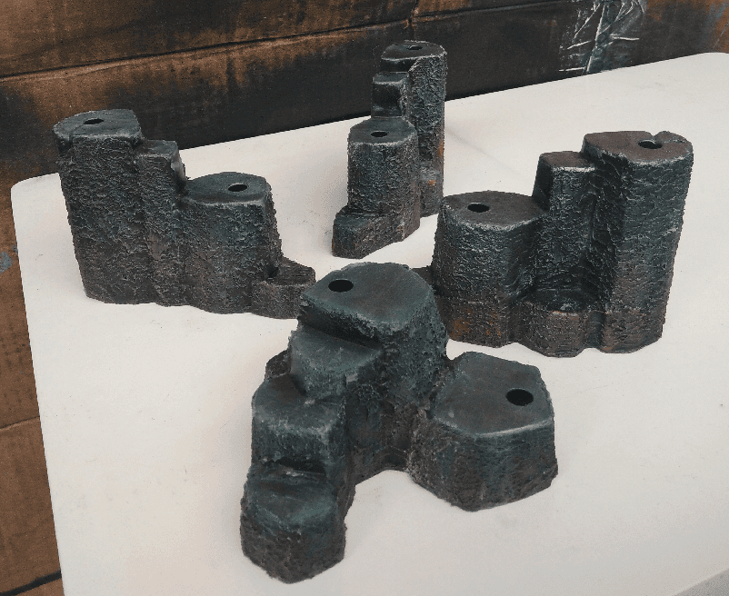
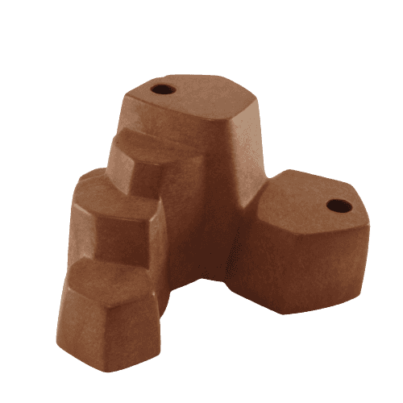

Those are playmobil rocks textured and painted.

This is the original piece. I sometimes find some in garage sales. I only added a layer of modeling paste on them to give them rock texture. I wait for it to dry (usually overnight) then sand it to make the surface smoother.

Then it's black priming, grey dry brushes everywhere, brown on the bottom, and some green here and there.

I kept the holes open as I plan to repaint the playmobil trees that come with them later.

I find that they make great scatter terrain pieces. The only issue is that some of the small "steps" are too small to properly accomodate a miniature. Only the big one could, but as soon as I'll start adding trees they won't have enough space either.

Anyway, that's one of the cheapest and easiest terrain I did.