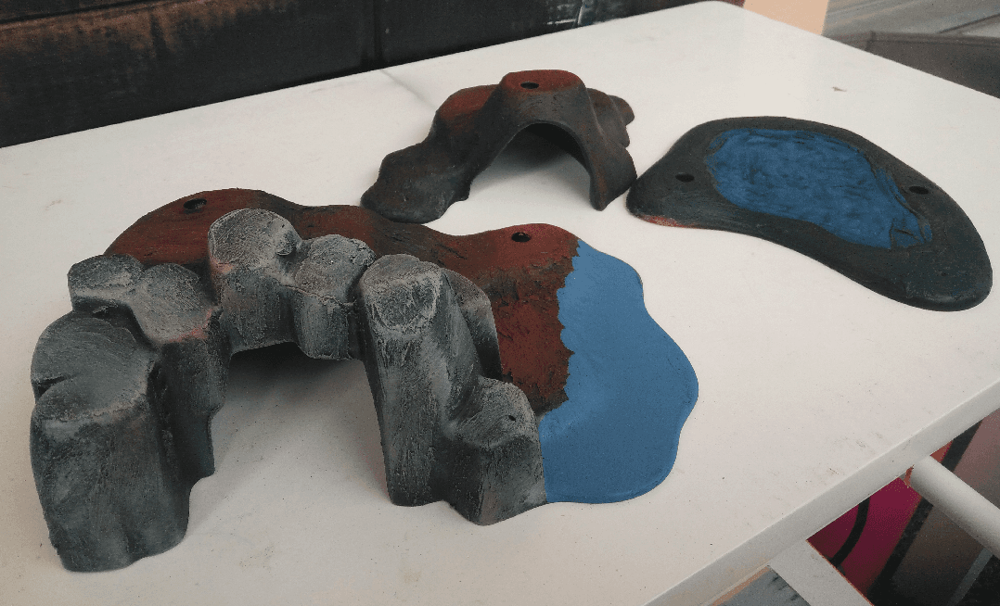

I tried to make some terrain pieces out of playmobil parts. Mostly just apply modeling paste on top to give them some texture and repainting them. I plan to use them in my mega dungeon game, where my players are exploring a swamp full of forgotten barrows.

Here is the toy when I bought it. I knew I could paint the rocks in a convincing fashion using some modeling paste to give some texture, because I had done it before.

What to do with the dune and the water, though, I wasn't sure.

Here is the other piece of terrain. Could work as a small barrow as well. The holes are meant to be used to fit trees, and I intend to convert some playmobil trees as well. What I'm concerned about with this hill is in terms of gameplay; if there is enough room to make miniatures fit on it...

And a patch of sand... I thought I could maybe paint that as a small pond. I have no experience with painting water, so it could be a way to try.

Here they are, textured, waiting for the paste to dry.

This is the current state of the pond. Does not look better in reality than what you can see on the picture. I plan on testing a water effect on it, and adding some grass around it.