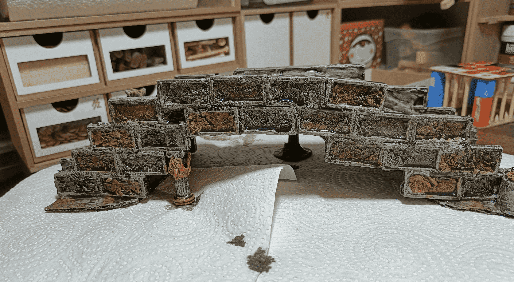

I didn't have much inspiration when I started this bridge. I took the materials I had lying around: some cardboard. I thought "hey maybe I can make a bridge out of it". I remember the crafting pages of the White Dwarf of my youth, where talented people explained how the terrain I saw in my Warhammer Battle army book were made. I vaguely remember one about turning cardboard into a bridge, so I tried to do it from memory.

I don't have much pictures of the early stages of the build. I just went on as inspiration struck me. I cut first one of the arches, then used it as a template to cut the other one. I then cut a strip to act as the floor and glued it between the two arches. I trimmed of the edges so it stoped exactly at the end of the arches. To stabilize it, I added some flat bases on each side.

Then I glued bits and pieces I had in my bits box. I used some kind of plastic domino on the sides to act as stones. I added some plastic pillars underneath, and various toys with interesting shapes.

I paved the floor with plastic squares.

I then textured the interior of the bridge with some spackle, to cover the corrugated interior of the cardboard.

I did the same on the floor, to merge a bit the squares together.

I then used a wet sponge to dabble on it, to try to muddle it a bit.

I also applied some more on the outside, to cover the geometric shapes, and give them a more organic look.

Finally it was time for painting.

I first drybrushed everything. I knew I would cover the bases with flocking later, so I didn't bother.

I painted the floor in earthy tones, to symbolize all the mud and dirt from travellers.

The previous attempt at texturing this floor helped convey the effect of mud on top of square stones.

Then I tried something new. I actually painted that part with my 3 years old daughter. We picked some colors, and she applied them inside the rectangles.

We added a black wash on top.

I had an issue here. It's not the first time it happens to me, and I'm still unsure why. When applying the wash, it did remove layers of the paint I had put before. It was not the wash itself, but applying the wash with a brush removed the paint, just like it was water paint (but it was not, it was acrylic craft paint).

I used to have this issue with my cheap acrylic metallic paints, which is why I know only use more expensive Citadel or Vallejo metallic paints in my crafts. But it was the first time I had this issue with regular gray/brown craft paints.

Maybe it was something in my wash recipe. Maybe the matte medium, or the flow improver? Anyway, I've now switch to a much more simpler wash formula (water and china ink), and never got the issue again.

The last step was to cover all the imperfections with flocking. As you can see, there were a lot of places where the underlying materials could be seen, so I hide them. Flocking stuff is almost cheating. It's almost as good as the black wash.

More pics of the various angles of the build.

The slope is a bit too steep for miniatures to fit correctly, they tend to fall backwards.

