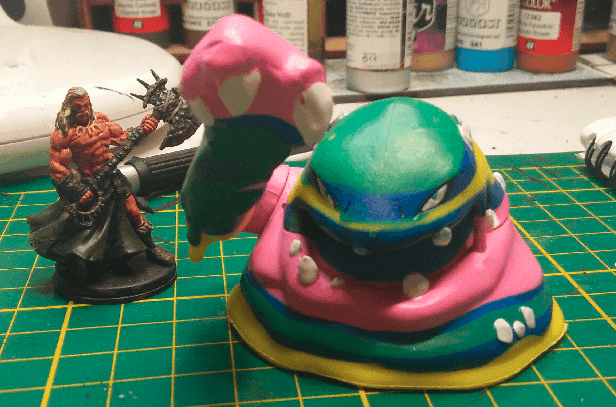

When I found the miniature I knew I would turn it into a kind of Ooze. I find it pretty hard to find cheap Ooze miniatures.

I didn't really know which kind of Ooze I would make, but then I  realized Ochre Jellies are large Ooze, so that would fit and I was set on this idea.

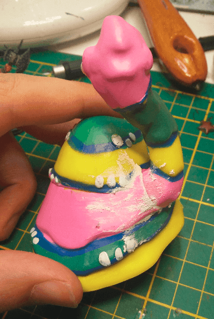

I glued the hand in place and tried to fill the gap with modeling paste. This is the only paste I have, but it is very good for that. I will need to learn how to use milliput/greenstuff.

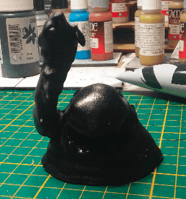

No more of this weird colorscheme it had before.

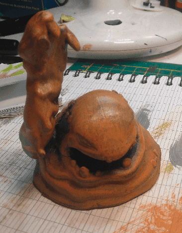

Heavy drybrush with some Caramel craft paint. It starts to look like an animated quicksand creature.

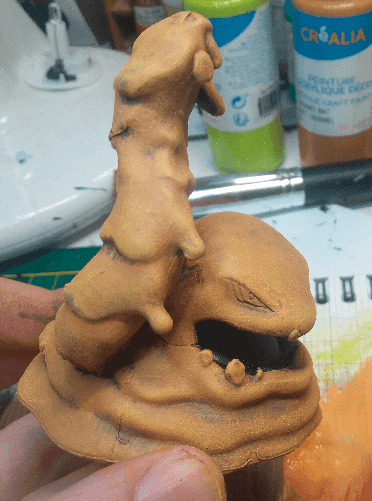

After more and more layers of drybrush, I'm starting to get this sandy effect.

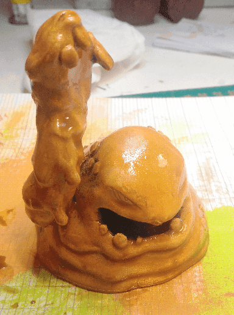

Adding a wash to increase the contrast of the recesses.

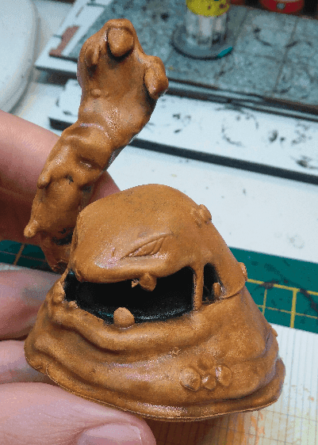

And once the wash dried.

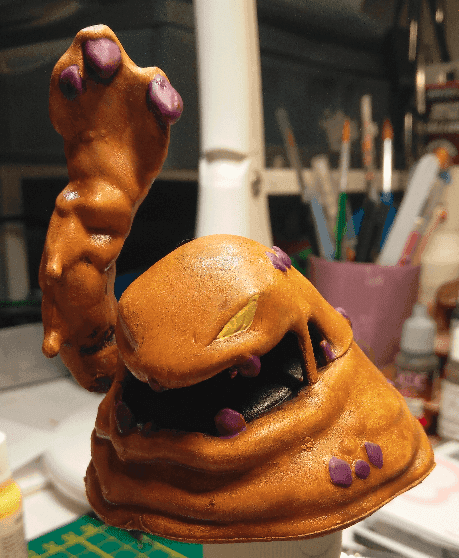

I decided to stray away from my initial attempt at making an Ochre Jelly and went for a custom quicksand monster instead. I painted the rocks in a purple tint, to make it look like it's a stone-related creature.

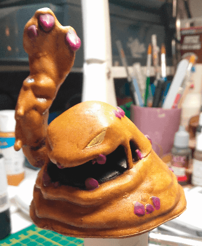

I painted the bottom half of all gem in a lighter purple.

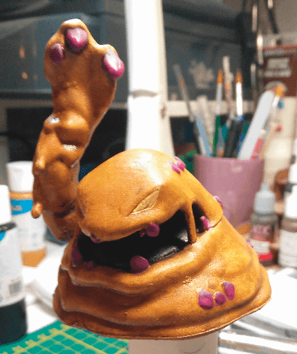

It's hard to see, but I added some even lighter purple on top of the gem.

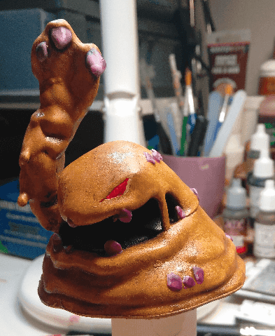

The previous effect didn't work as I expected, so I started highlighting the edges with a white-purplish color.

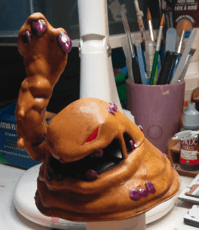

I then applied a purple wash on the gems to try to blend the previous attempts together. As you might guess, I had no clear idea of what I was doing. I didn't check any "how to paint crystals" tutorial online and just went on experimenting.