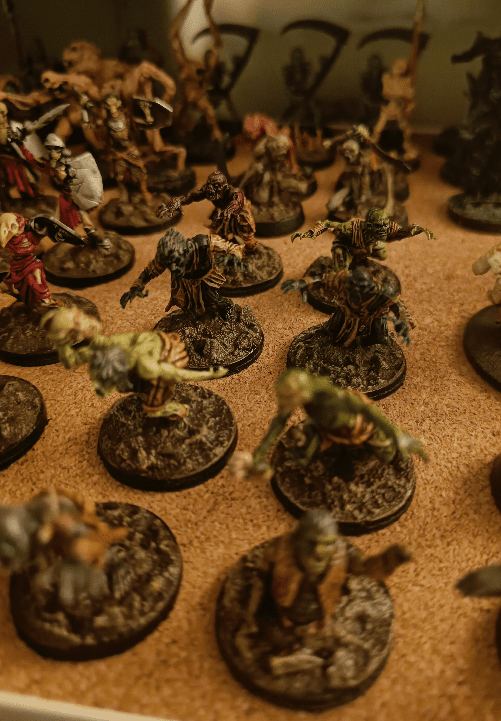
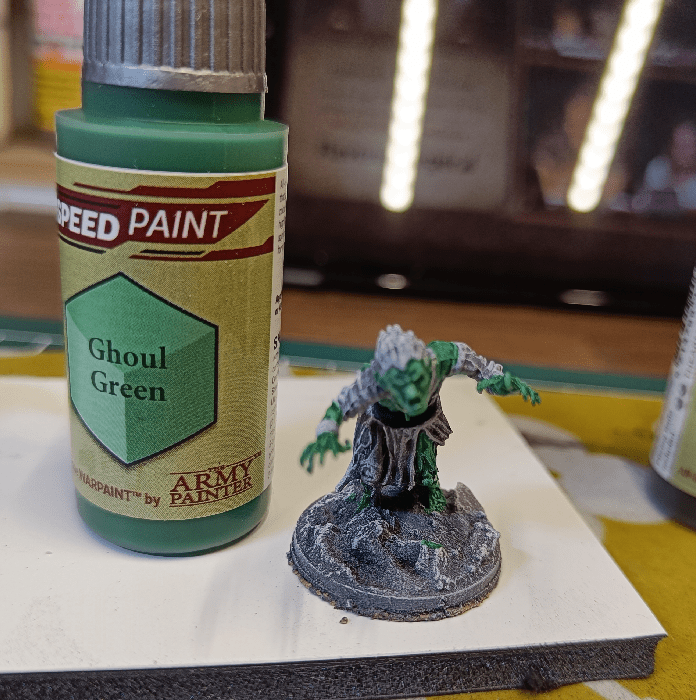
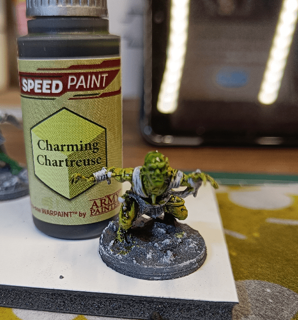
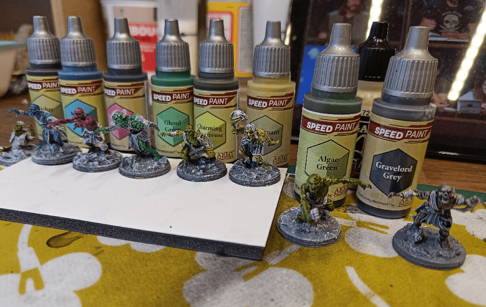

I used a sprue of plastic ghouls as an excuse to test some of my new paints.

First, I was surprised by the Ghoul Green. It felt very vibrant to me (where I expect a Ghoul to be more in the faded, dying colors). I thought I should try the paint on the miniature of the same name, maybe it works well on it.

Well, it still seem very bright to me.

On the other hand, I also tried the vary Charming Chartreuse on a not-so-Charming ghoul, and the result is better.

I extended the test on more ghouls. My favorites are the various greens. I could see a whole group on various shades of green. That could look great.

The Blue, Pink and Green on the left are way too vibrant for me. The Gravelord Grey on the right could be another interesting color scheme.

