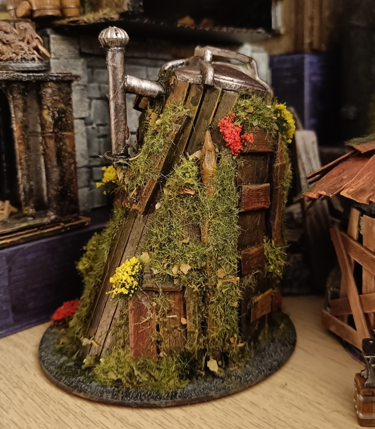

This might be a goblin hut, or the a forest gnome laboratory, or even the visible part of an underground complex.

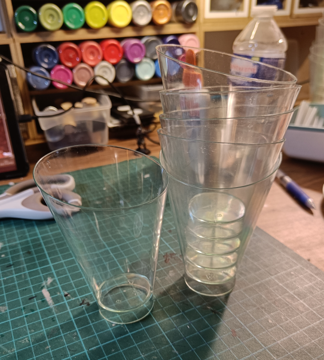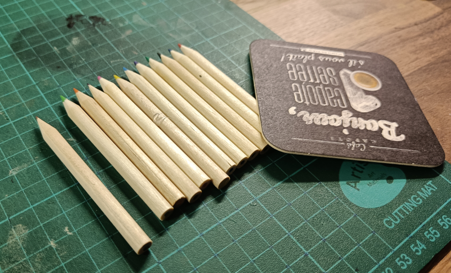

But, more specifically, it's mostly old coloring pens, a coaster and a plastic glass glued together.

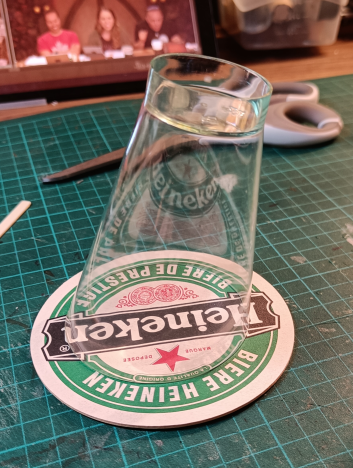

The glass is some kind of fancy plastic cup with a weird shape. I thought that glued upside down, it gave a nice slanted shape I could use.

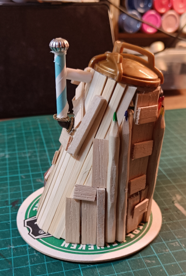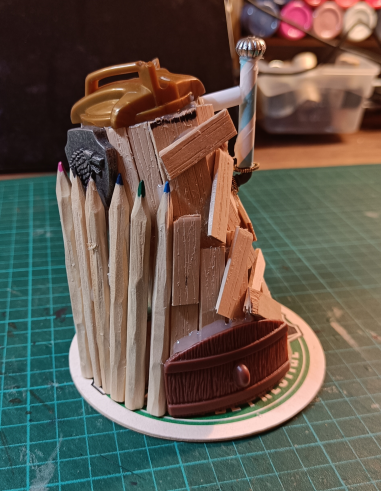

I went to town and glued bits and stuff I had lying around. Coffee stirrer, bits of plastic toys, coloring pens, straws and beads.

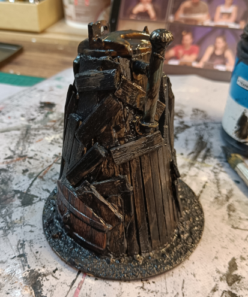

I added some sand on the base, and added the usually black modpodge mix.

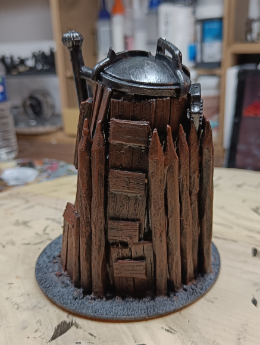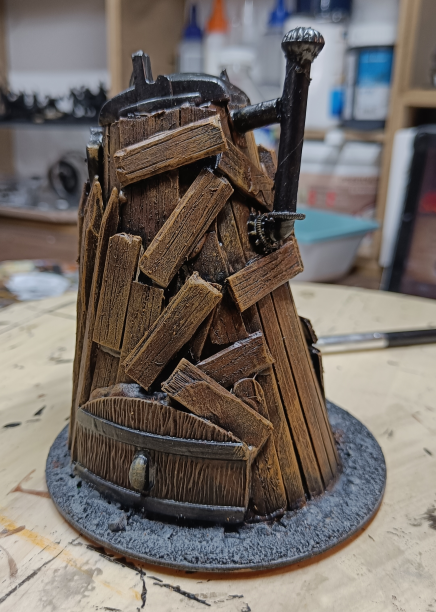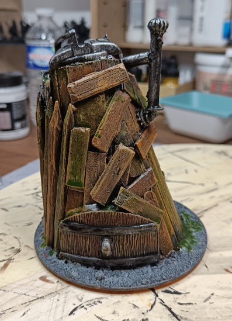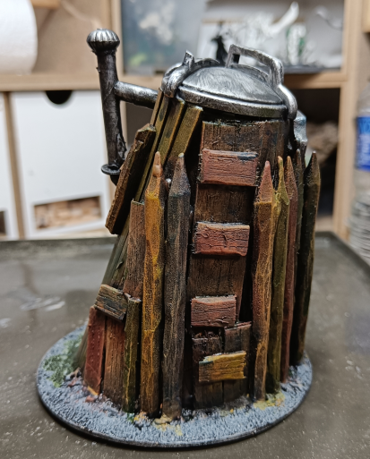

Dark brown overbrush, and light brown drybrush. Followed by some green ink, and black wash once dried.

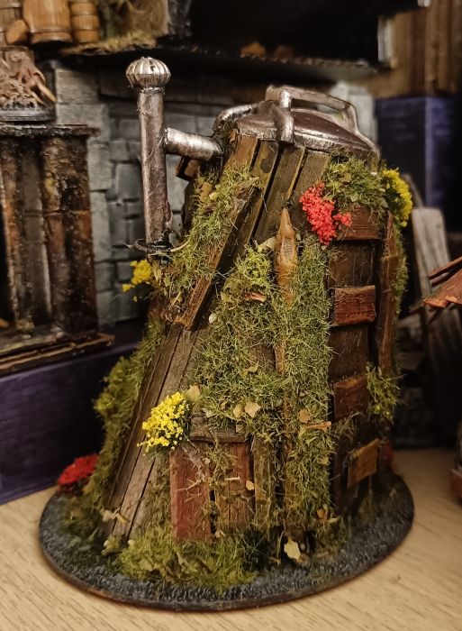

It didn't look like much, so I added some heavy flocking and fake flowers to it, and now it kind look like something usable (even if I still don't really know what this is).

