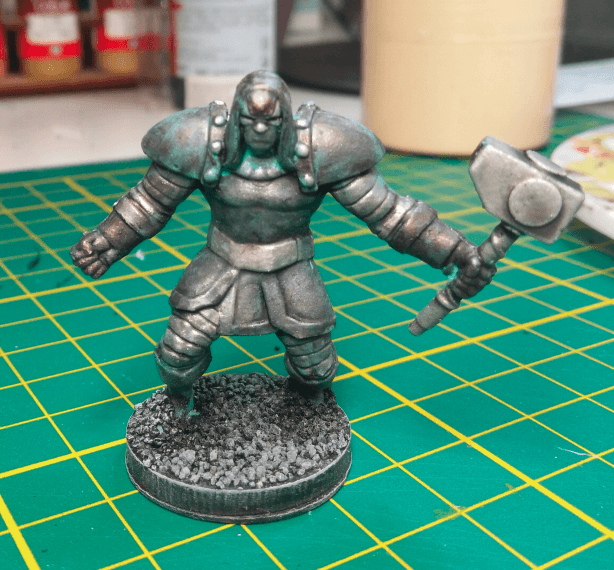
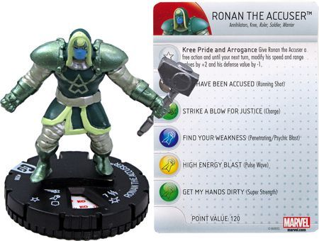

I made an Iron Golem out of Ronan the Accuser

I used this mini as a practice for testing the Nihilak Oxyde. I simply painted it silver, applied Nuln Oil and then tried to apply Nihilak Oxyde to its head.

I'm not so happy with the result, the oxydation does not make sense (why would it be only on the head) and the miniature overall lacks any distinctive feature.

In retrospect, I should have used this mini as practice for other techniques, like layering or highlighting (stuff I still don't know how to do) because it has a lot of large and easily accessible surfaces.

