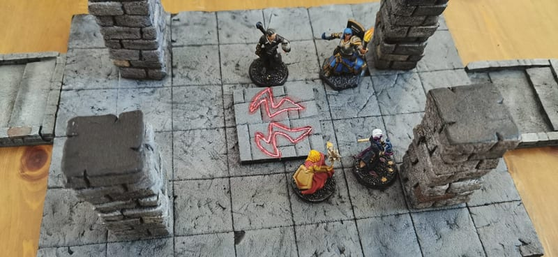
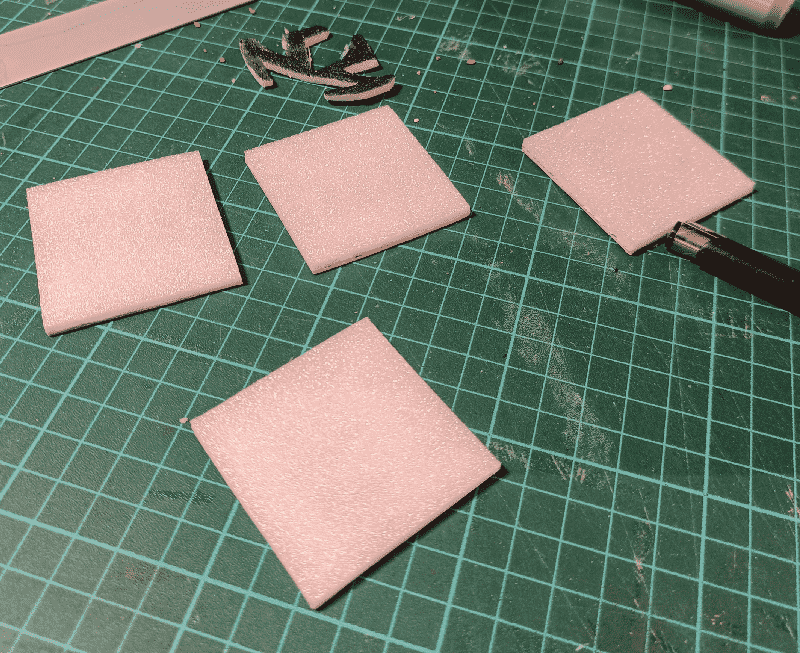
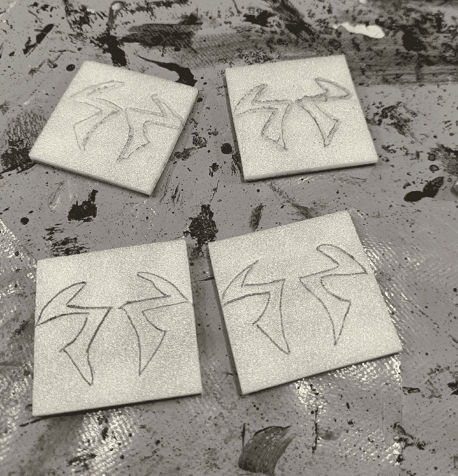
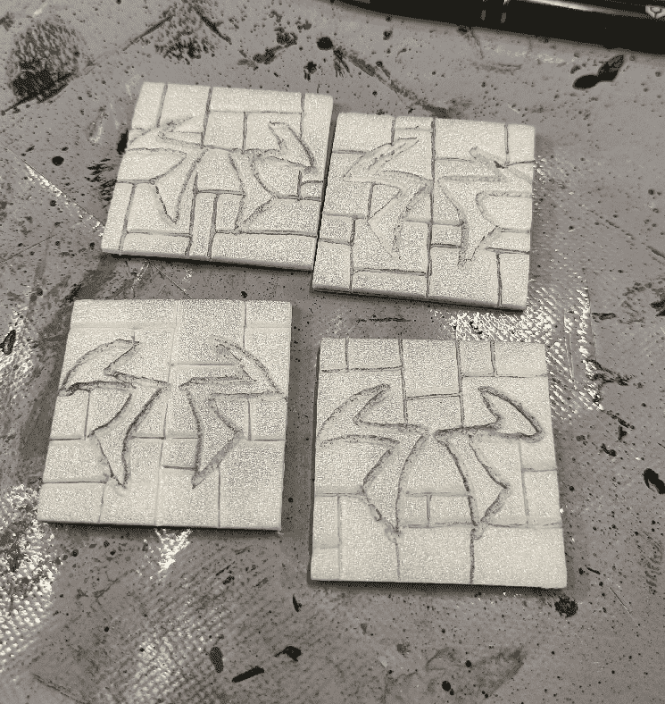
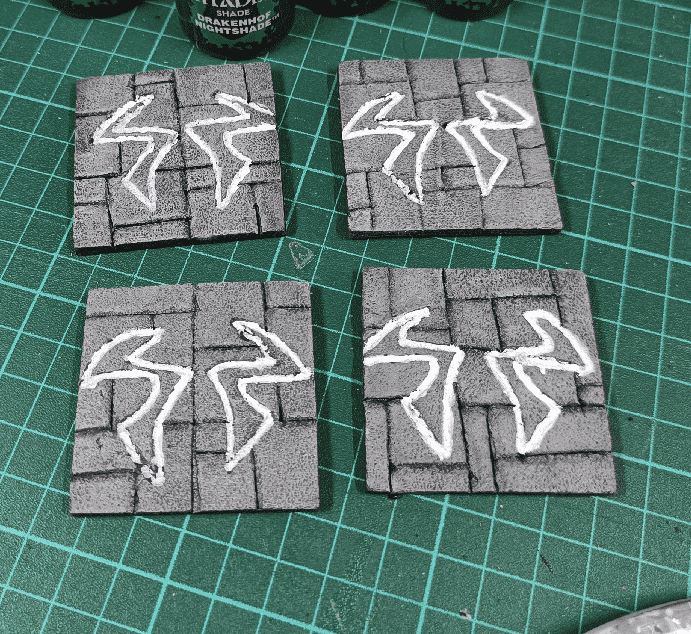
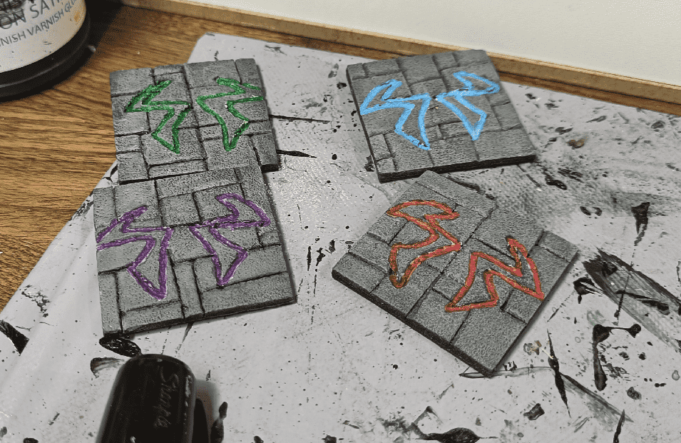
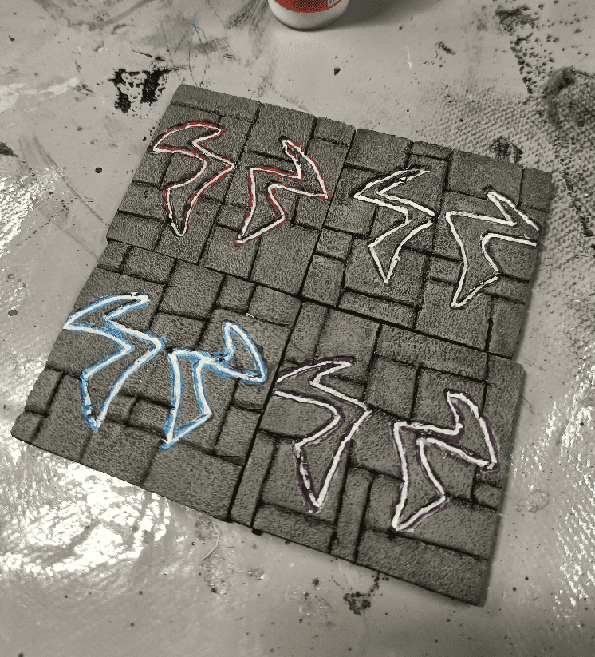
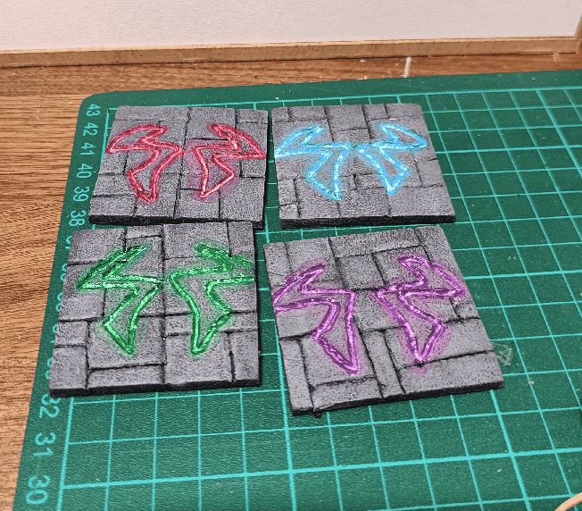

The rune on the floor is a variation on the Alaznist rune from Pathfinder, and has been the rune of Ezren, the Warlock of the group, whose evil twin has perverted all timelines. The various dungeons they encounter have variations of this rune, and in this room specifically it was part of a puzzle, of the rune turning red and green.

To build the runes, I carved a template out of foam (top of the picture), and used it to trace the right shape on four foam + cardboard tiles. I made the tiles smaller than my usual dungeon floor tiles, so they could sit in between walls.

Using the template I draw the run on the tiles. For the first ones I tried to melt the foam using the tip of my hot glue gun but it turned out to be too rough. For the last one, I didn't even used the template and free-hand draw them.

I carved the rune, and added a classic stone pattern in the background, to better blend them with the rest of the terrain.

I painted the stone, and traced the rune white.

I then painted each rune in a different color. The white priming helped in making the colors more vibrant.

Then I added a second layer of white, this time focusing on the central line.

And I finally added a last layer of highly diluted paint, making it bleed on the side. It gave kind of a glowing / neon effect to the runes.

