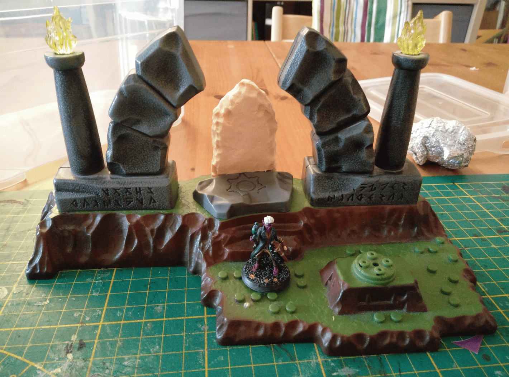
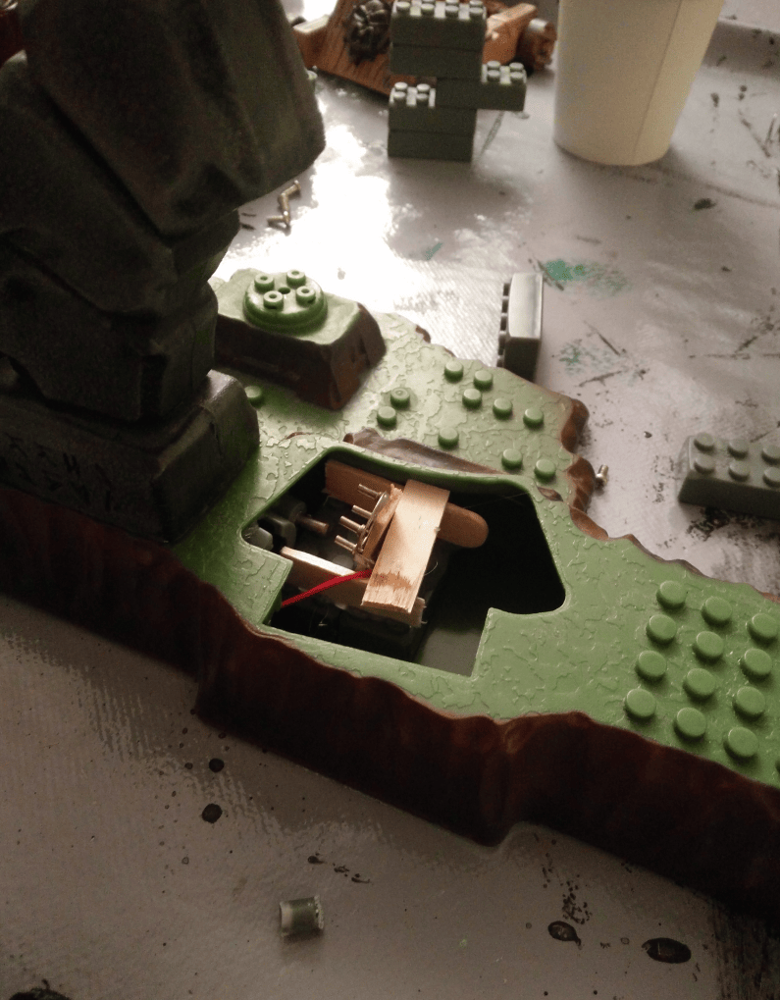

<!-- Image 1 -->

I picked up this Megablocks set at a secondhand shop. Sacrificial altars are a pretty common terrain piece, and the scale looked about right, so I figured I could turn it into something usable.

<!-- Image 2 -->

Here are all the different pieces. The central stone actually moves, and when it does, it triggers a little switch underneath that lights up the flames on top of the columns. I thought it would be cool to keep that feature working, so the flames would light up when you move the stone.

<!-- Image 3 -->

The mechanism was a bit broken, and I'm not an electronics expert. I tried modifying the system to make it light up when the stone moves. I spent a lot of time on it but couldn't get it to actually work.

<!-- Image 4 -->

I completely gave up on that idea and started sculpting a standing stone out of foam to place on top instead. This would make a proper centerpiece for the altar.

<!-- Image 5 -->

I kept working on the standing stone. To get that flint-like stone texture, I used my fingernail to tear off small bits of foam bit by bit. It creates that stone effect.

This project stayed in limbo for quite a while without being finished. I eventually completed it, but took a completely different approach. I separated the arches from the green and brown base and painted them individually, which made everything much more modular.
