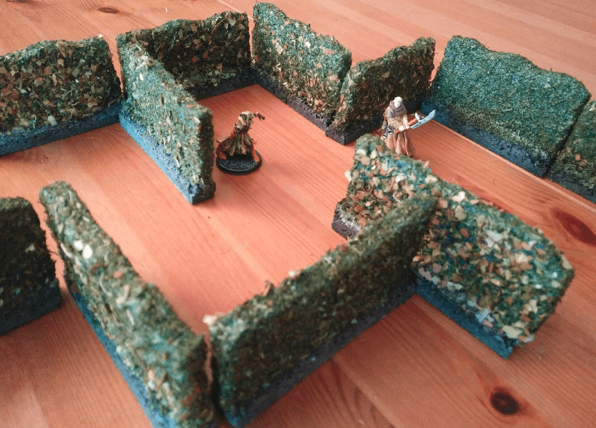
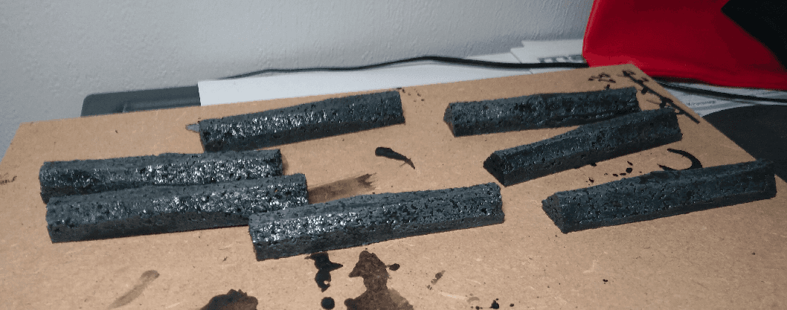
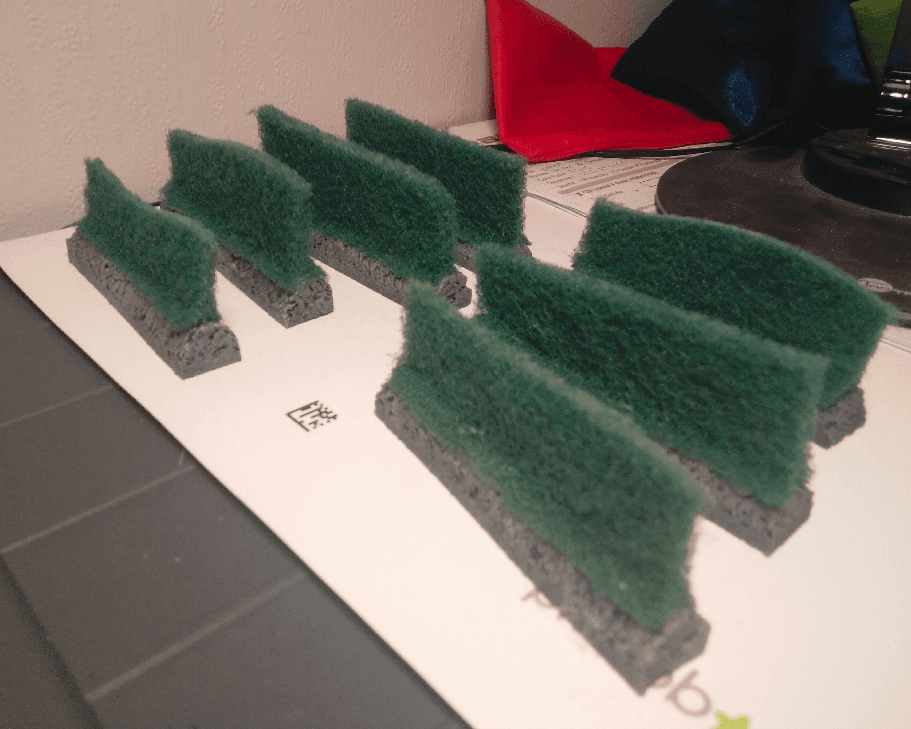
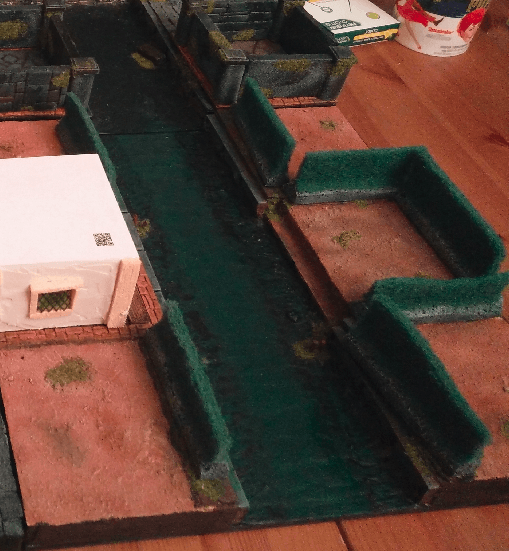
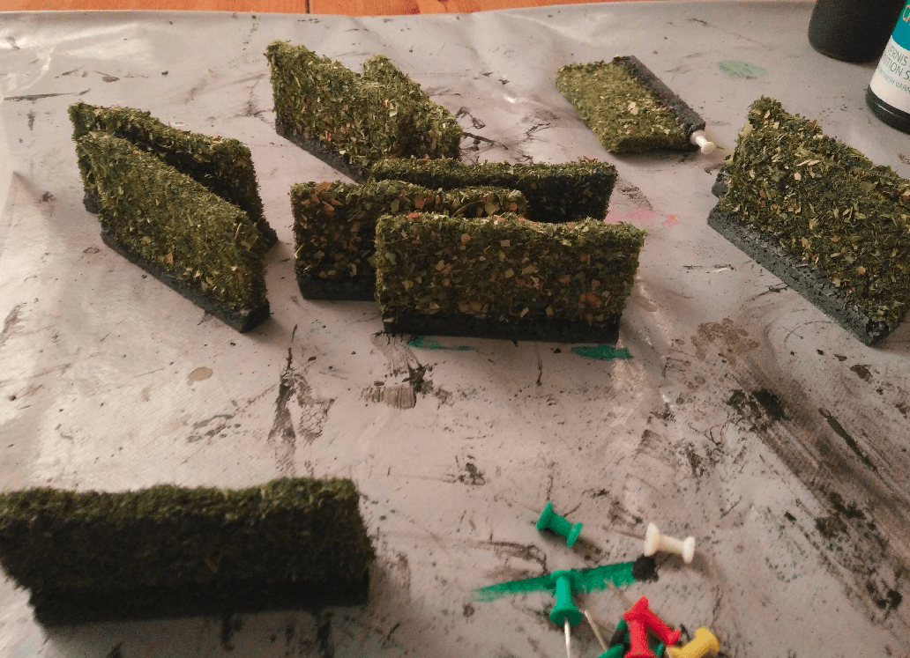
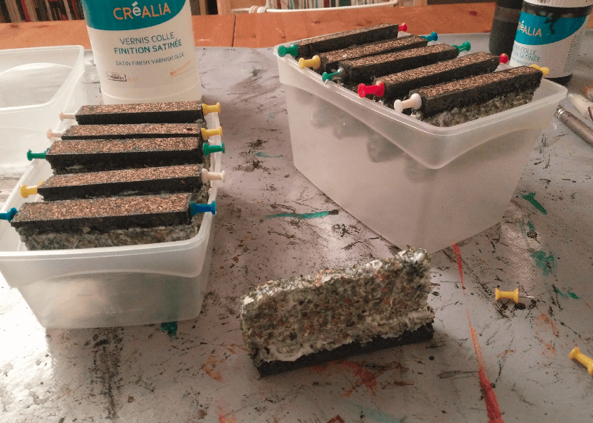
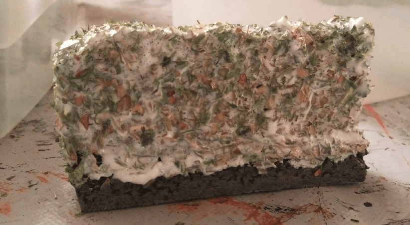
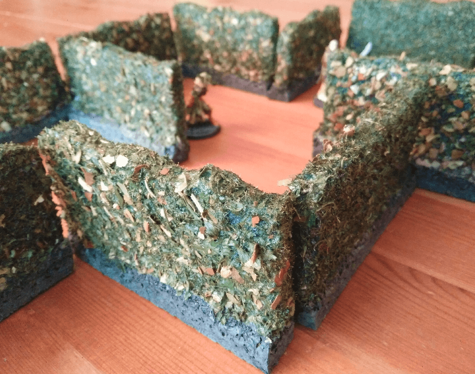
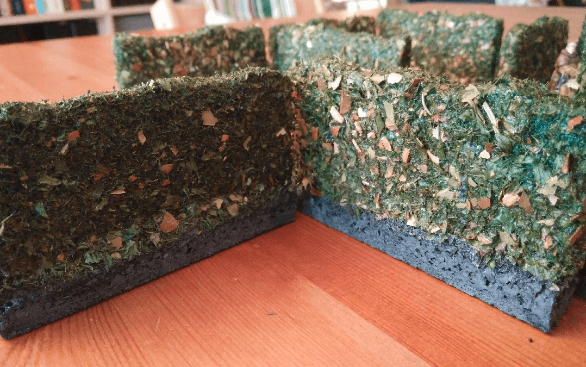

This is a set of hedges I made for my Zombicide Green Horde game.

My first implementation was pretty rough. I started by cutting strips of cork to act as bases. I painted them black, dry brushed gray and applied a wash, for the usual stone texture.

I then glued scratch pads on it. I tried to cut the pads in an irregular fashion, but I think it looks pretty weird.

Functional, but not very pretty.

To make them look a bit more realistic, I sprayed glue on them with a glue spray I had. This was very messy and did not smell good. I do not recommend that.

I then sprinkled a mix of leftover flocking and various cooking herbs on them.

I waited for them to dry, then dipped them in modpodge to seal the herbs. When the modpodge cures, it stays invisible, but keep all the tiny herb pieces in place. I kept them upside down in various containers to have gravity spread the modpodge evenly. The upside down part wasn't even necessary as the thing stayed mostly in place.

No worries, this will be transparent once cured.

And the final result. This still does not look very good, but it's better than raw scratch pads. But more importantly, I won't be spreading cooking herbs everywhere when playing this them now.

This size of this batch works well with the size of the miniatures.

As you can see on those close up pictures, the original scratch pad can still be seen underneath. I wanted to add a black undercoat (or a very dark green), but couldn't find a reliable way to paint the pad.

