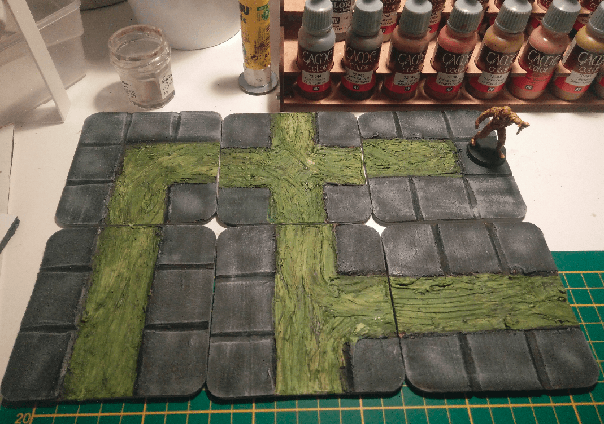
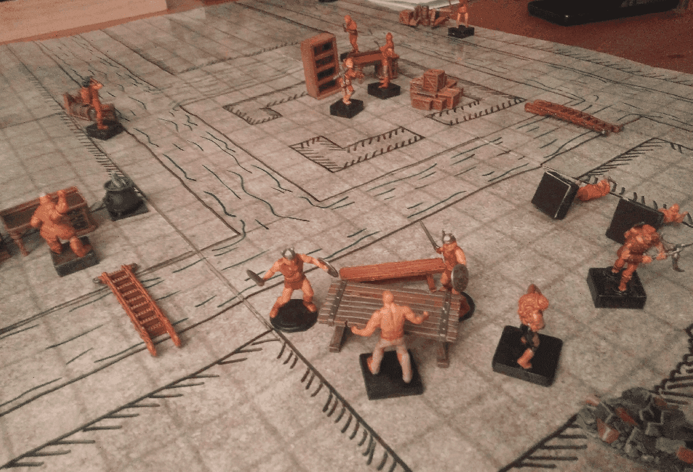
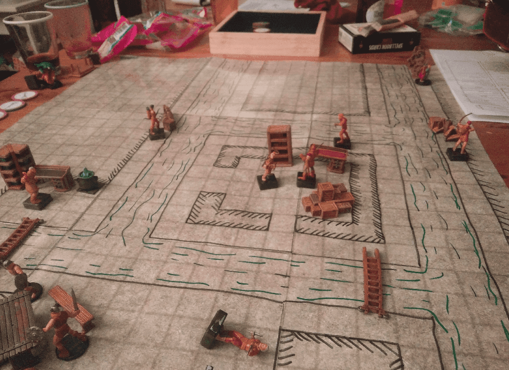

I made some sewer tiles from a set of square coasters.

The coasters had a cork underground, so I traced a squared pattern on it and dig some recesses along the lines with a utility knife.

I then pulled the cork out where I wanted the dirty water to go, applied a fair dose of texture paste, and brushed them to make it look like water.

I painted the tiles black, and applied a light dry brush (in retrospect, I can see that they lack texture, but it was good enough). For the water, I applied green paint and a green wash

I'm happy with the overall result, it looks like dirty water. I just wished I had more coasters to make more tiles, this set is pretty limited in terms of gameplay.

We ended up not even using it in our game, and using the game mat as it allowed for versatility.

