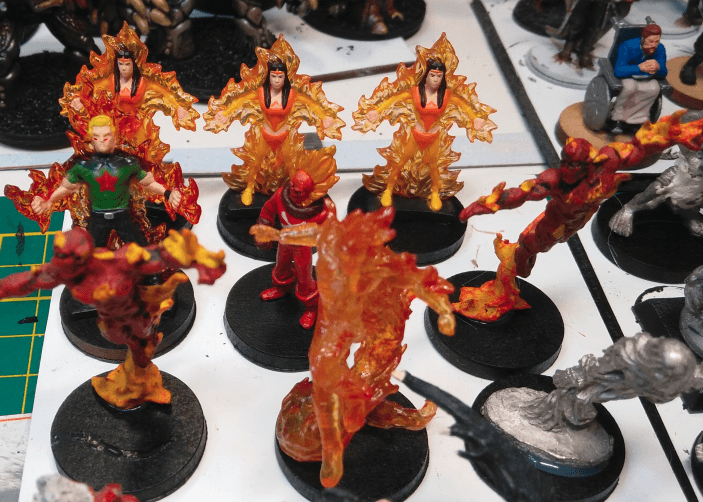
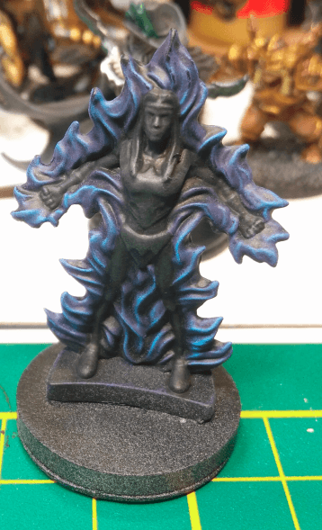
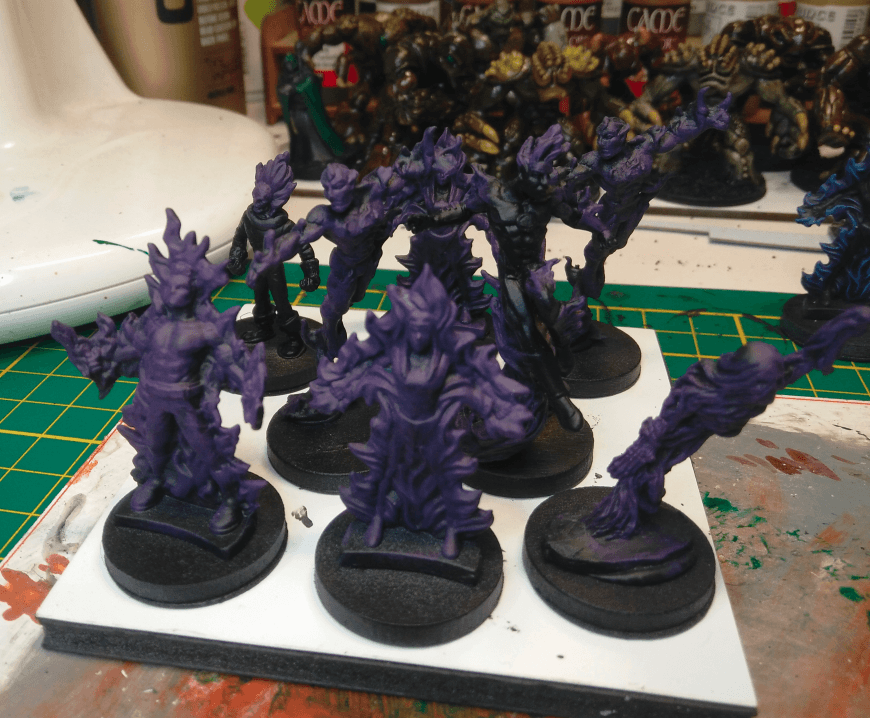
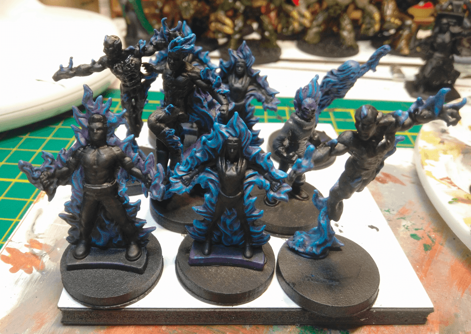

Here are the original miniatures. I tried to grab everything I had that had some flames on it.

This is the first test. After a black priming I tried a pruple dry brushing on the flames, followed by a lighter blue one. I fixed any mistakes with black, and applied some light gray drybrush to make the edges pop a bit more.

The test miniature worked great, so I started working on dry brushing all the others with purple. As you can see, I was pretty rough in my attempts and a lot went on the torsos as well. That's ok, I'll clean that later.

And with blue added. Once again, only a dry brush.