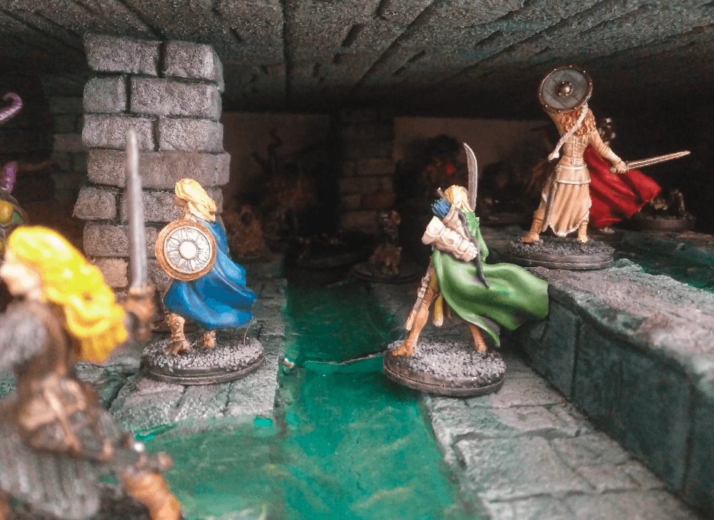
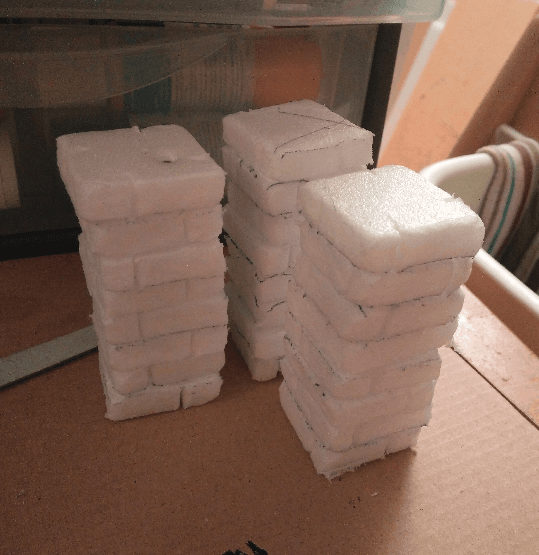
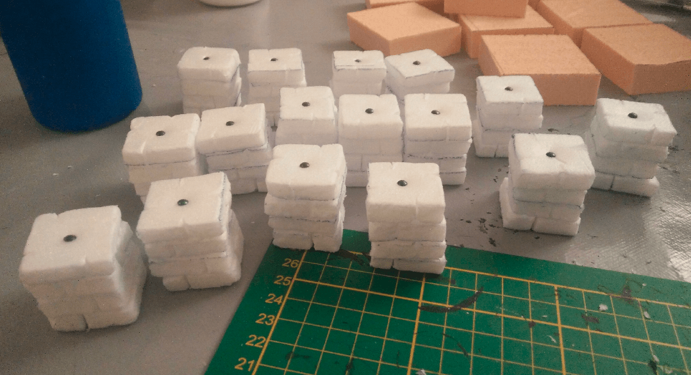
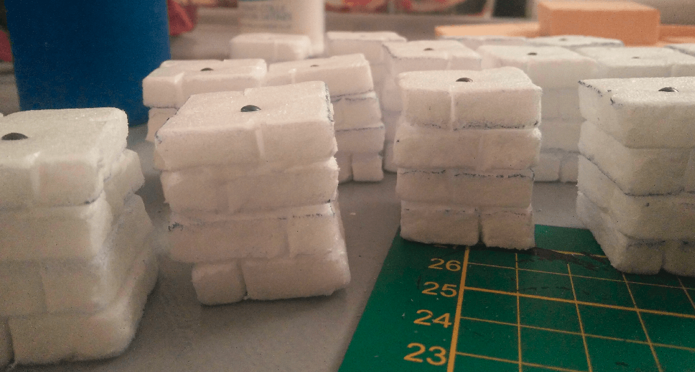
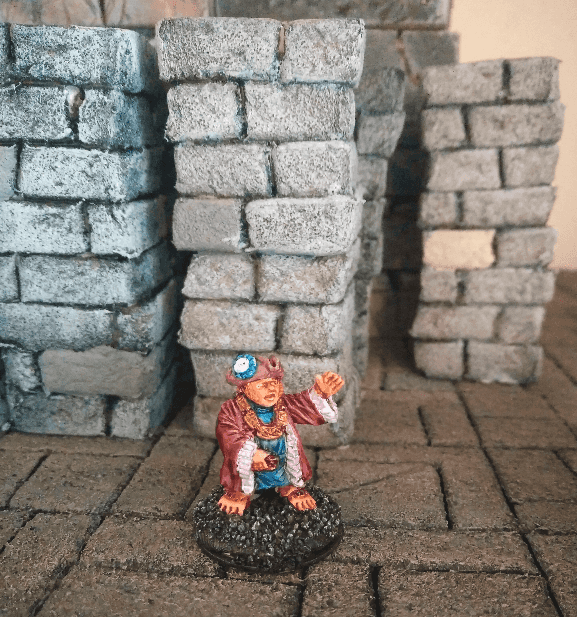
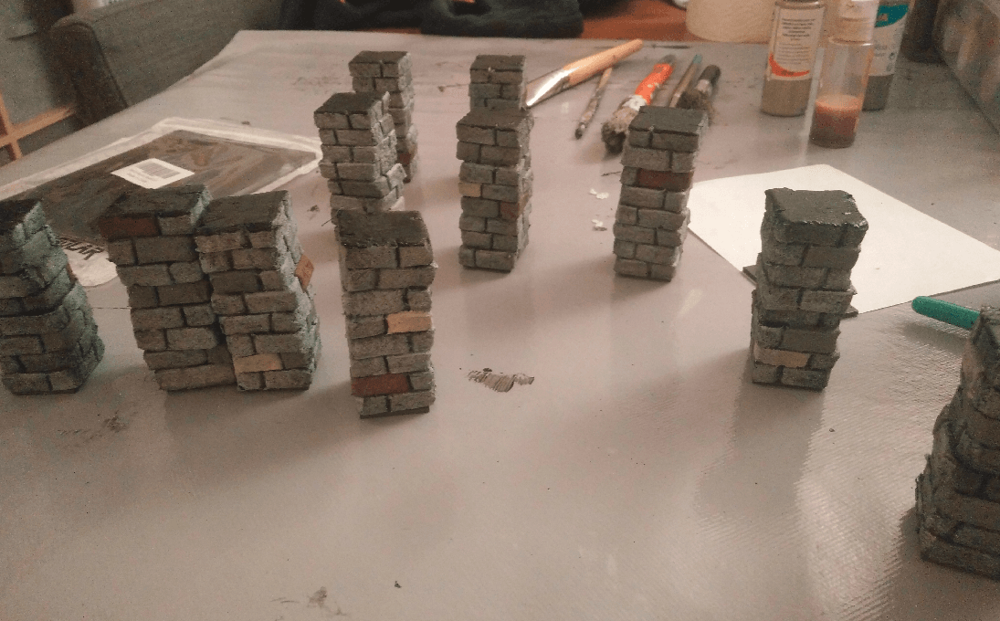
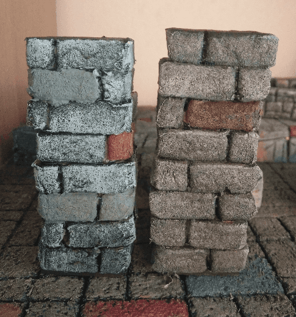
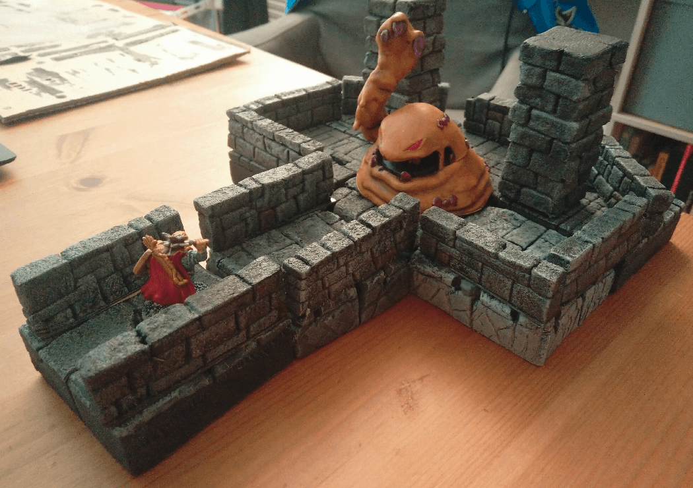

With the excess foam from my [previous project](/blackmagiccrafttower/), I started crafting some pillars. Once again, they are heavily inspired by [Black Magic Craft](https://www.youtube.com/watch?v=a2UXNbw6Ynw).

I stack them four by four and put a nail in the middle of the stacks. This allowed me to bind them together nicely, and also gave some weight to the build. 

I will then glue two stacks together on top of each other for a complete pillar.

Here is what they look like once painted. This was a messy dry brush of light gray on the stone.

I painted a few stones in various colors for variety.

I tried a brown wash on them. On the left is before the wash, on the right after it. It certainly tied the whole pillar together in the same color space, but it toned down some of the colors so much that I wondered if it was worth the time painting those bricks in various shades of gray in the end.

And for scale, with some other minis and other fun foam stuff I was messing around with at that time.
