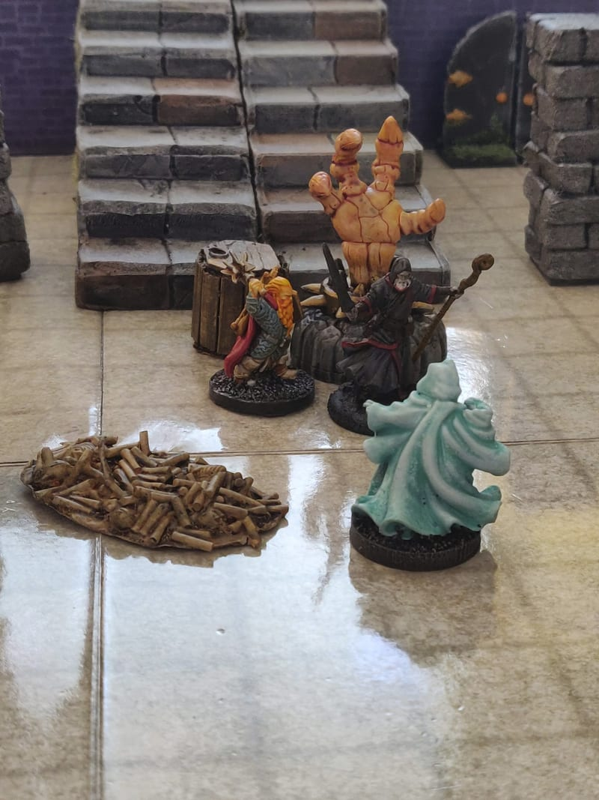
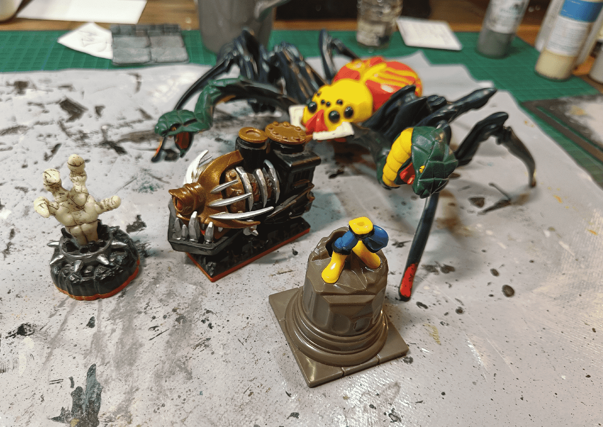
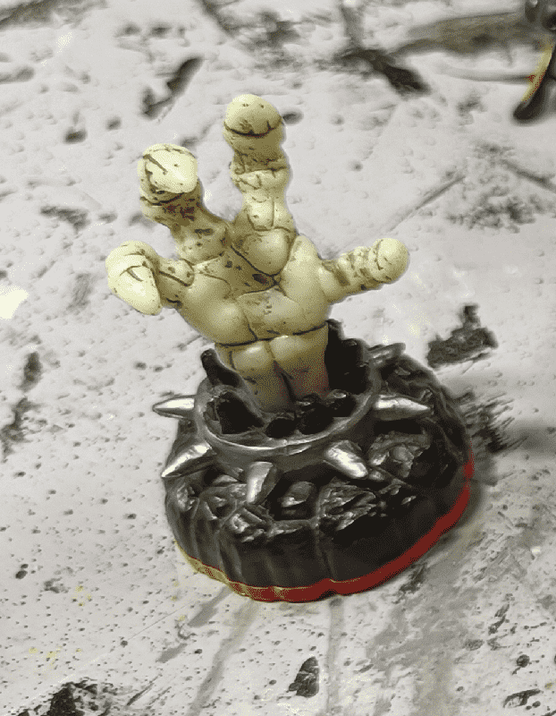
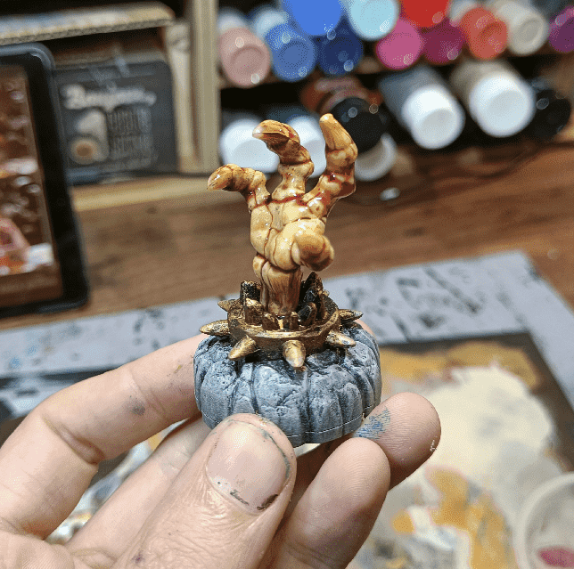
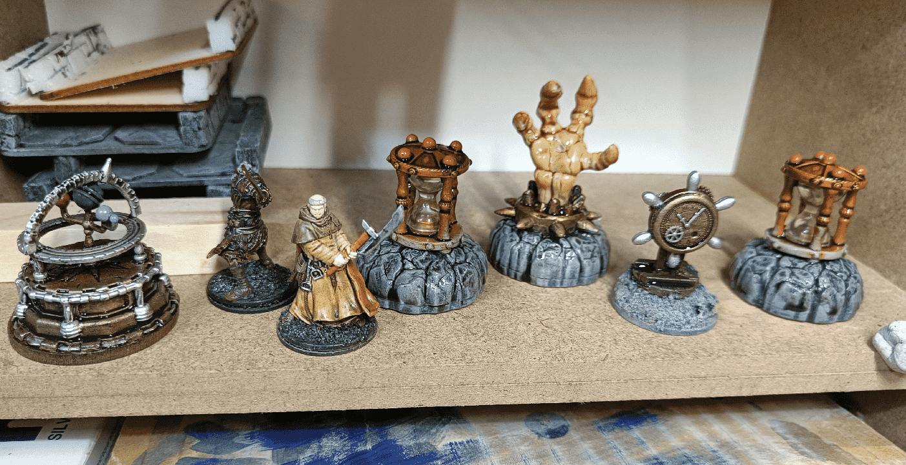

The final boss of the campaign spent most of his time hidden behind a giant skeletal hand, as seen on the picture. I didn't initially planned that, but because I had just found the perfect mini in a garage sale, I gave him the Bigby's Hand spell.

This is one of those occasion where the story is influenced by the miniatures you have, as opposed to the opposite.

This was the catch of the day at the garage sale. Two SkyLander miniatures, a broken pillar super-hero thing and a giant, horrible, spidersnake. I haven't yet done anything with the last elements, but the hand was a quick job.

It already looked pretty gnarly without any touch up, but I wanted it to look less like a toy, and more like a threat on the board.

So I painted the base in my usual stone colorscheme. At first I wanted to remove the actual hand from the base, but those things are heavily attached and I gave up. I painted the spiky thing gold and the hand in bone tones. I then added a red wash on top, to make it look bloody.

Here it is on the shelf, with a few other props for this scenario.