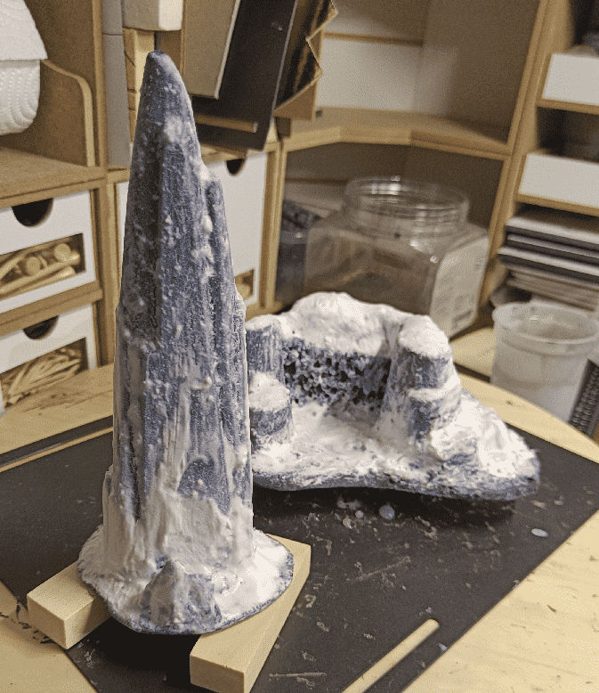

My daughter being in a Frozen-Let-It-Go phase, she asked me if I could create some snow mountains for her to play with her Elsa and Olaf toys.

I used some Playmobil hills and rocks we had laying around and found it a great opportunity to try to build some snow terrain.

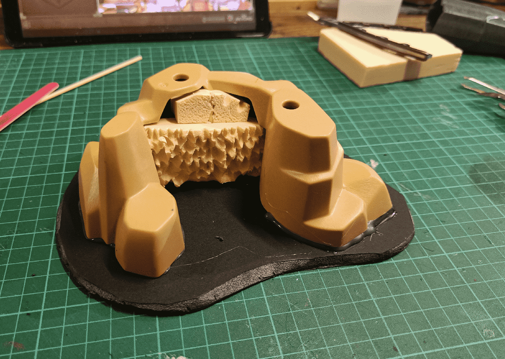

It all started with a Playmobil rock formation glued on top of foamcore. I crammed in some more foam to fill the hole and carved some rough surface using a knife and extracting small bits of the foam.

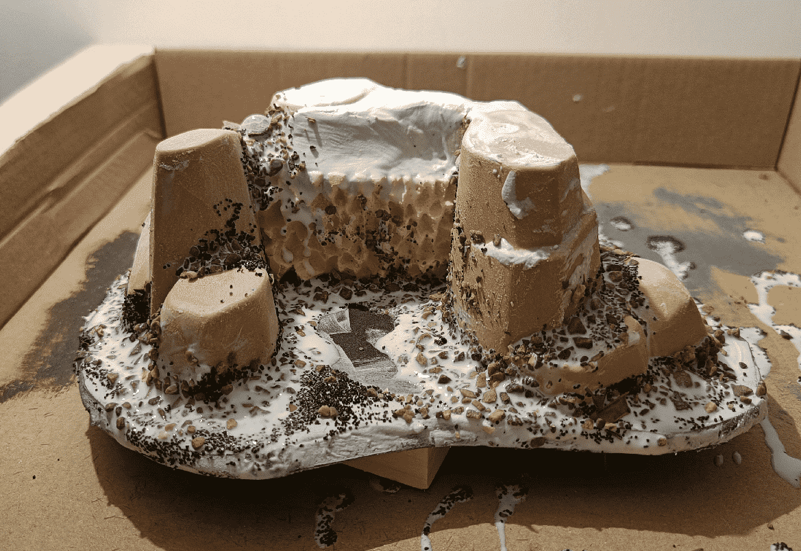

I filled the other holes with spackle and rubbed some on the flat surfaces to give it more texture as well. I then added glue, rocks, sand and more glue to cover it all.

In hindsight that part might have been overkill because I will be covering almost all of it with snow later.

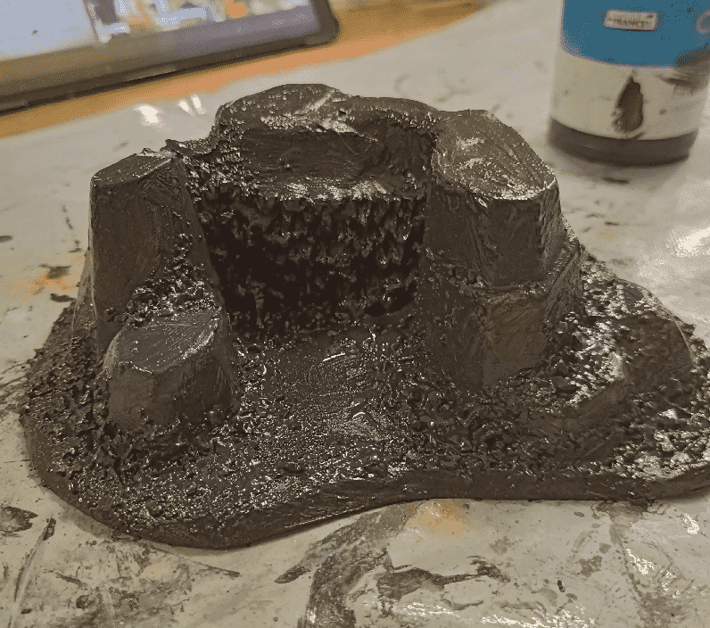

The usual black base coat.

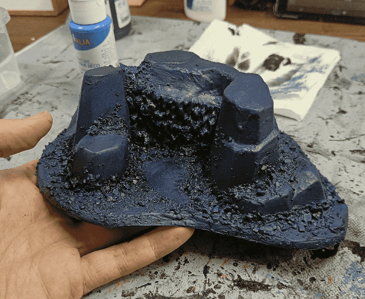

I started with some blue undertones.

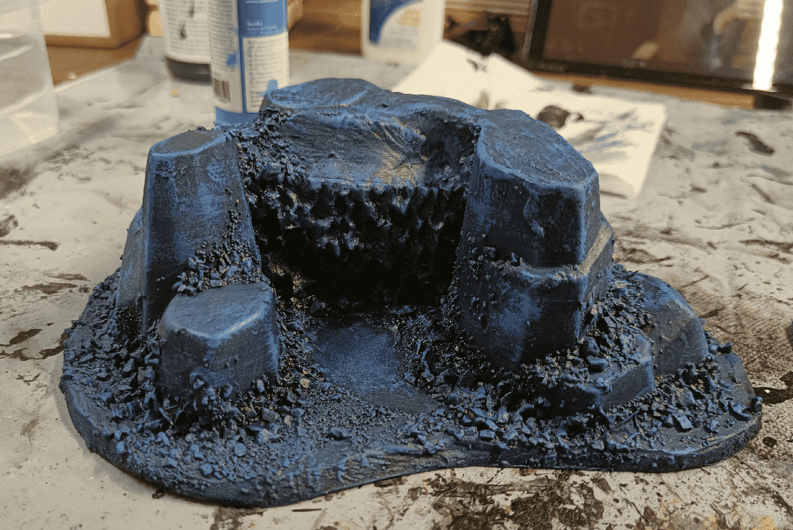

And progressively moved onto lighter tones in drybrush.

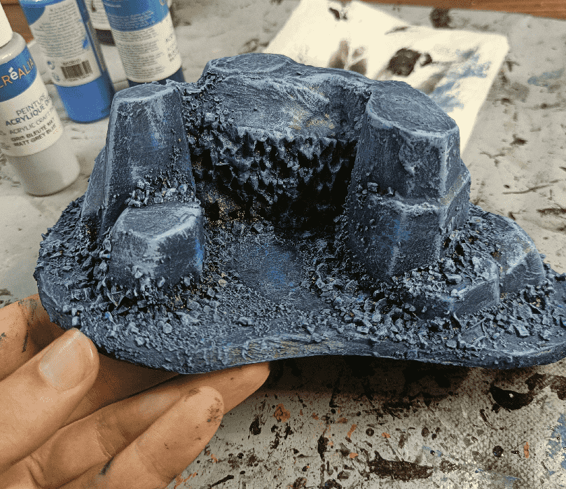

Once again, not sure it was useful as it will all be covered in snow later on.

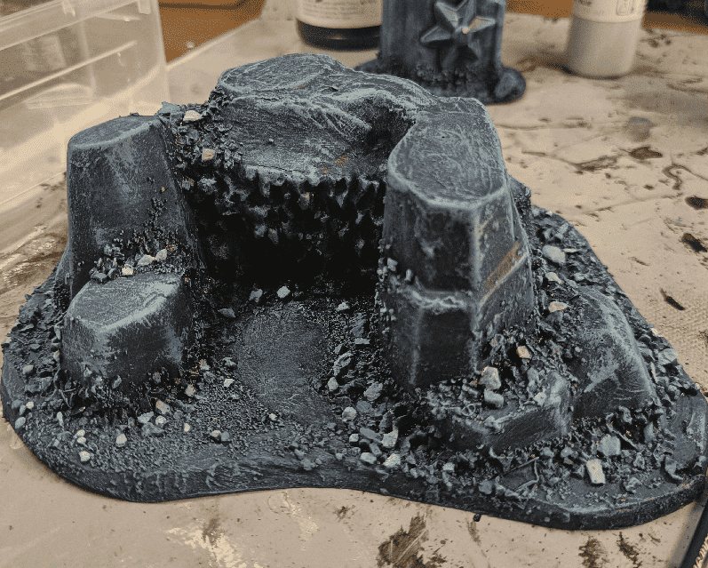

Continuing on the useless detailing, I colored individual stones to break the visual monotony.

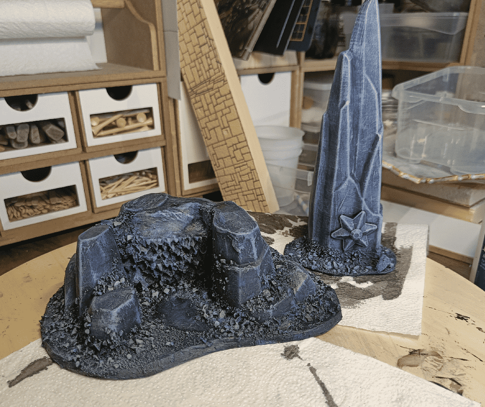

I also worked on a second, similar, piece: an obelisk at the same time.

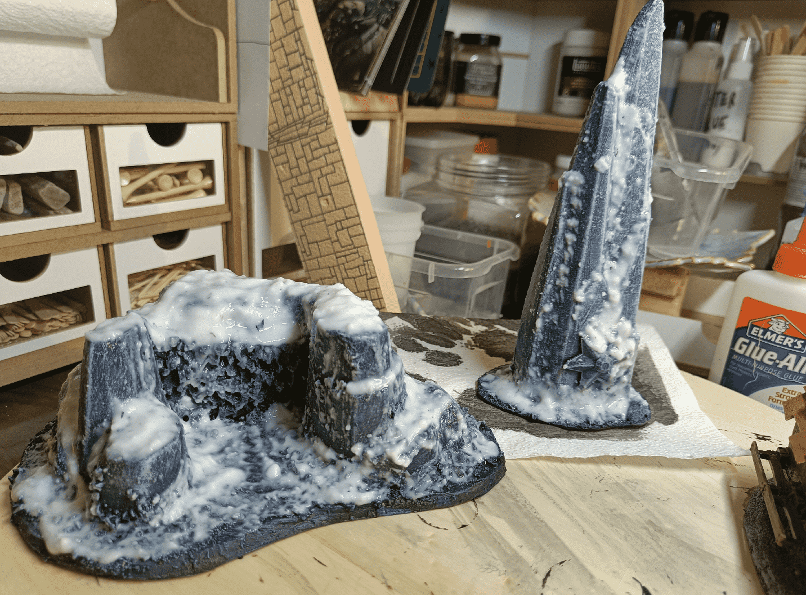

I baked a mixed of water, PVA glue and baking soda to create fake snow. This looked like a great idea at the time, cheap and effective.

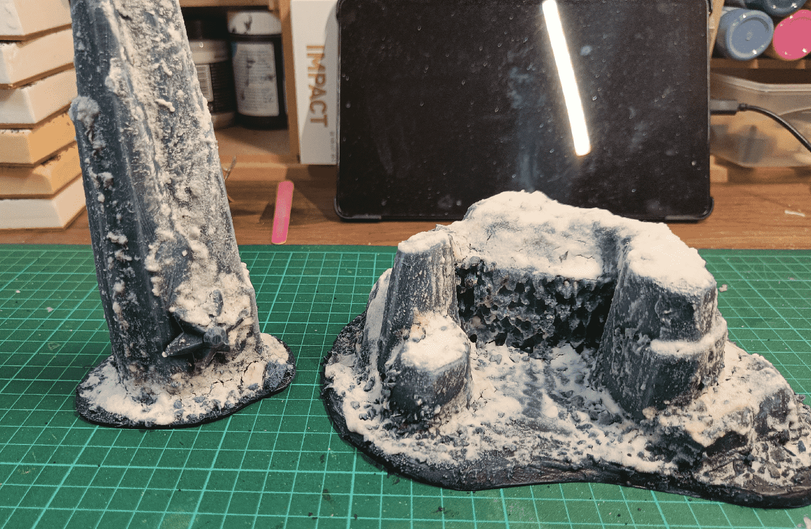

But after letting it dry for a few days, cracks started to appear. This could actually be an interesting feature on an icy lake, but here it just felt wrong.

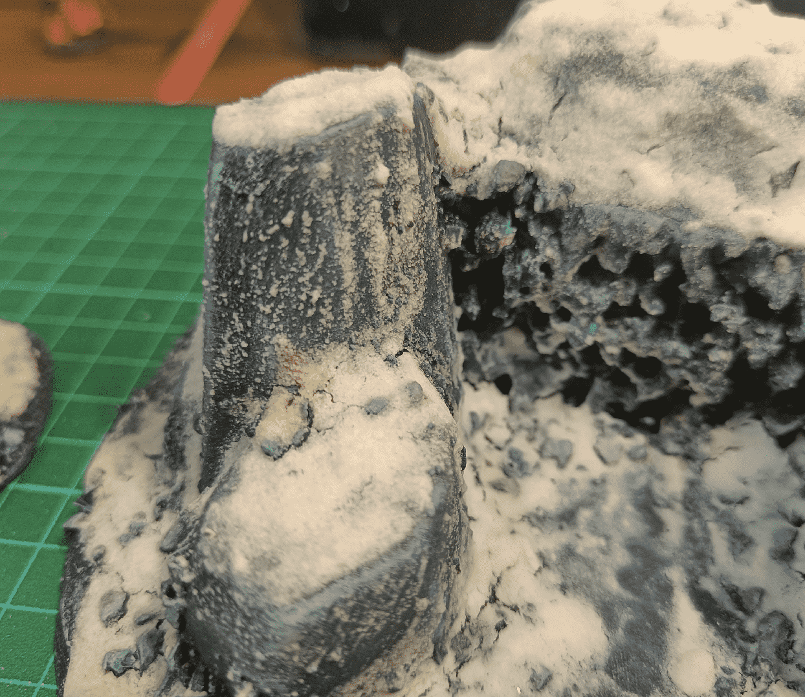

Even worse, the "snow" started to turn yellow where I had touched it when it was drying. Some would say it adds to the "realism" but I was aiming for a more pristine snow effect.

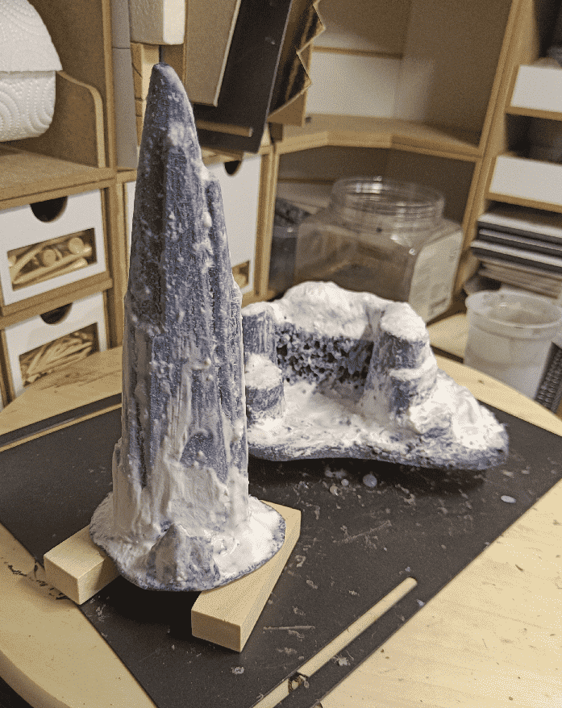

I finally went on an bought some official diorama fake snow (AK Terrains Snow and AK Terrain Snow Sprinkles) and covered back my creations with it.

Overall they work as nice pieces of scatter terrain (and toys for my daughter), but if I had to do it again, I would spend less time detailing what would end up below the snow and would use professional snow directly. I would still use Playmobil rocks as the base as they are very durable and offer nice shapes, but I might try to add some glitter to my paint or fake snow to make it a bit more shiny, like real snow is.

