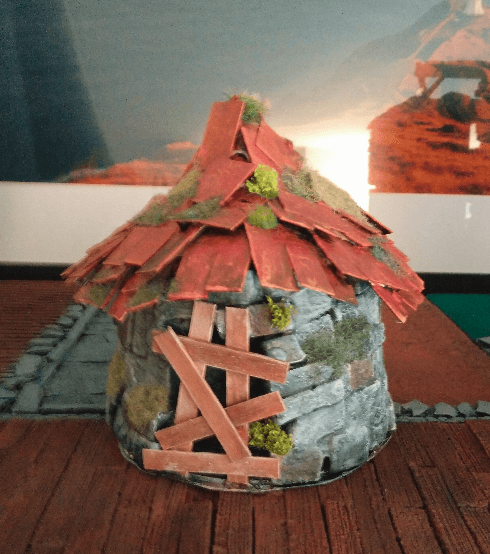

This abandoned shack was made from a Sour Cream plastic packaging.

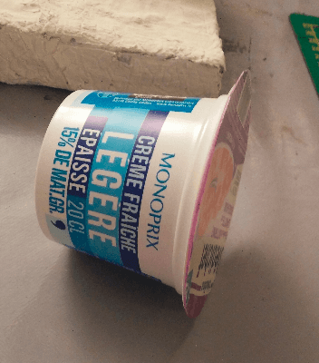

I started by gluing the packaging to a piece of solid plastic, to cover the gaping hole and act as a base.

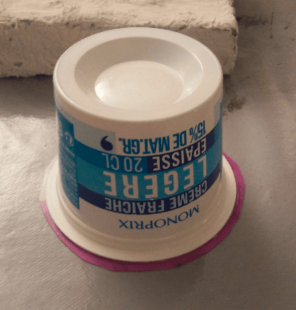

This, is about to become a stone hut in no time.

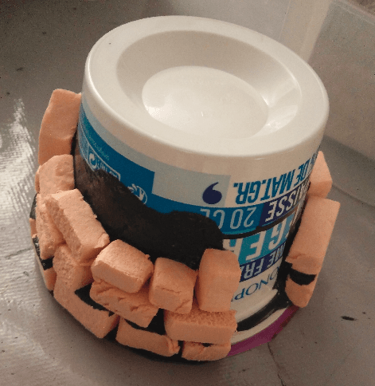

I applied black paint mixed with wood glue on the bottom part, and glued with this mixture all the bricks, layer after layer.

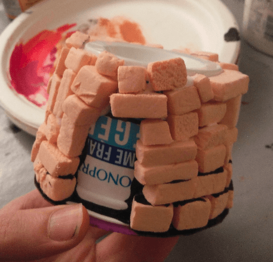

And all the way to the top. I tried to break the monotony of the layers by putting some bricks vertical, forcing me to stack them in a random manner.

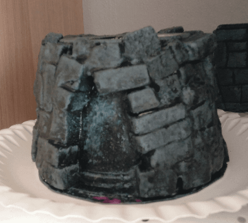

I applied diluted filling paste on it, to fill the small gaps between the bricks and act as some kind of mortar. I think there is potential in this technique, as it make the brick stacking look more realistic, but I might have been too heavy handed on the filling paste at some point because it kinda obscured the actual stones.

I also covered everything with black wood glue again, to act as a basecoat and varnish, and drybrushed this thing gray.

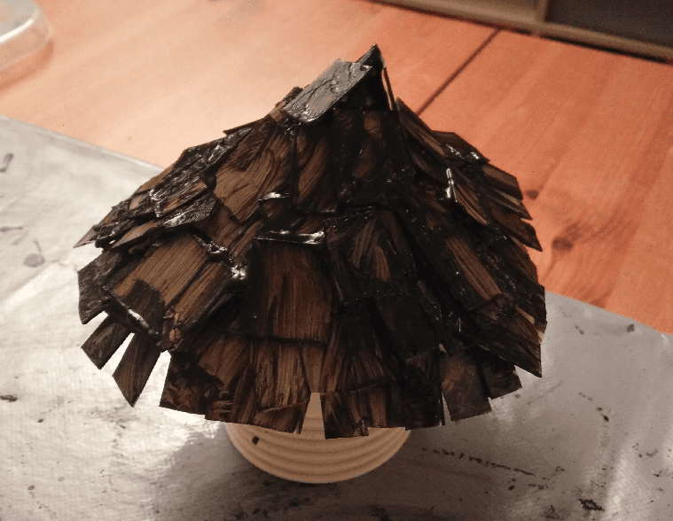

For the roof I made a conical shape out of a sheet of paper, glue squared bits of cardboard and painted it all black (with some mod podge / wood glue added for strength).

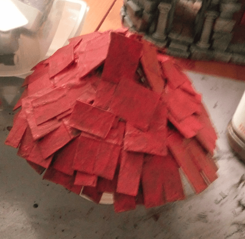

Red first coat.

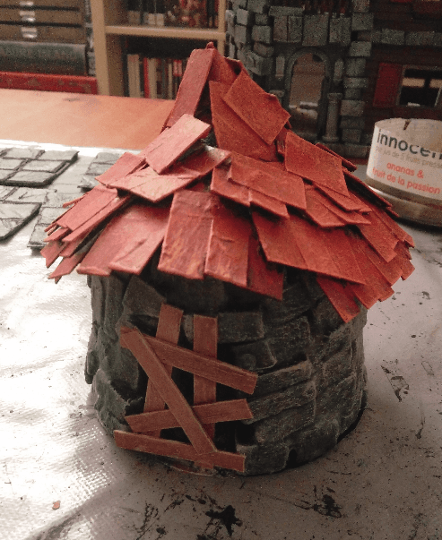

And after a second drybrush of lighter red and orange. I had no idea what to put for the door, so I decided to make this an abandoned shack with some barred door.

The door is made from coffee stirrers painted brown with a tan drybrush.

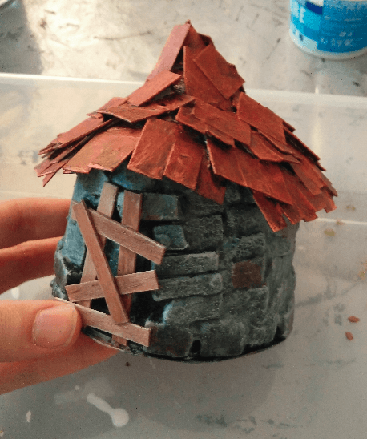

Added some dark colored washes to specific stones for breaking the monotony.

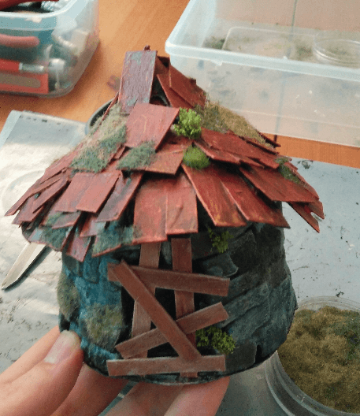

And flocking, to make it look like it has been abandoned for a long time.

And here it stands, finished and ready for the glamor shot.

