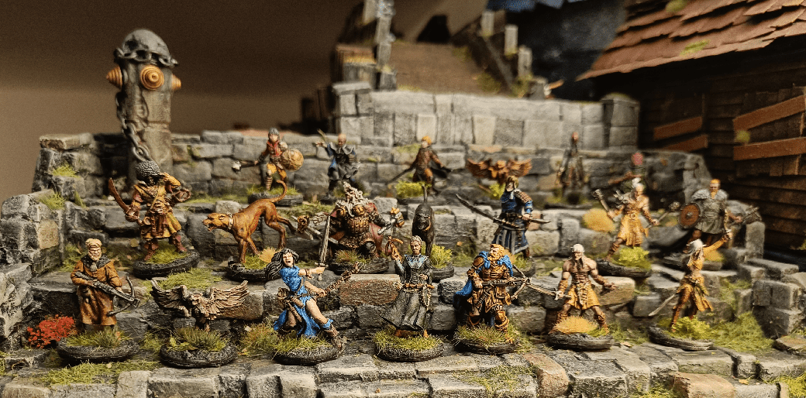

I recently bought the new Army Painter Speed Paint small set, and it has been a revelation to me. Painting miniatures became fun again, I was having a lot of fun doing it. With barely some skills, I was able to quickly pull full groups of creatures with a painting level as good as what I wanted to achieve when I was young. It's really liquid talent, it's like a 3D child coloring book. One coat, and it's looking fine.

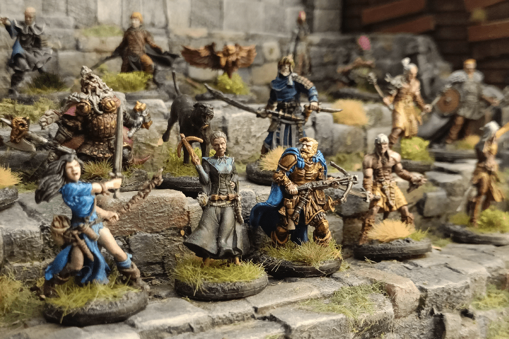

I started with some Zombicide heroes, testing the new colors and the results were fantastic.

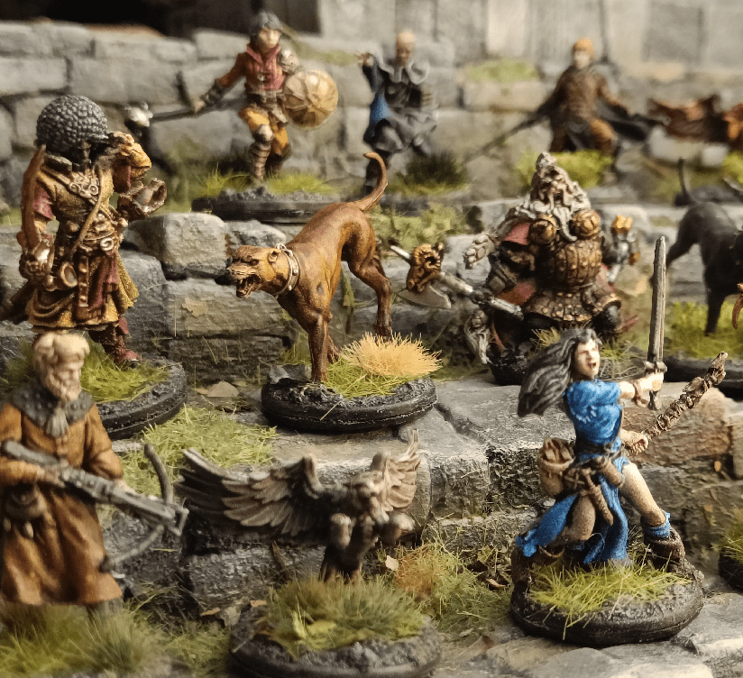

One coat of brown and the whole dog was done.

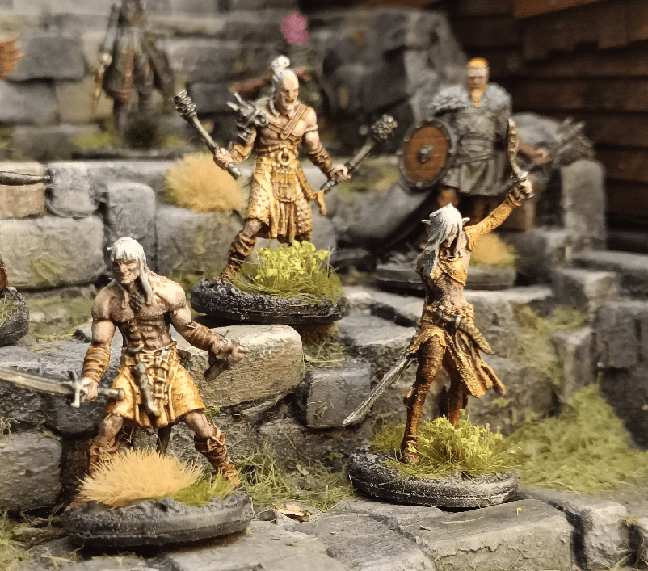

The yellow bottle allowed me to finally paint yellow in one coat with it looking good enough!

Even the more green and purple colors looked great.

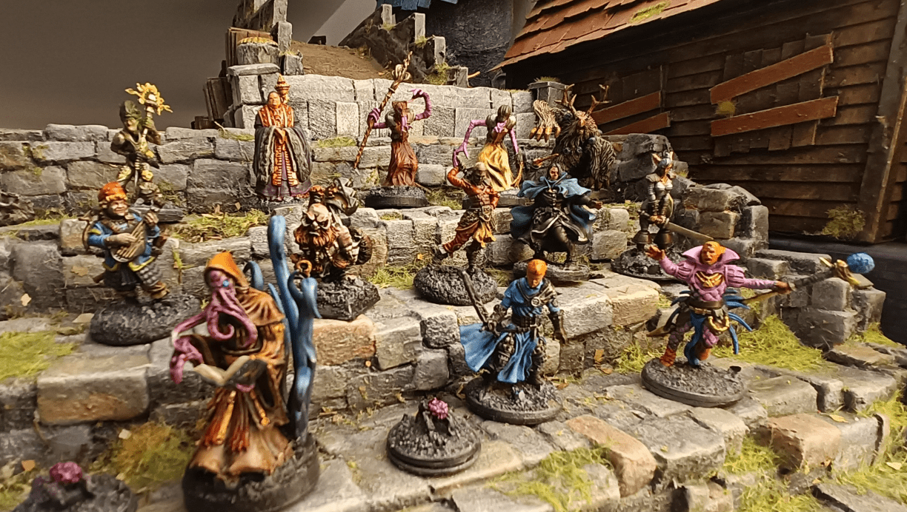

I continued with more miniatures I had, with no real goal, but just to test the paints. This kept getting better.

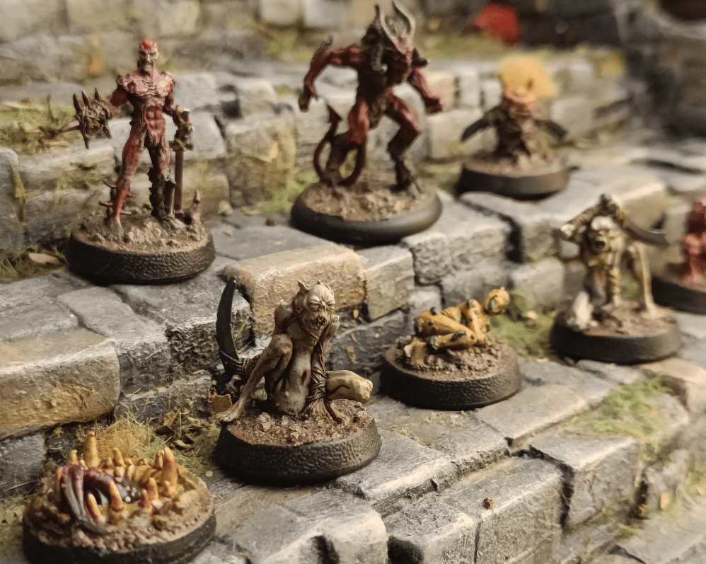

I continued with some Hell Dorado miniatures gifted by a former co-worker; the sculpts are incredible, full of details, and a joy to paint. I would gladly paint more of them, but they are quite expensive.

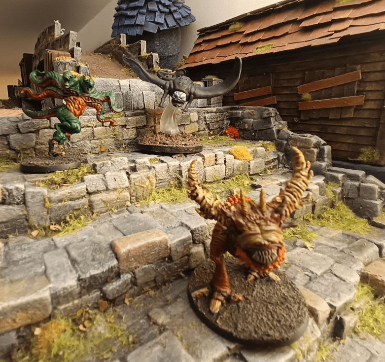

Painting large monsters was so easy. Especially the black part of the Cloaker that would have been a pain to do otherwise.

I went ahead and painted the giants of Zombicide as well.

I continued with the Abominations. Some colors were hit and miss, especially the green on the right (I think it's Orc Skin, but it's way too bright).

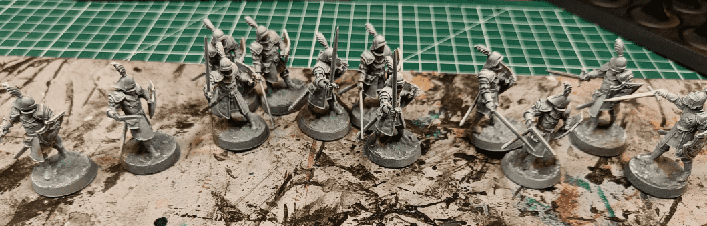

I had been basecoating them in full white initially, but then switch to black basecoat followed by a white drybrush to make the edges more visible.

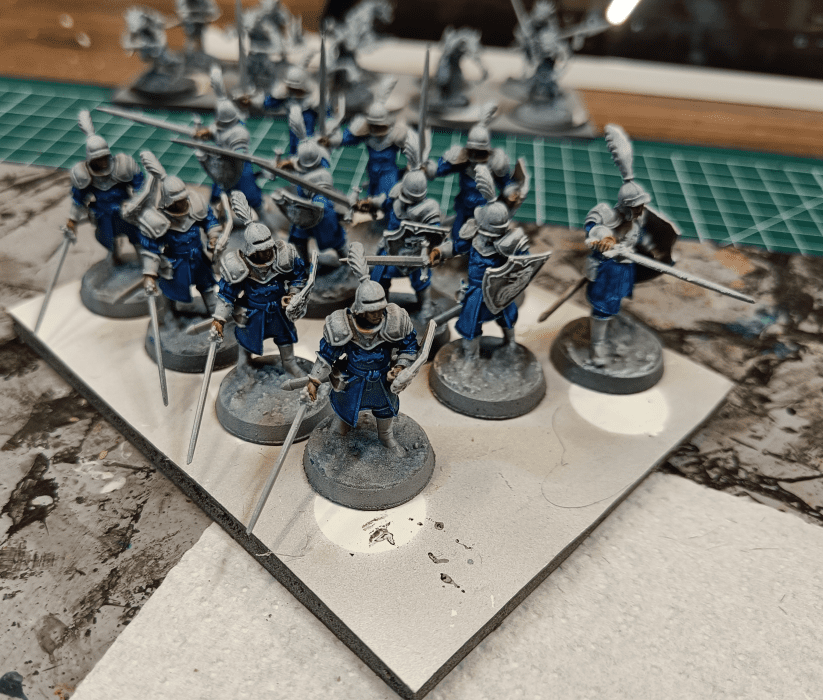

I started with the flesh and the main blue. I didn't bother avoiding the details (like the belt, etc) because I was planning to overwrite them in brown at a later stage.

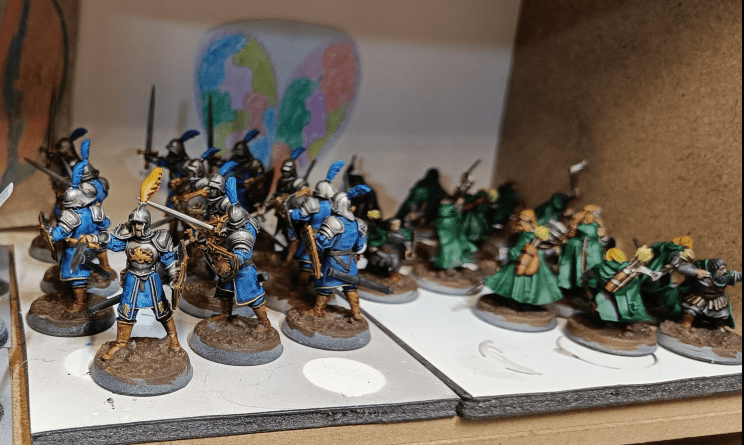

And here they are, waiting for the final stages of basing. On the side also a troup of dwarven ranger.

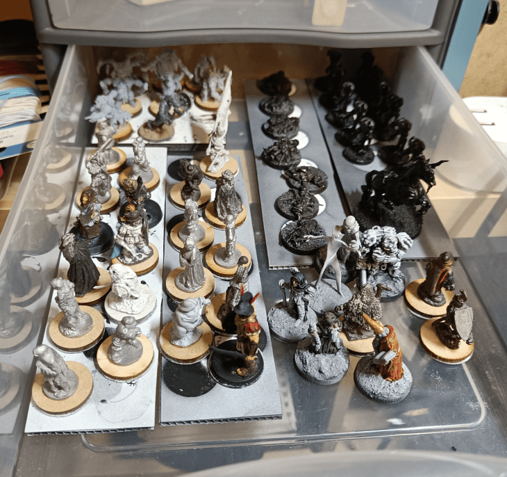

I still have a lot more to paint in my drawer, but with this new paint it's going to go pretty quickly.

Oh, and this is what I use for basing. Sand, small rocks, glue and paint.

I used test miniatures to test the various paints and see what it would look like.

A few more tests. The more I see the results, the more I like it.

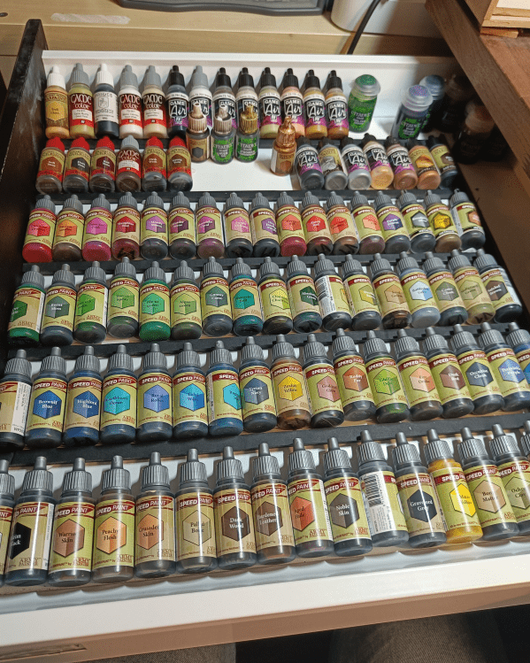

And I finally bought the Speed Paint Mega Set with the whole range of colors!

So I updated my army of little colored mens!

And what better than an undead unicorn to test those new colors?

