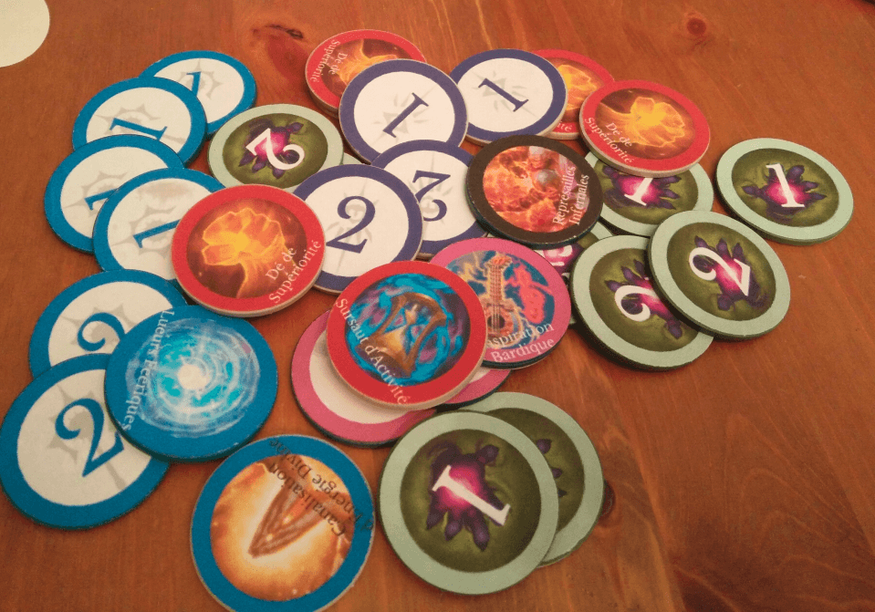
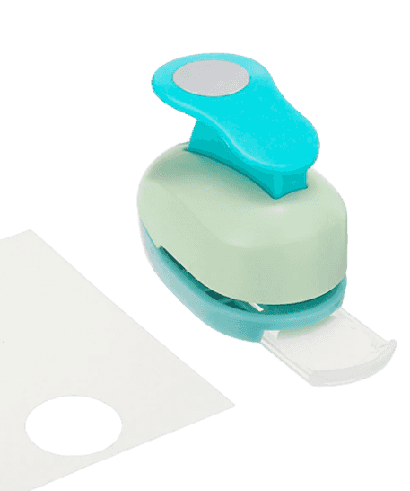

I crafted a bunch of tokens for my players abilities. It's poker chips with round stickers on both sides.

I created round token images in Google Image with artwork found only (mostly icons from video games) and printed them on sticker paper, then cut into a round shape using one of those tools:

We use them for spell slots. Whenever a PC casts a spell, they give me the token and I hand them back on a rest. Same goes for class abilities. I also use some generic ones (the green on the right) myself to keep track of my bad guys spell slots and toss them on the table when I use them. It also gives the player an idea of how low I am on spell slots.