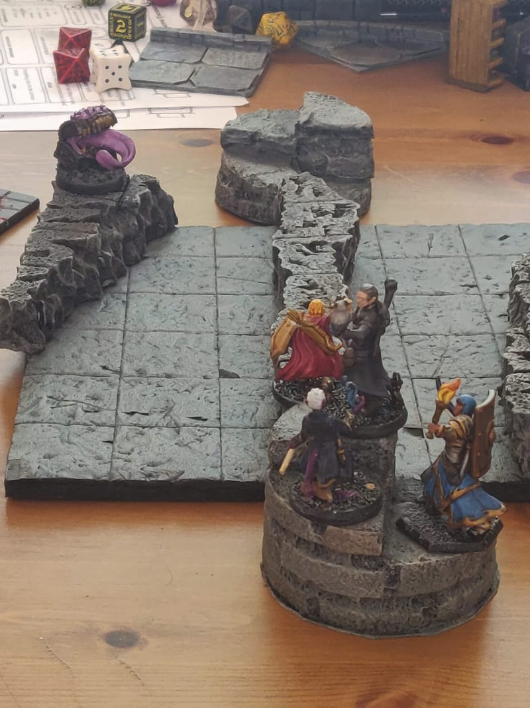
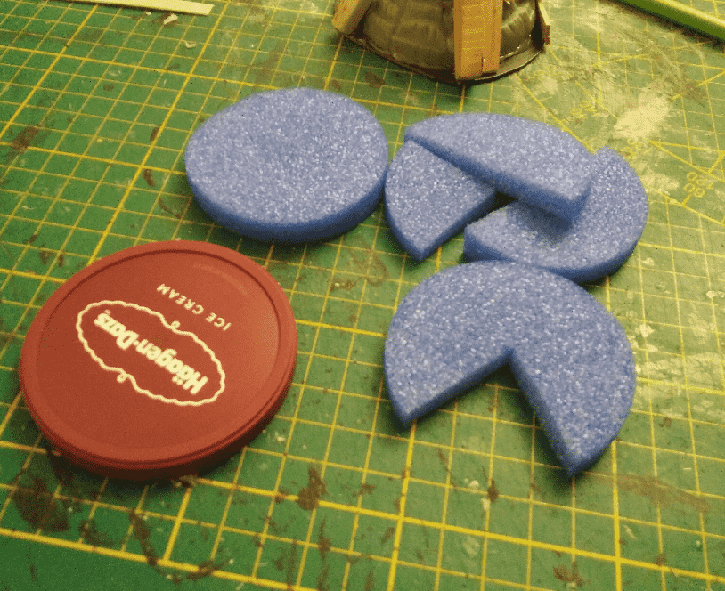
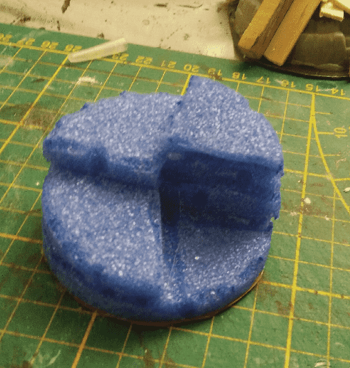
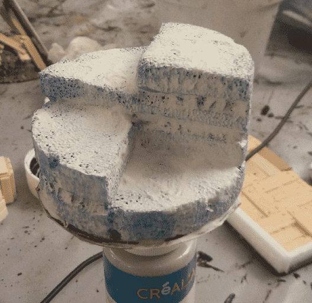
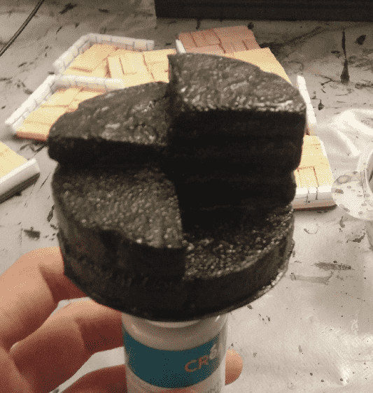
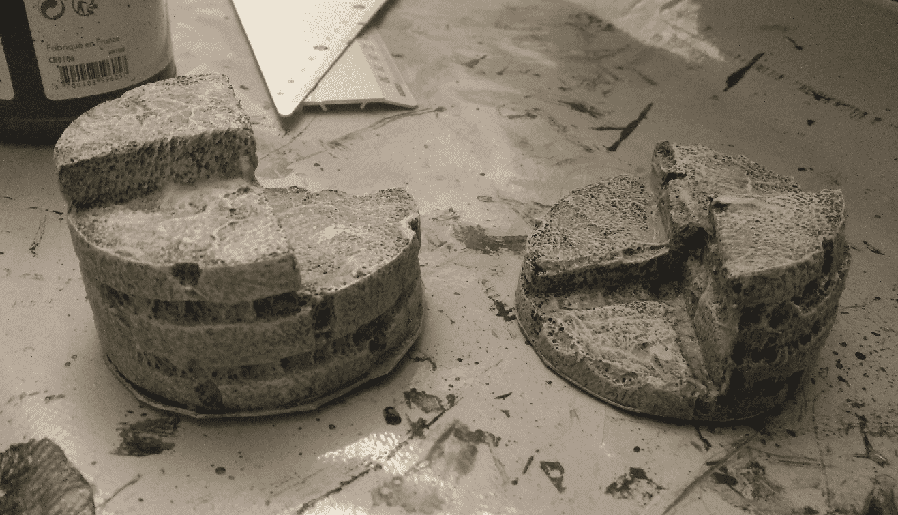

In dungeons, players often have to use spiral staircases to go up one level. Thankfully, this is a simple build.

The base is an ice cream lid, and the stair itself is made out of foam from a swim noodle, cut in slices.

Stacking the slices on top of each other, and adding grooves by melting the foam with the tip of a glue gun.

I added some spackle / wall filler on it, to give it some texture. Without it, the foam would absorb all the paint, and it would also be too soft.

And another coat of black modpodge to further strengthen it.

A simple drybrush, and ready for the table.