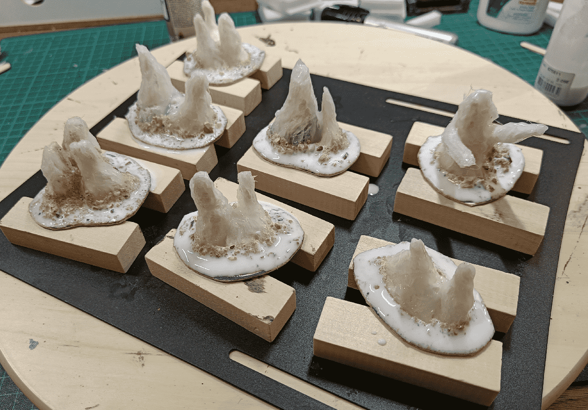

When they took a rest in the underground caverns and got attacked by a Roper, I used some Stalagmites to add some interesting dressing to the scene.

This was my first attempt at crafting them. I think they are a first good attempt (I didn't throw them away), but they can definitely be improved.

The core of it is made of paper towels that I dipped into a mix of water and wood glue, then tried to sculpt into shape. For some of them I even added gravel at the bottom, to give them some weight, but it turned out to be a mistake as the gravel was leaking while I was handling them.

My crafting bench is in my basement, which is slightly damp and so it took forever for them to dry. Honestly, they stayed wet for more than 48h, until I decided to move them outside for faster drying. And they dried in about 4h there.

Finally, I covered them all with a fine layer of glue (from the glue gun), to protect them and give them some texture.

I did the base, with sand and small rocks.

Sealed the bases, with more glue and water.

And started painting.

I wasn't exactly sure what to do with the paint scheme. I didn't want them to be full gray, as it would be to monotonous with all the other gray-only pieces I have. So I went with some kind of brownish red. Still not sure what I should have used.

Just for fun, here is a picture of what my crafting looked like at that time. There was a lot going on, from walls to windows to railings to stalagmites to rocks to props.