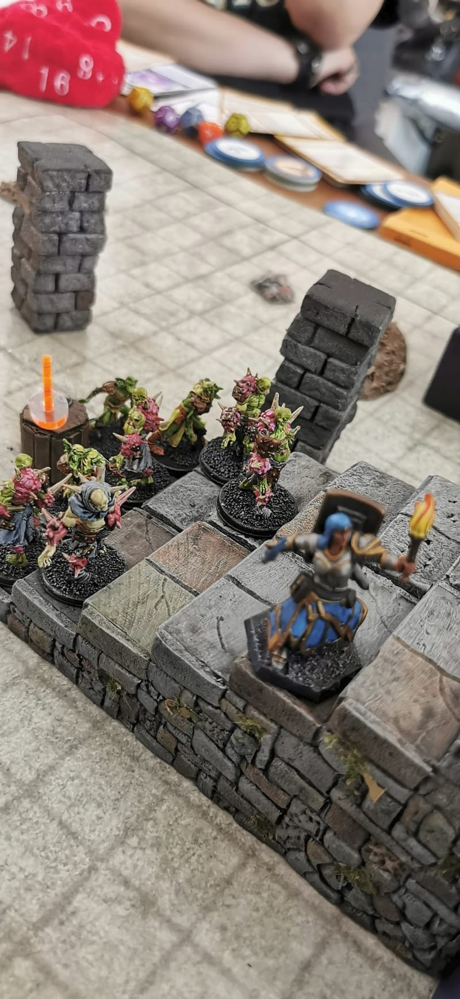

During the final fight, Kyra had to run on a set of stairs to avoid a horde of reanimated zombies. Those stairs turned out to be a great crafting investment, as I have been reusing them in various contexts already.

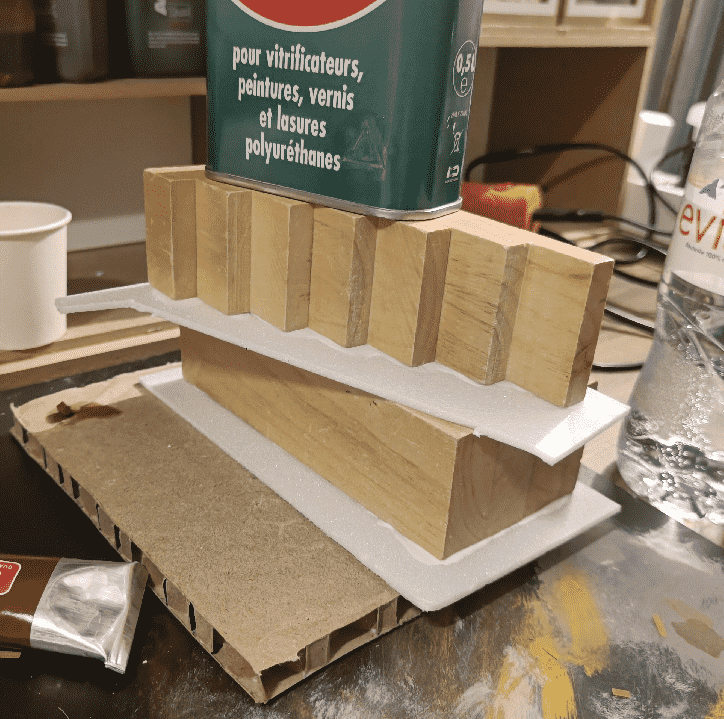

The stairs themselves are coming from a doll house toy I found in a second hand shop, and are made of wood. They are sturdy, well made and I knew they would make a great basis for crafting something more. But the wood itself was too smooth, so I needed a way to make them look more like stone.

I glued on some thin foam layers on the sides. I left it to dry for one night on each side, with something heavy on top.

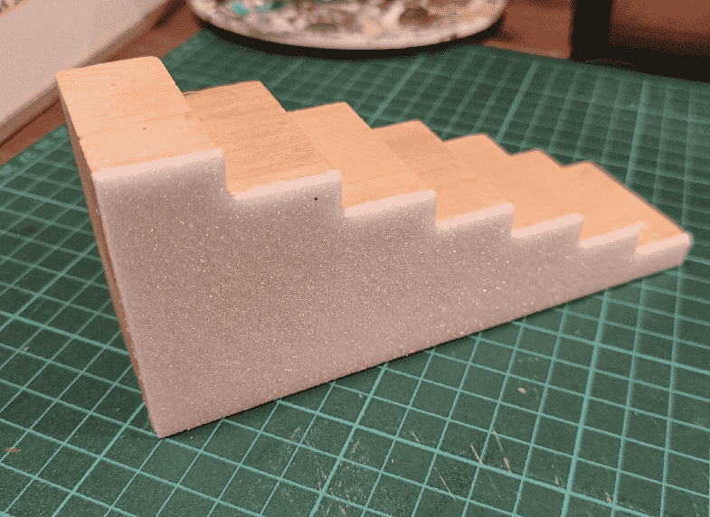

I followed the wood shape to cut the excess foam.

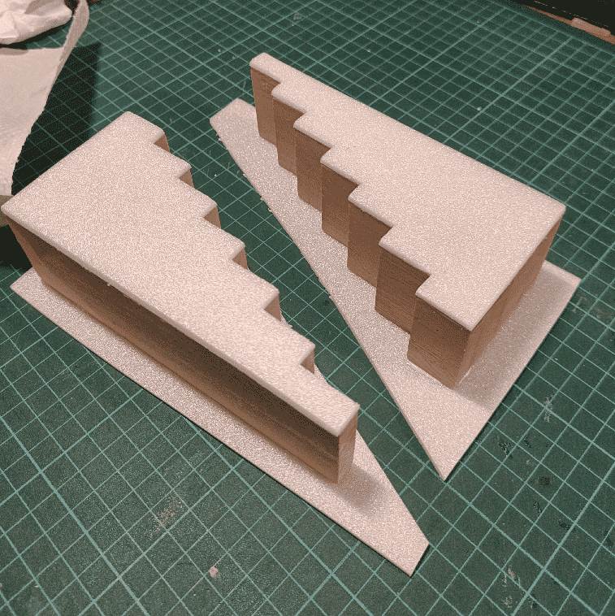

Did the same treatment on the other side.

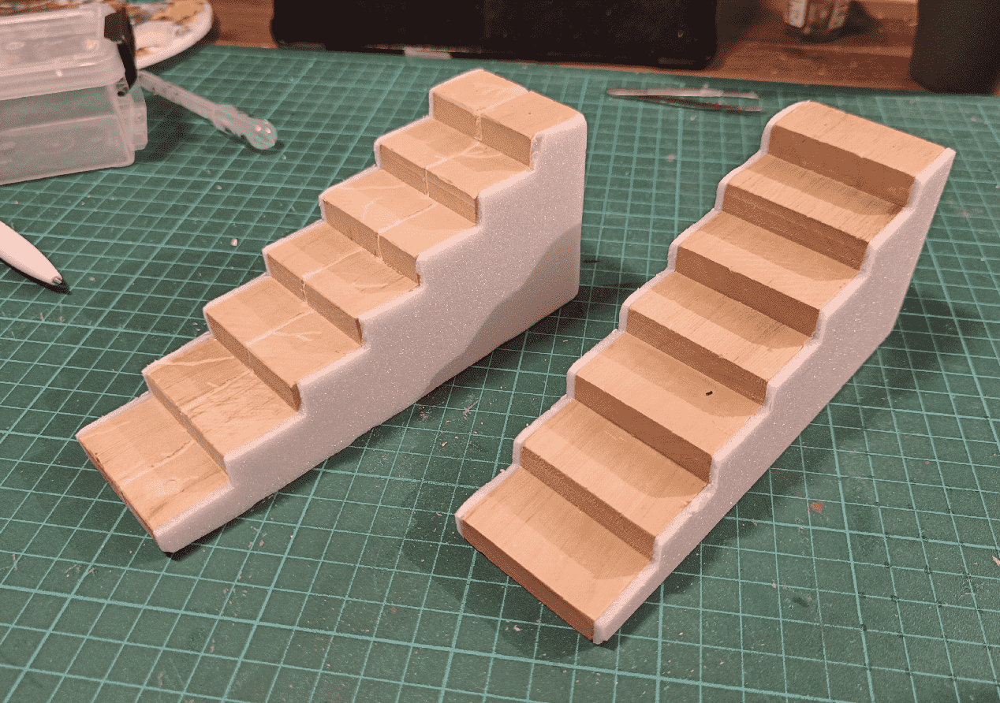

I then used a dremmel tool to split each step in two. I also tried to add some random cracks.

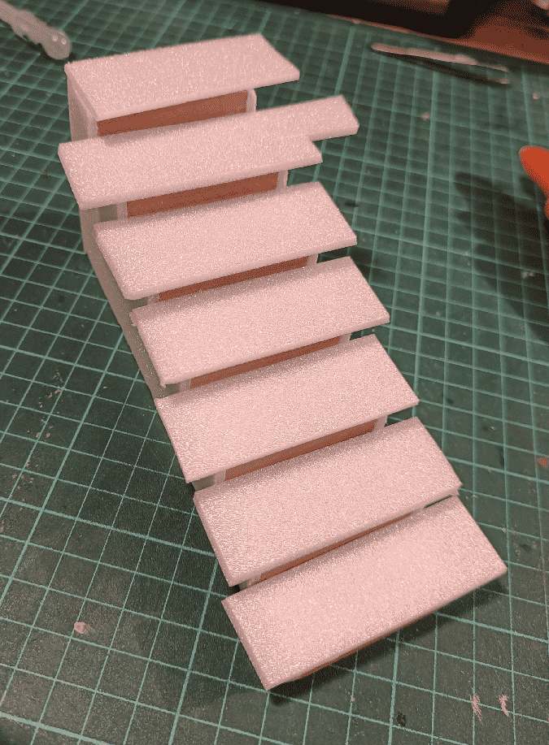

I wasn't very happy with the result of the dremmel on the first stairs, so for the second, I glued some more foam on the steps.

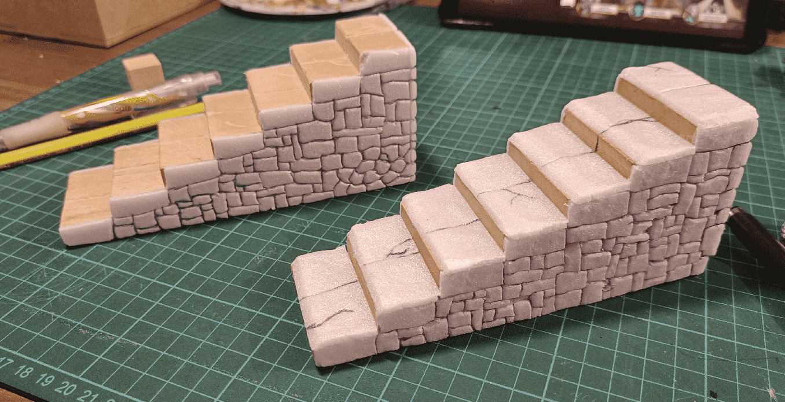

Once cut to shape, I drew on some stone patterns on the side with a pen and a knife.

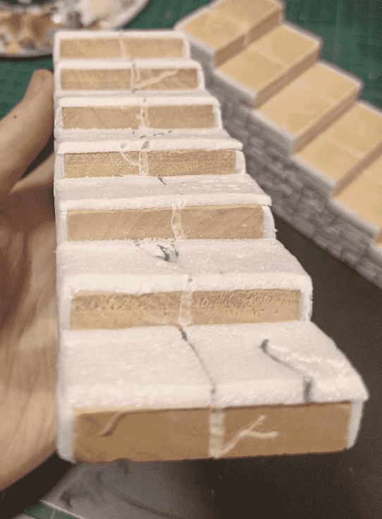

I still used the dremmel to carve a separation in the middle of each vertical step; otherwise it broke the illusion.

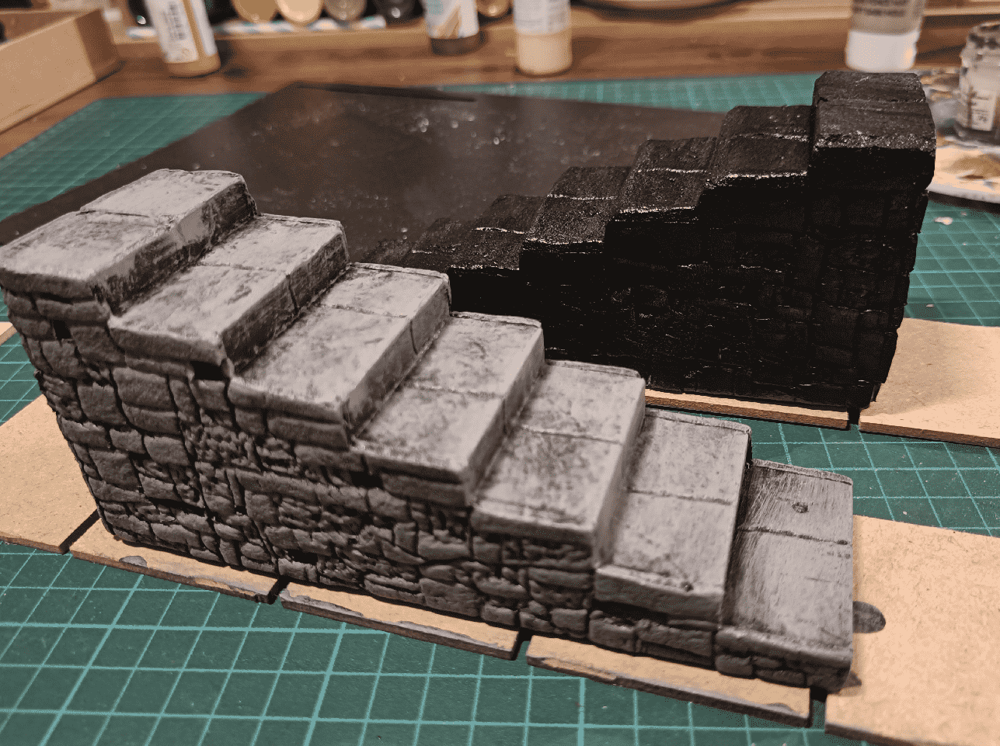

Once painted black, and one with the first drybrush.

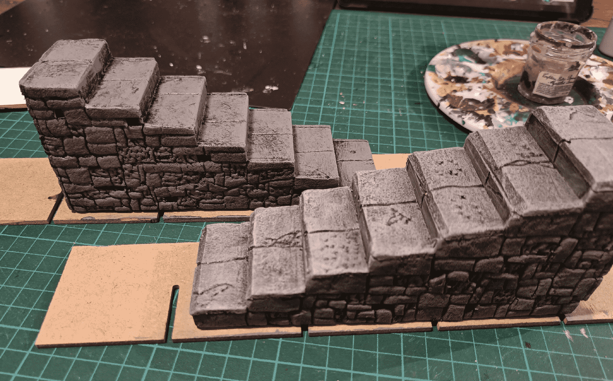

Only one drybrush on the back, and a second lighter on the front. The back one really looks rough, the second drybrush brings it to life.

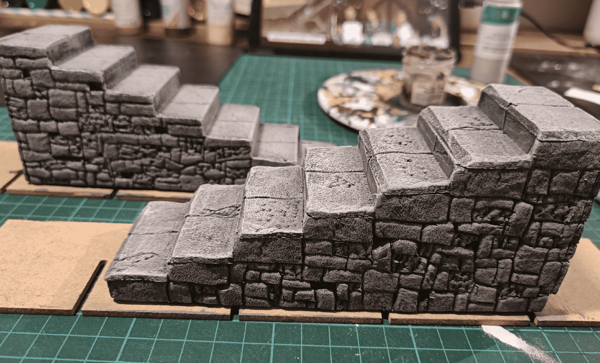

I even did an even lighter drybrush, on the edges here. It makes it pop even more.

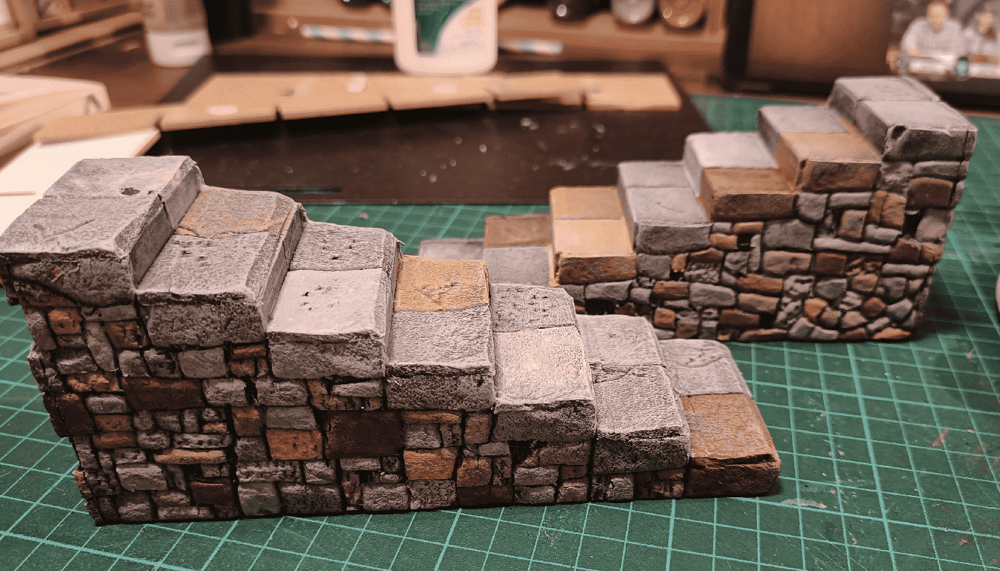

But it was a bit too gray, so I painted individual stones in various earthy colors, using highly diluted paint.

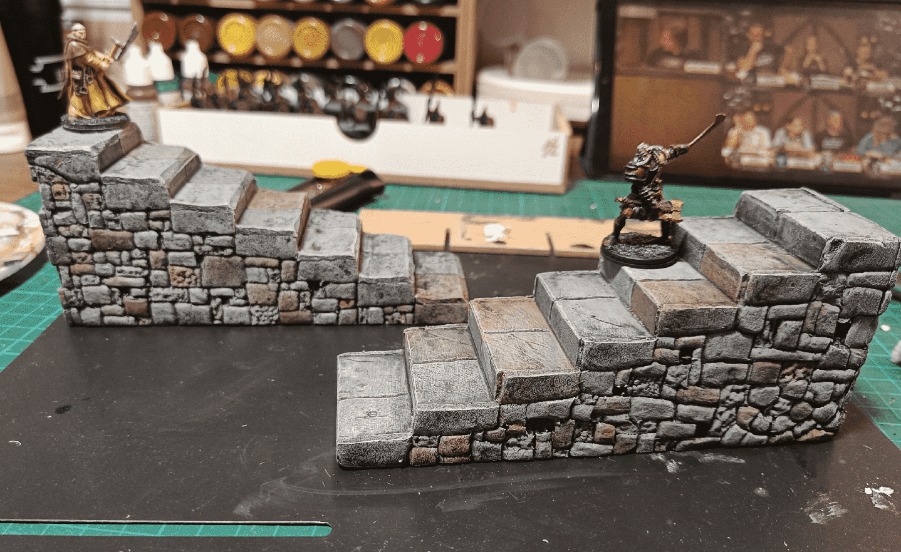

I then added a black wash on top to blend it all together. Last step was to add some flocking on the sides.