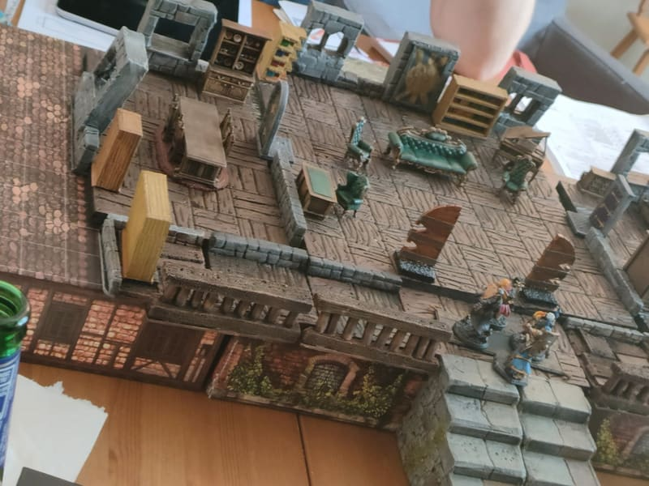
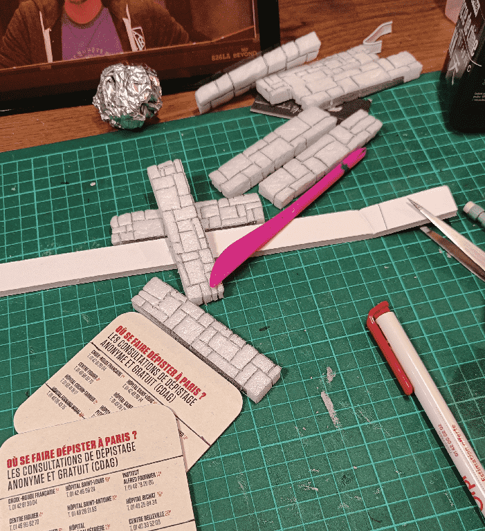
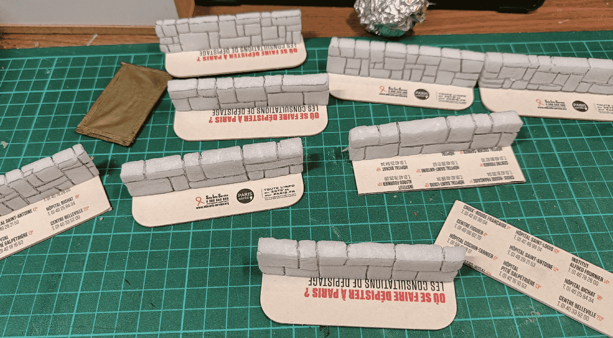
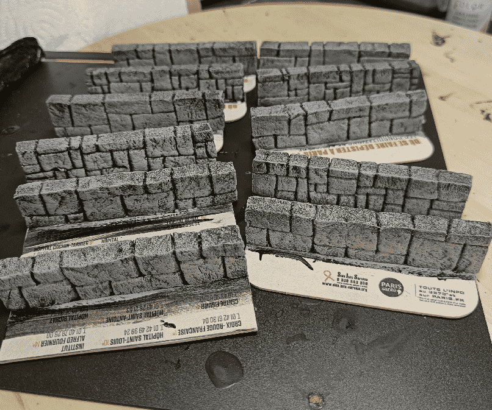
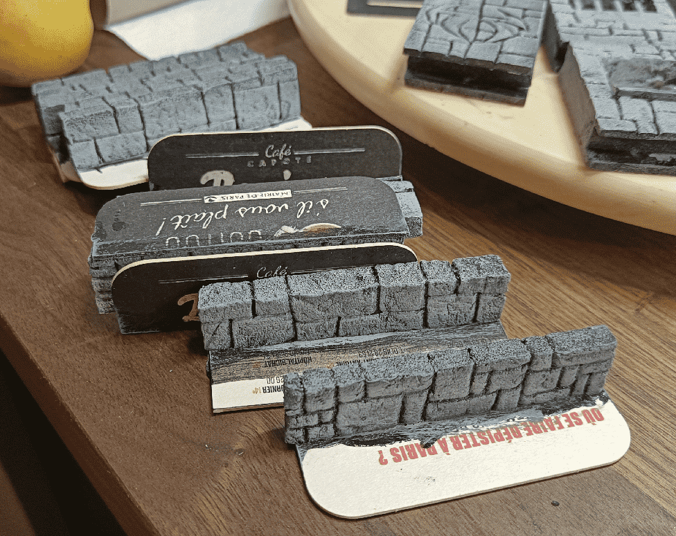
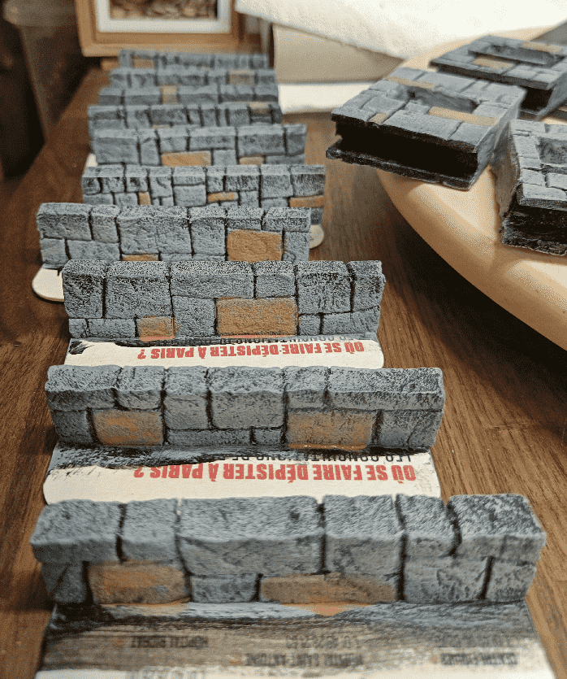
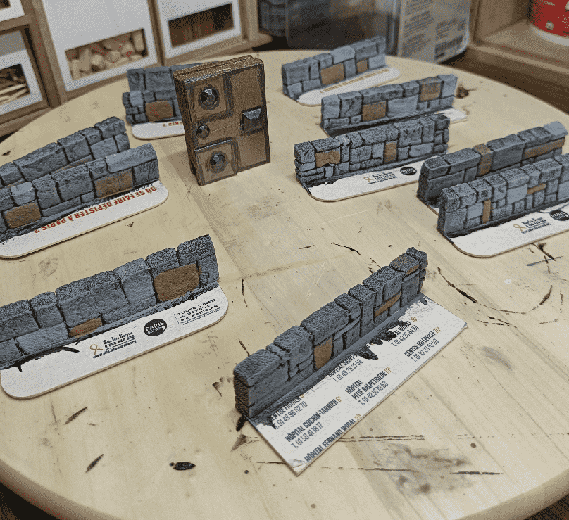

To separate the various rooms, I built some small stone walls. The dungeon tiles already have them included in the tiles, but for the larger rooms I needed a way to symbolize the walls, so I could clip on some more wall features.

I started with some cardboard for the base, and the same foam for the wall itself that I used on the tiles. 

I needed the base to be quite large, for it to stay stable on the table, and also so I could insert it under the larger rooms to stabilize them in place. It means I can't really use them in free form, because they need to be positioned close to a larger room, but they have the perfect size and height for that purpose.

I did a very quick overbrush on them. They are supposed to be almost invisible in play, just to mark thresholds, so I didn't want them to distract from other more important set pieces.

The top part was the hardest to paint, as it is full of small holes and didn't take the paint really well. In the end, adding the brick grooves on the top was enough of a hack to make it look like a real wall.

I also painted two bricks in brown on each side, for variation.

And two others in a much lighter gray.

All of it was finally muted after the final wash.

