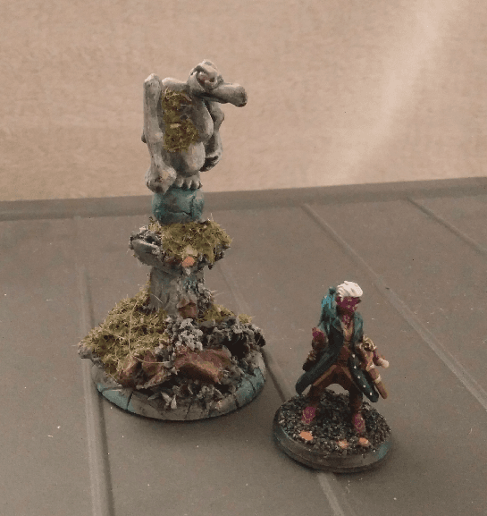
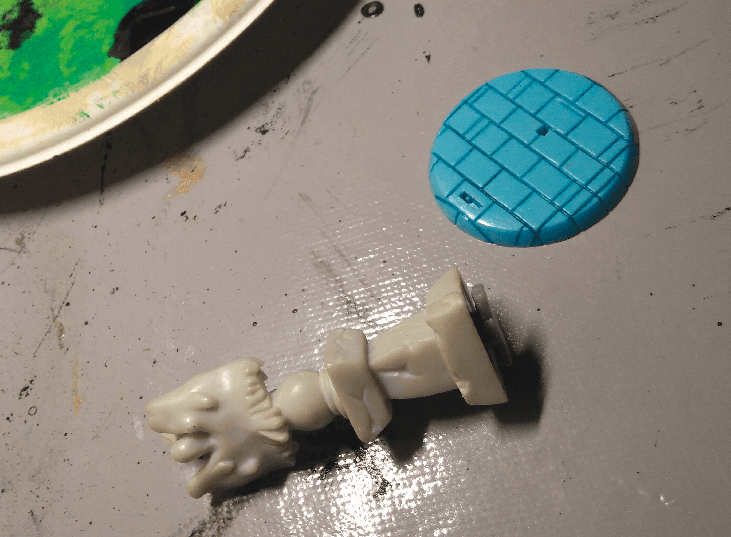
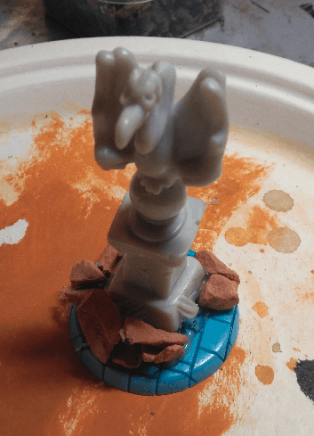
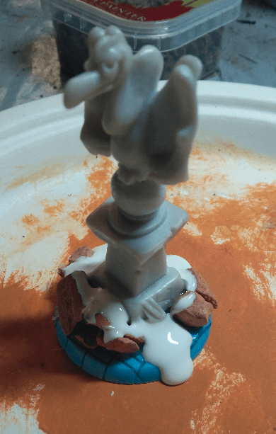
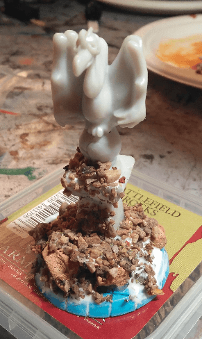
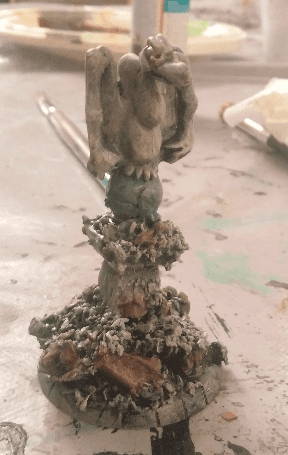
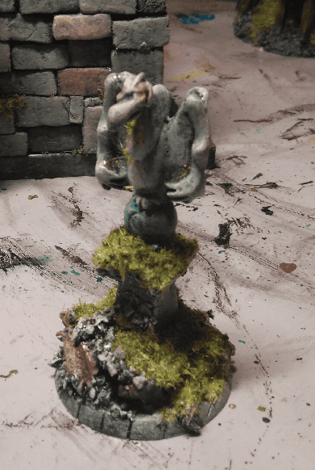
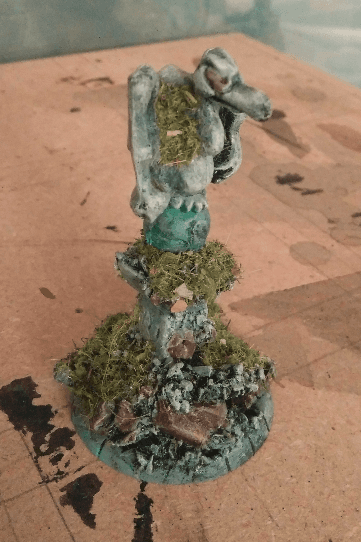

Covered in moss and abandoned, this statue guards the streets of a city that has been deserted for a very long time.

This is tiny piece of scatter terrain that would fit well in a Mordheim-like setting.

As usual on this blog, it started with some second hand toys. The blue base comes from a Pet Shop toy, and the gargoyle itself is taken from an Halloween-themed board game.

I glued one on top of the other and added some rocks to cover the mess I did with the hot glue.

More glue...

And more pebbles, rocks and dirt.

Drybrushed everything gray, then painted a few pieces brown to make it look like rubbles. Also painted the orb green because why not.

With a bit more flocking. I might have been too heavy handed on that one.

I'm happy with the final result. It's durable, made of blocks of plastic. It's stable because the base is large. It's ubiquitous, I can put than on almost any board and it won't look out of place. 