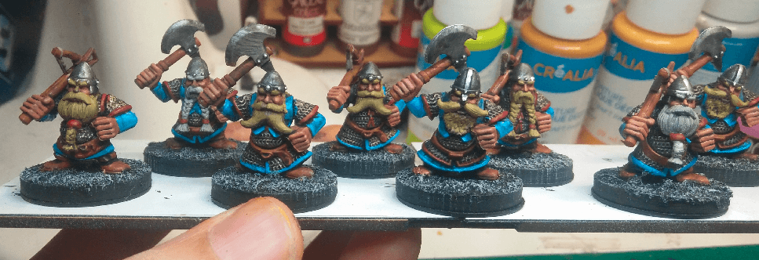
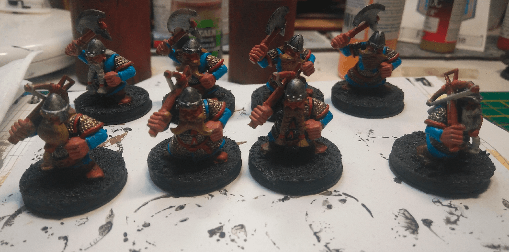
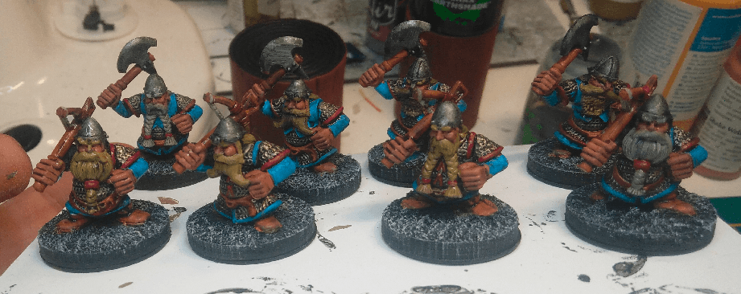
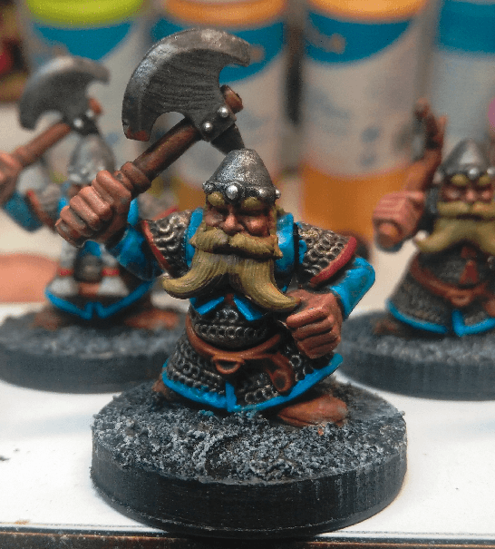
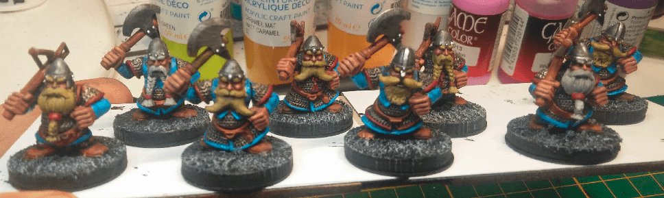

A full garrison of Dwarves from the Stronghand house, supporting the official blue and red colors of their house.

This is after an evening of basecoat.

And after a Nuln Oil wash and some drybrush on the bases.

This is the first time I actually do highlights. It's pretty simple but effective. I just re-apply the basecoat colors on top of the wash, but only on the edges.

The effect is subtle, but I now feel like my miniatures look like the ones I used to see in White Dwarf when I was younger. I feel like I achieved something!