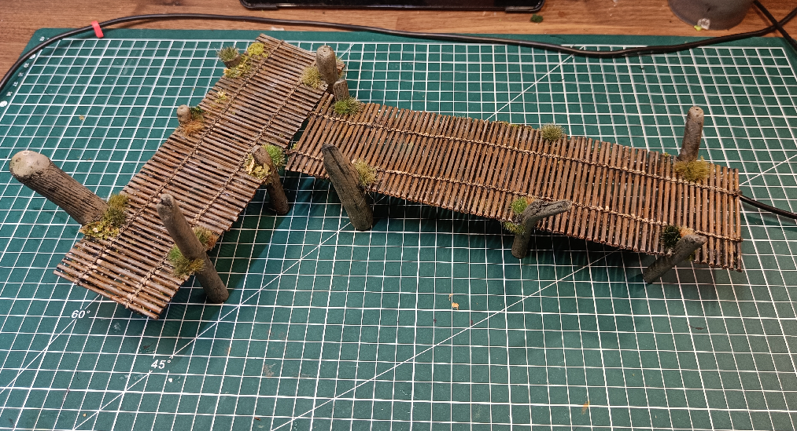
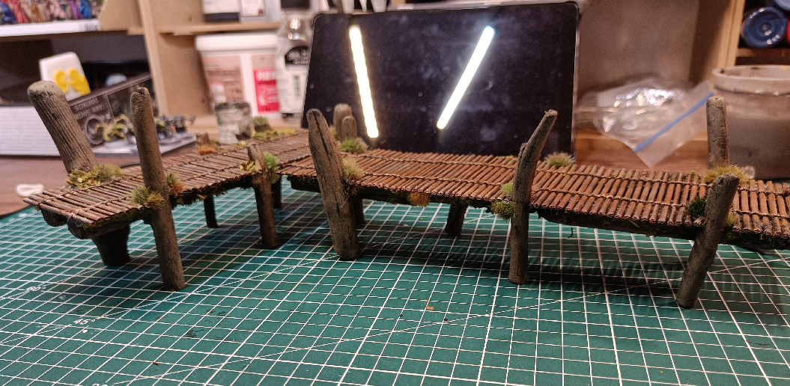
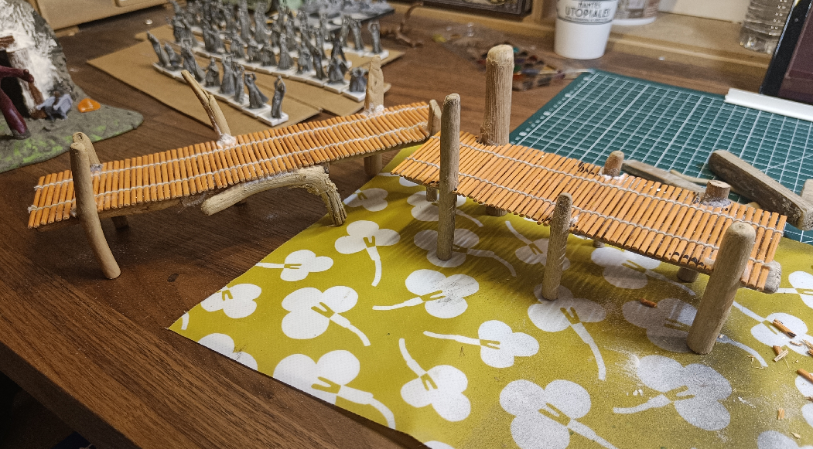
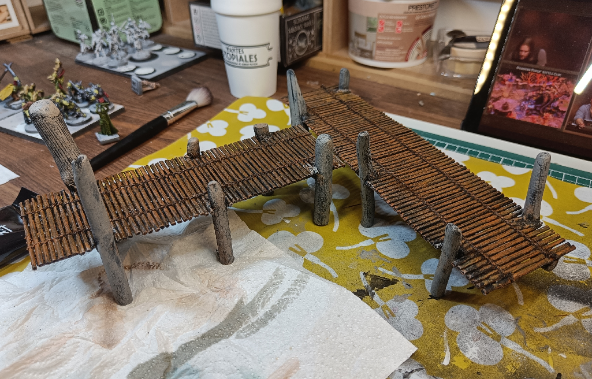
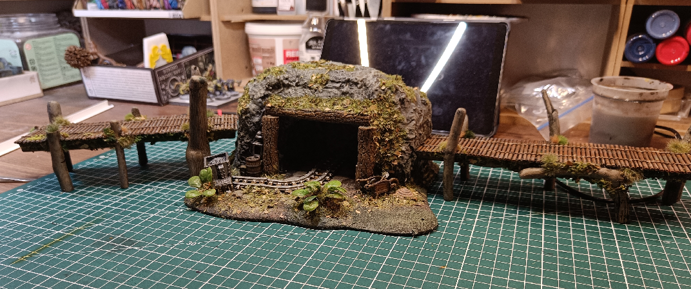

When you're crossing a deep swamp, and you don't want to get your feet wet (or worse), you need bridges.

I initially wanted to build city docks, but it actually turned out more like what you would find in a swamp.

I all started with some old table sets. They were made of tiny twigs weaved together. I cut them in vertical stripes, keeping the rope part visible. I then had to apply **a lot** of glue behind them to prevent them from falling apart now that​ I had broken them. Thankfully it's hidden below the bridges so you can't see it.

The pillars are made from decorative driftwood, and also heavily glued to the rest.

I painted the floors and the pillars in slightly different tones so it didn't only look like a brown mess.

And here it is, next to another creation. The scale is good enough that it can also probably be used in a forested bandit camp.