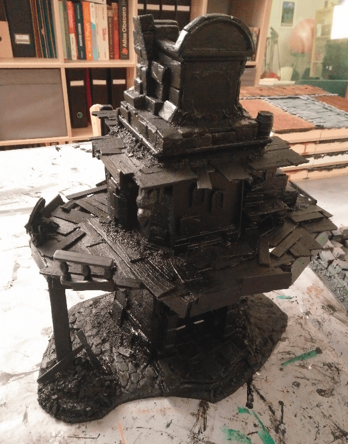

This is the abandoned Tarnopol Clocktower, currently occupied by a band of street urchins. And this was made from a second hand Titeuf boardgame.

The original inspiration come from this drawing from "Mariemburg: Sold Down the River", a Warhammer Fantasy Roleplay supplement. It represents the Tarnopol Clocktower, and abandoned building now occupied by a clan of street urchins.

## Structure

The build starts with this tower. I bought this in a second hand shop. It was part of a [Titeuf board game](https://www.amazon.fr/Lansay-75020-Soci%C3%A9t%C3%A9-Titeuf-LEcole/dp/B0050CFKQW). I threw away all the other cardboards pieces of the game, and only kept this main element. For 1€, it makes a great foundation for any craft.

You can see another similar tower in the background, from another game. I haven't started working on that one yet.

First step is top open the thing to remove all the moving parts. This will make the build lighter and prevent it from making too much noise when moved around. I also glued the door in place with wood glue.

I cut a base from a hard piece of cardboard, and glued it on it. I also started to cover the first level with wood planks, and glued some larger wooden sticks horizontally to look like beams.

More beam scaffolding on the back, to use as a base for more wood planks, to have the first level go all around the tower.

I also cut the small plastic wall next to the stairs, to give them a better 3d look.

I then started working on the support beams. They don't actually support anything, they are just glued together to make it look like they're supporting the first floor.

On the right I used a piece of foam (I intend to cover it with rubble later), and on the left some tree bark. I also recycled a Pet Shop toy part for the door steps.

I added a bit more details, by covering the front face of the planks. I picked some junk in my bits box to add a broken table, a barrel and some doors here and there. I also added planks on the second floor.

Better view of the kind of details I added.

On the back I added a sofa and chair (I had them from the Mantic Crate second Kickstarter) to make it look like this place is inhabited by vagrants.

## Adding texture

I then added some foam on the flat faces to give the illusion of a stone structure. For the most part, I put them where they could cover the holes in the plastic. I added two window on the central "blackboard" to cover such holes, and placed them slightly at an angle to make it look like there is a staircase behind.

I also added bricks at the top, and an old desk on the first level. The main idea with the desk was to cover the ugly flat wall behind it, but it also adds to the idea that people are living here and gathering all kind of weird stuff they find nearby.

I kept adding more foam slabs here and there to cover all the flat area. I added a door as well, to break the monotony of this flat wall and give an access to the first floor.

Mostly the job here was to glue bits of stuff here and there to forget it was flat plastic.

Then I started working on the cobblestones. Those are ripped from a thin foam board using only my nails. This give them an irregular shape, and I only had to apply a layer of glue on the floor, and then push them on.

I added a gargoyle from a Marvel toy, as an easter egg.

Covered the whole top.

I added more stone slabs on the floor because there was too many holes and "Pet Shop" engraving on it. I also added bricks on the side to smoothen the transition between the building and the stairs. I even added more bricks around the door to hide the sloppy traces of glue behind.

I then covered the floor with filling paste mixed. I applied it with a brush heavily loaded with water. This allowed me to push the paste in the crevices but still keep the cobblestones visible.

I also dabbed my brush full of filling paste on the walls to give them some texture. A bit went on the couch and door as well, but I didn't care much, it would just add to the old look of it.

With the foam slabs and texture on the wall, the back wall look much better than the flat surface it used to be now.

And one more full shot.

## Rubbles

Now it is time to add the gravel and rubbles. I added a lot of wood glue, then sprinkles on various sizes of sand and small rocks. I started with the largest ones, then added smaller and smaller ones. I threw in a few broken planks in there for good measure as well.

I did the same on the upper levels as well, mostly to cover the seams where the plastic wall and wooden floor met.

## Painting

Now it's time to paint.

I had to do two coats of my initial black mod podge mixture because I mixed black ink in it instead of black paint, and it made a very liquid final mix, which didn't cover much. This picture is made after the first coat.

And after a second coat. Now we can get to the painting part.

Note that I put some masking tape on the actual clock. I intend to keep the original picture there, so I will remove the masking tape at the very end, once everything is painted.

I started with a first overbrush of dark brown on the wooden areas.

While drying, I did a dark gray overbrush on the stone areas.

Then a red one on the cobblestone. I didn't want the cobblestones to be gray, as I thought it would look too much similar to the actual building. I went with red hoping that the following drybrushes and washes would turn the color into a more natural stone color.

I then worked on brighter and brighter drybrush of the wood and stone. The various layer gave some more depth to both parts.

I applied a wash on everything, to further dark the recesses. At this point I wasn't really happy with the cobblestones as they looked too much like fire or lava to me.

Still, I went on adding more details to the build. Painting individual stones with heavily washed colors (gray and red), to further break the all-gray monotony.

I added some rough highlights on the door, painting each upper part of the panels in a brighter brown.

I finally heavily drybrushed the cobblestones with tan, to tone the red down, and it gave the initial effect I was looking for.

I added on more small details, like some candles or a forgotten purse.

I painted the couch and adding a bit more details.

I even added a forgotten teddy bear at the bottom of the tower, to keep in the theme of the tower being inhabited by orphaned street urchins.

## Flocking

I had a lot of fun with flocking. What I initially imagined as an urban building, actually became much more rural once I started adding green vegetation to it.

I used a mix of static grass, cooking herbs (this build smells soooo good) and grass tufts.

Flocking was used mostly to cover all the bits where seams were too visible.

To really seal the flocking in place (so it won't put tiny fibers of static grass everywhere whenever I use it), I coated everything with a mix of wood glue and water. This made everything more durable but had the side effect of really flattening all the static grass, that now look much more like mushy moss. I might buy another type of flocking (made from foam) next time.

More glamor shots for you to enjoy.

And with a mini for scale.

Yeah, this is the "grass flattening" effect I was talking about.

Front porch. Here the sealing glue is still wet, which is why you see this white paste in the flocking.

I finally let it dry on my balcony, with natural sunlight.

