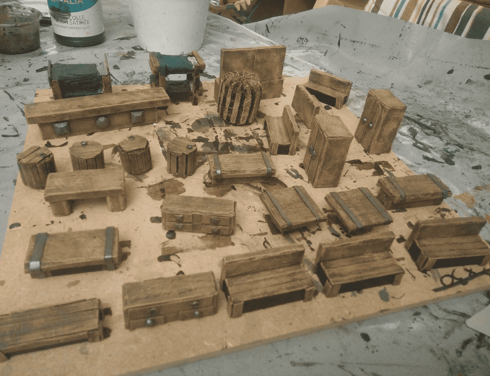

Sometimes I need to quickly furnish a room with some dressing to give it some character. Most dungeon lairs have a bit of furniture, especially if they are inhabited by humans. So I decided to craft a bunch of stuff that could work either in a tavern (PCs always visit taverns at some point), or any bandit lair.

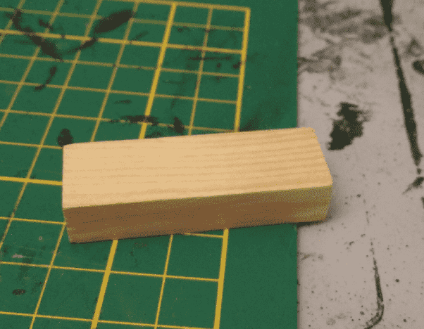

Most of the above props are crafted from this simple Kapla-like piece of wood.

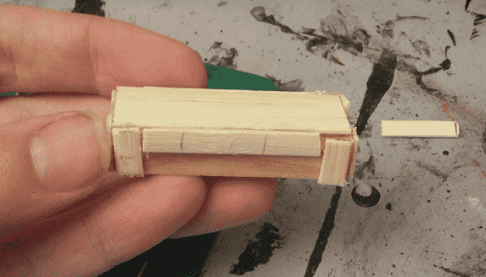

Add some bamboo sticks and you can simulate a table.

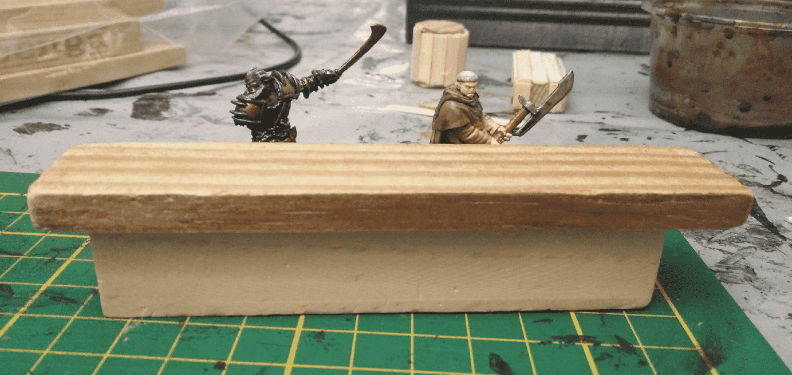

Stack a few and you can have a bar.

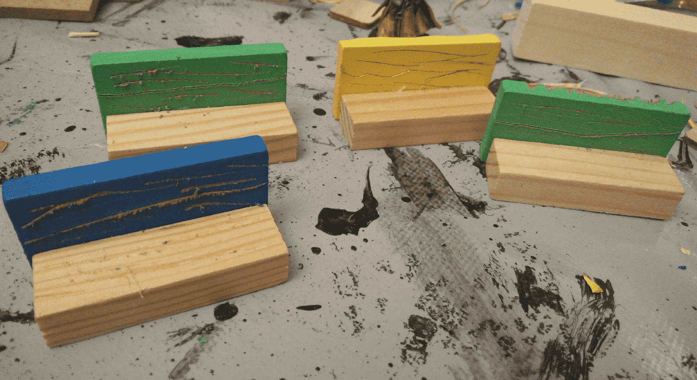

Glue some together for some benches.

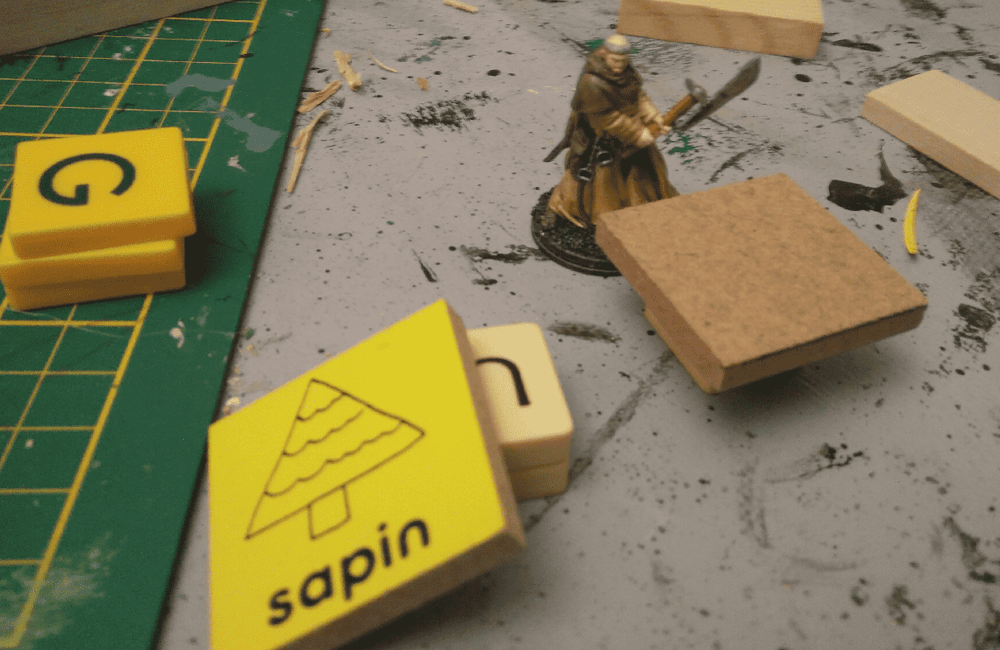

Add in some scrabble pieces and other wooden parts for tables.

Decorate some rounded ones with more bamboo sticks for barrels.

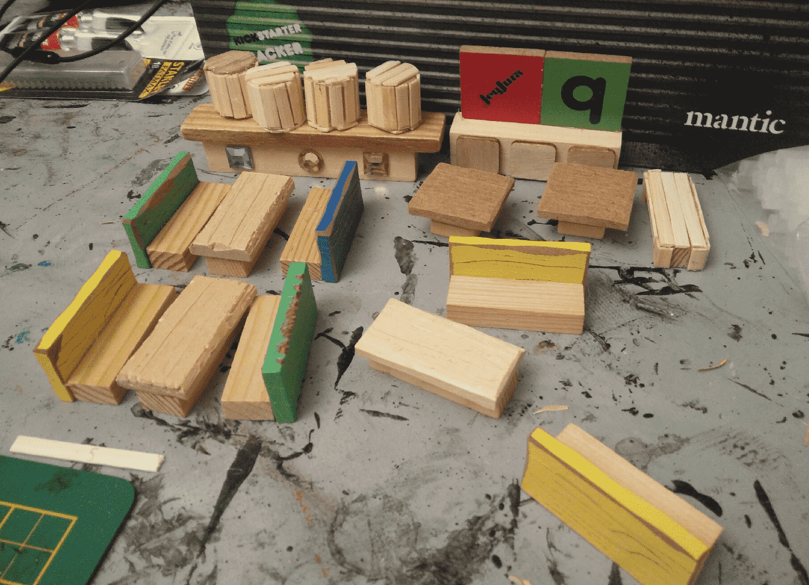

And soon, you have a pretty decent tavern set.

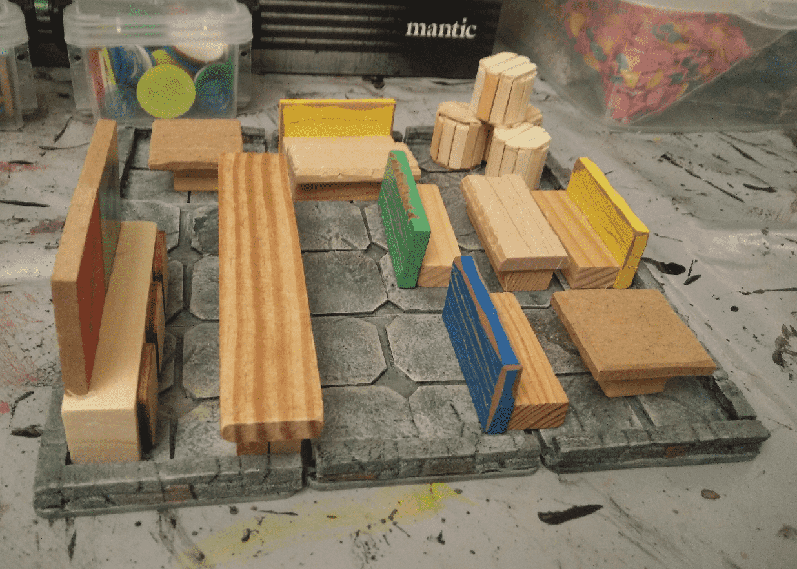

Once displayed on dungeon tiles, it does look like a tavern. A bit crowded, though.

I tried to create a mirror effect by applying a lot of glue on the frame, hoping it would create some shiny surface (spoiler: didn't work).

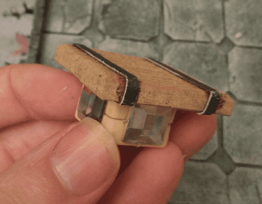

I "decorated" the tables by adding strips of cardboard on top to simulate metal bardings, and square plastic jewels to add some decoration and hide the underlying Scrabble material.

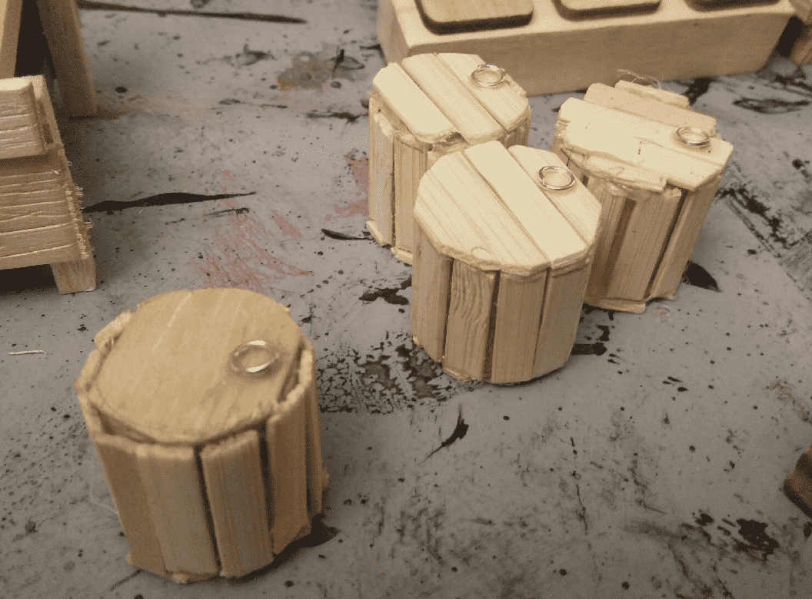

I added small jewelery rings on the barrels.

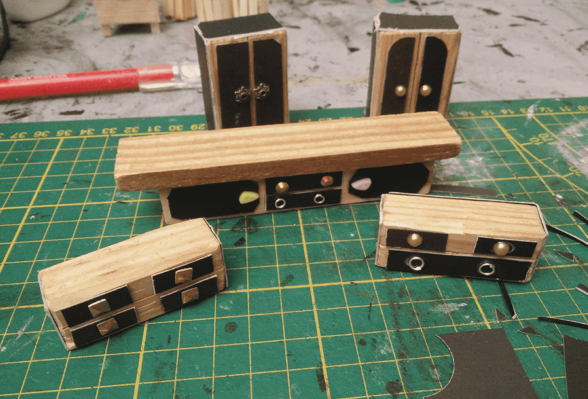

I also went on decorating more of the sticks with carboard and fake jewels to create wardrobes and cupboards.

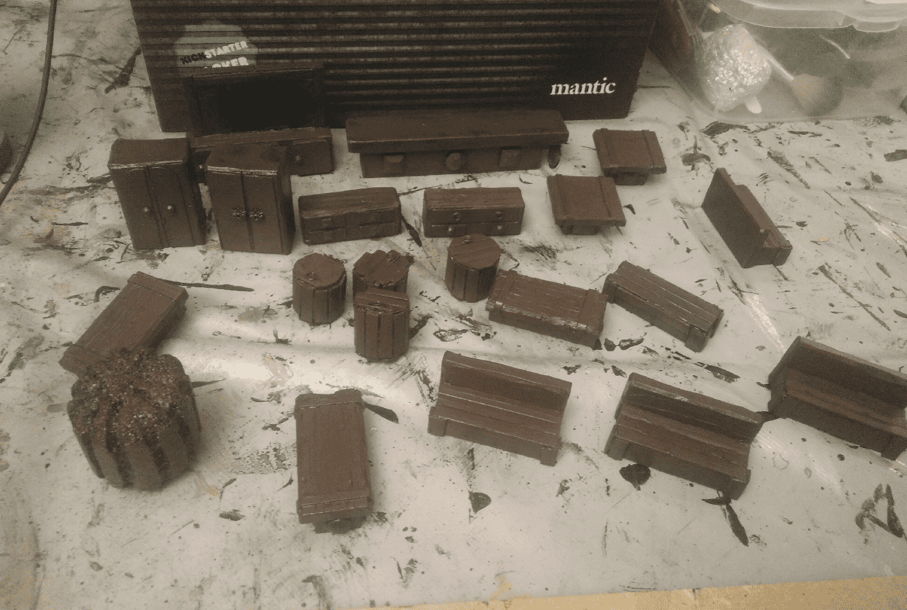

The a heavy brown overbrush.

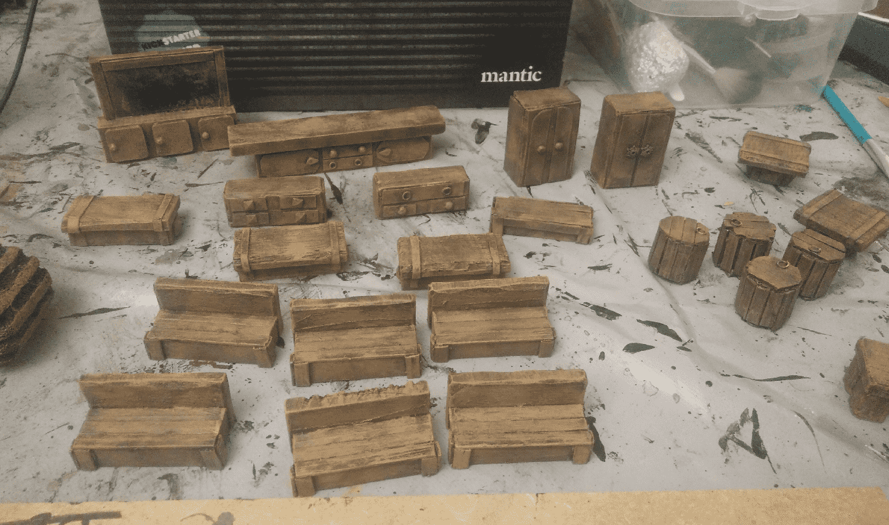

Lighter drybrush to give it some wood aspect.

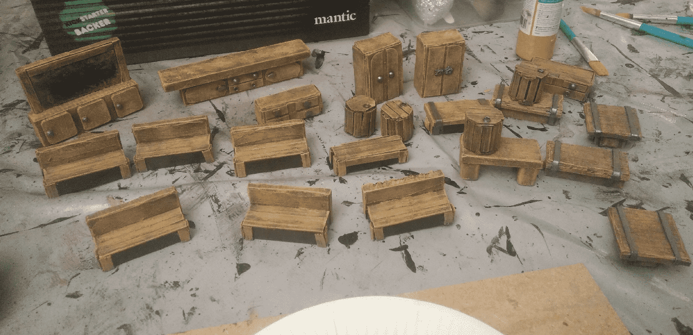

Painting the metal details and the underneath of the benches black.

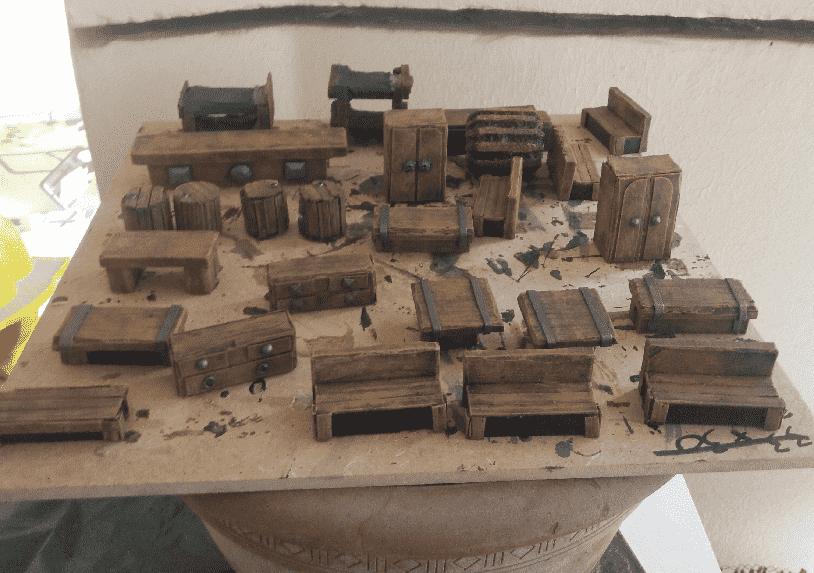

And a final black wash to darken the wood.

This was a very satisfying craft. It only required simple tools and materials. The main ingredients are wooden pieces (that you can easily find in second hand shops, from games like kapla or jenga). You add in a bit of cardboard for details, and fake jewels for relief. Black, brown, lighter brown and silver for the paint, and a black wash.

The resulting pieces are sturdy; you can through them in a bag and they will not break, and immediately convey the atmosphere you're looking for.