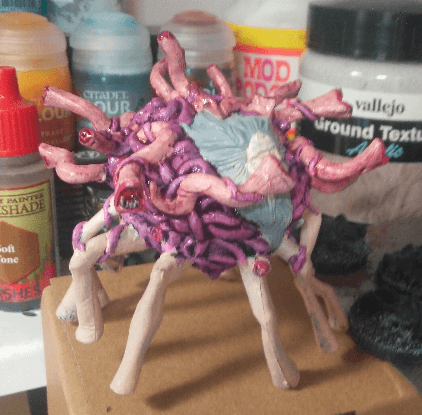

I had this mini on my table for a long time. The sculpt of it makes it hard to paint. You cannot attach it to a base or you won't be able to access the underneath, so you have to manipulate it while painting, and wait for the paint/washes to dry on one side before doing the other side.

Here you can see the top part drying after a red wash.