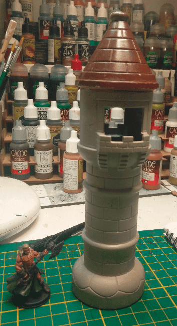
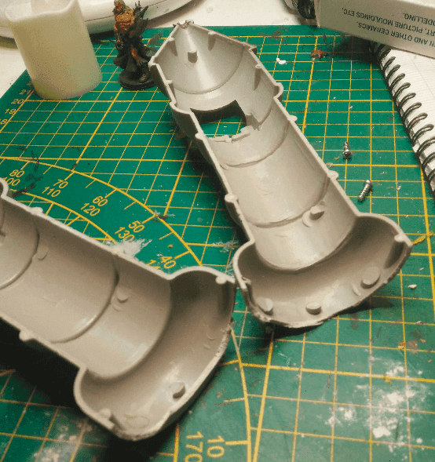
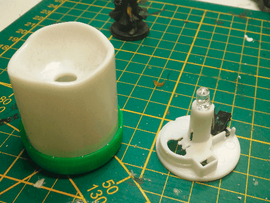
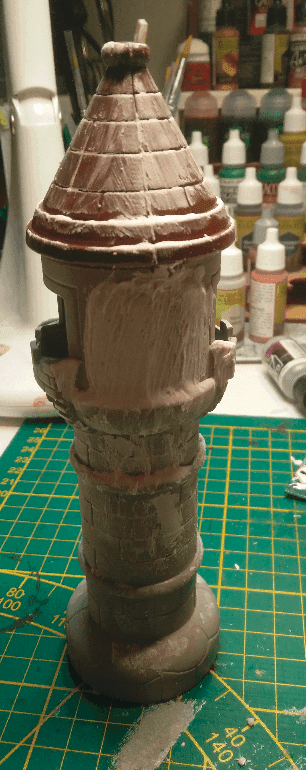
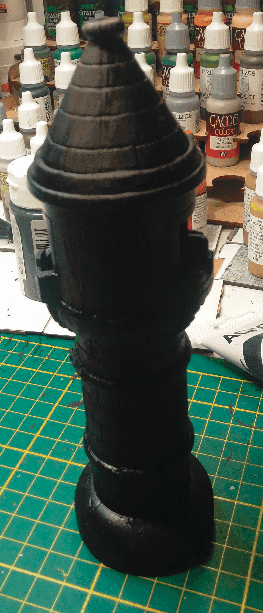
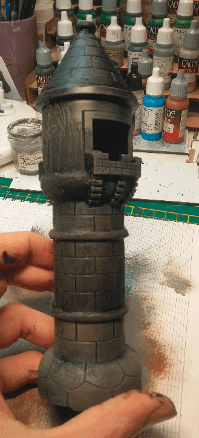
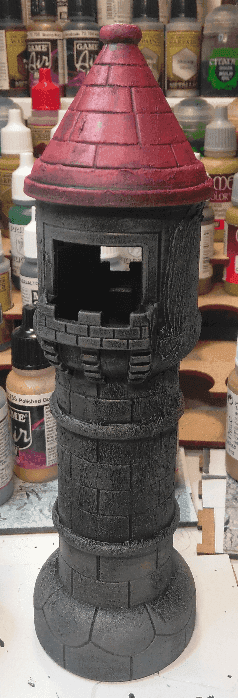
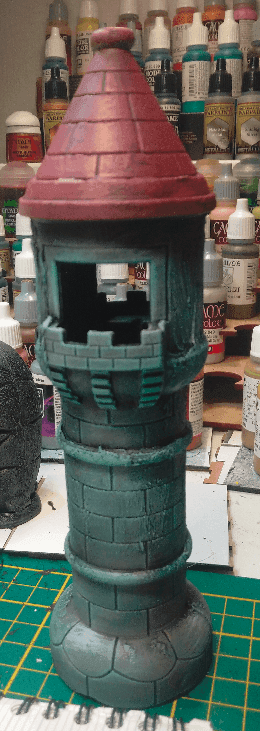
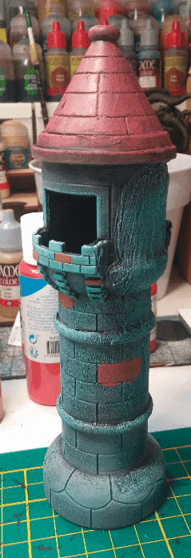

At first I thought I could add a small light at the bottom of the tower so it would light the upstair window. Turns out my lights were not powerful enough, so I reverted to making it a regular tower instead.

But now I had a top of a small light lying around. I put it in a bottle cap and thought maybe I could make it look like a broken pillar? I'll explain what I do with it in the next section.

I did the same on the tower. Maybe too much actually, I wasn't really sure of what I was doing there to be honest.

Now that it's primed, I should be able to add more details with a dry brush and better see how it goes.

Ok, so the drybrush did bring some details. My brush wasn't totally clean from a previous drybrush so I had a few parts of brown as well. It's ok, it made it look a bit older.

I painted the roof red, giving it an old Warhammer look.

But then something unexpected happened. I started drybrushing some more light grey on it, but I didn't clean my brush correctly once again, and this time it added a green glow on it. At first I wanted to stop and clean the brush and then I got curious: what would happen if I paint it green? So I kept going. I expected that the green would be toned down with the wash I'll be adding later, so we'll see how it will turn out.

I painted a few bricks in another color for more variety. I think I should paint a few in a darker brown or gray as well. Maybe not too much as there isn't that many bricks in this tower I don't want it to look like it has too many colors.