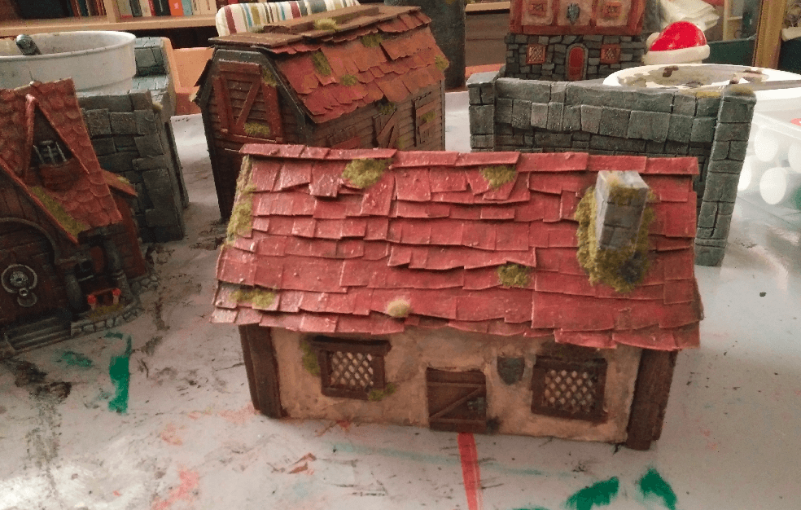

I tried to make a few timber houses from cardboard.

​	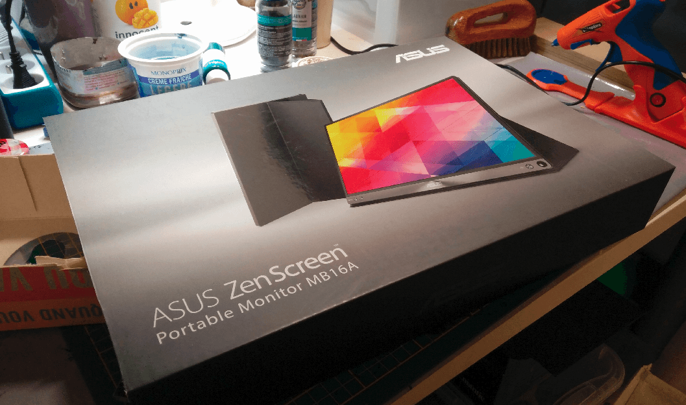

It all started with this thick cardboard box I found in the trash. It's easy to find lightweight cardboard; the kind you usually receive packages in. But it also wraps quickly as soon as you apply glue or paint. Thick cardboard is much better for crafting, but harder to find.

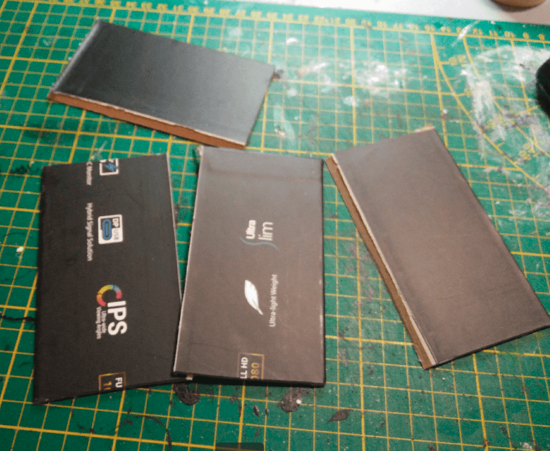

I cut four strips in it, that would be the walls of my house.

Gluing them together with hot glue for the generic frame.

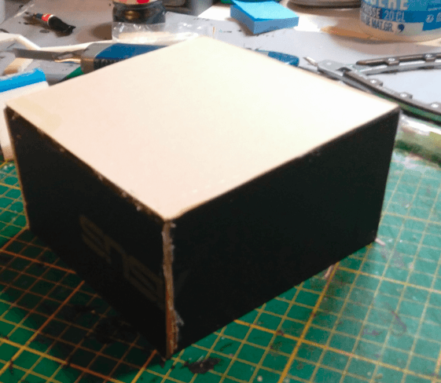

Then glued lighter cardboard on the roof. I used the current construction as a template to cut the roof to shape.

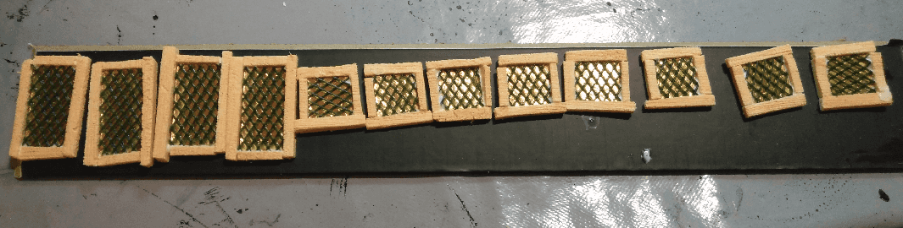

I made a bunch of windows from foam strips, golden cardboard and gardening mesh.

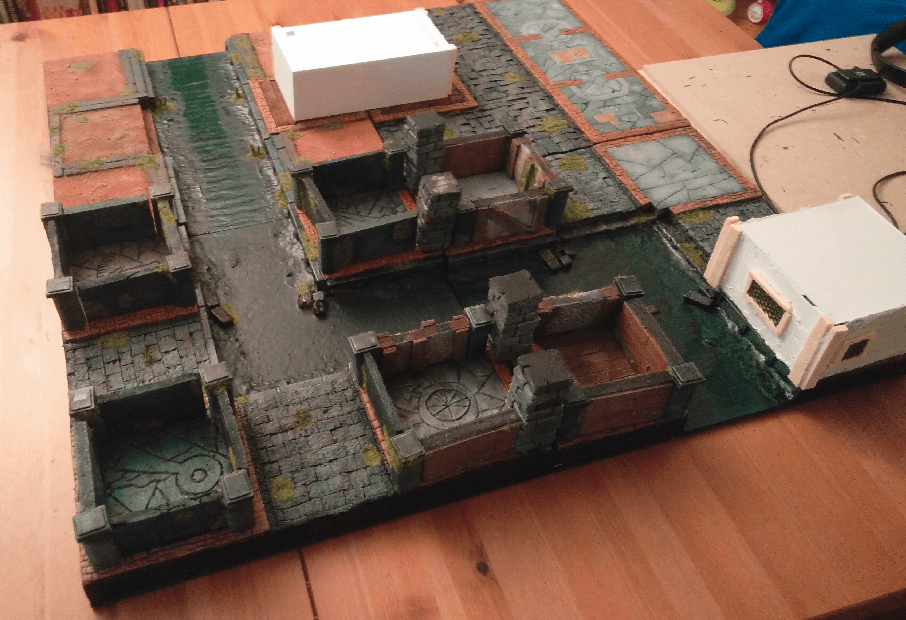

I also started working on a second house, from an old phone cardboard box. I wanted to have them in dimensions roughly compatible with the Zombicide board I was working on.

Same, but with a different angle. The dimensions are not quite right, but it's also because my Zombicide board itself does not have perfect dimensions.

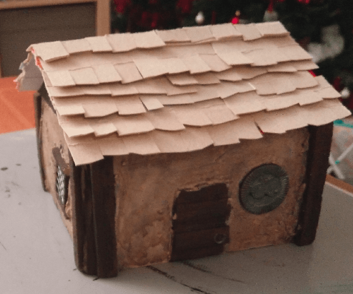

And then, it magically had a roof, timber frame, doors and windows. Well, it seems that I actually forgot to take pictures of the whole process in between.

Let's just say the timber is foam textured with a metal brush, doors are coffee stirrers, the roof is cardboard and the walls are plastered with filling paste.

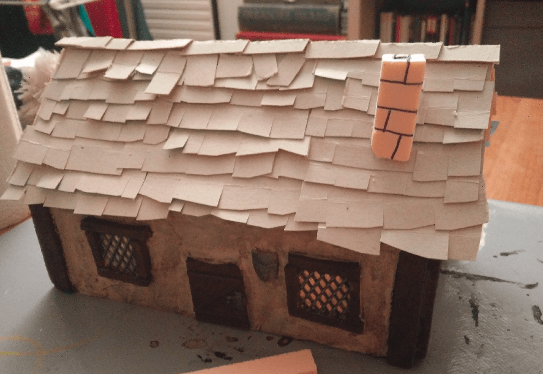

On the long house, I also added a foam chimney, glued directly on top of the shingles.

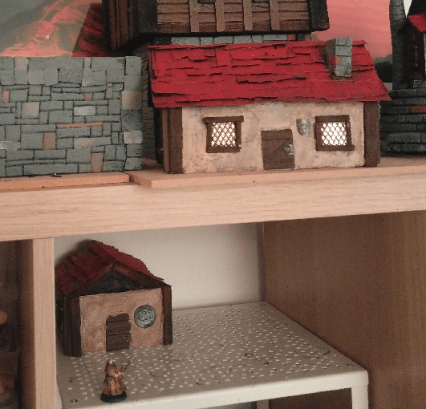

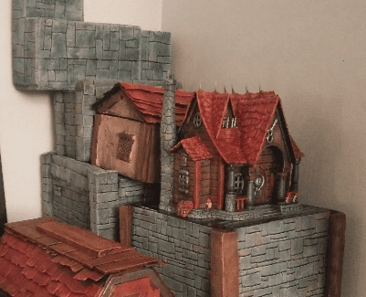

I don't have many pictures of the house by itself, so this are group shot with other projects I was working on at that time.

This is a better shot at the long house, once the flocking was added. I only had one flocking color at the time, but it already greatly enhance the model.

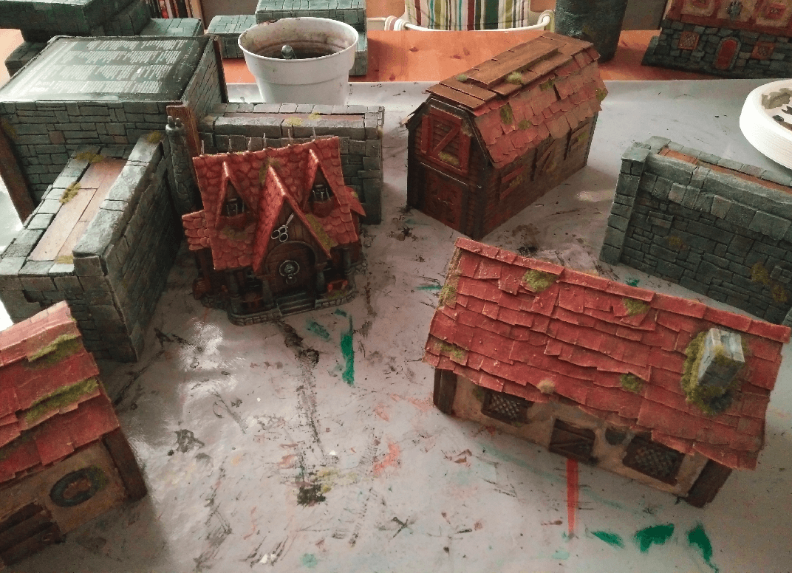

Another group shot, just for fun.

