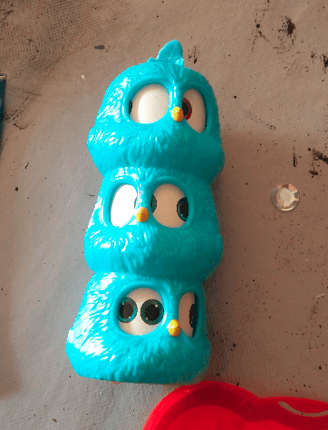
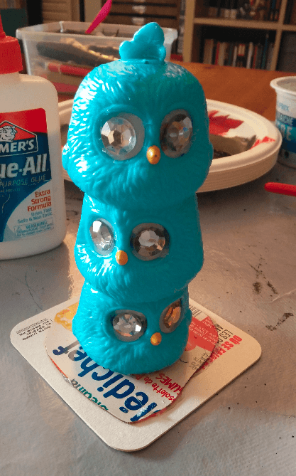
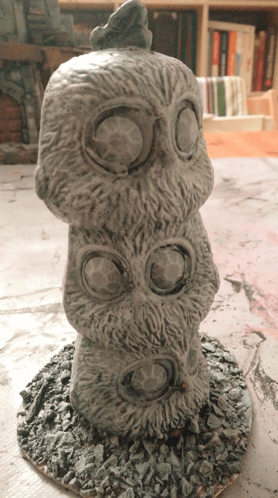
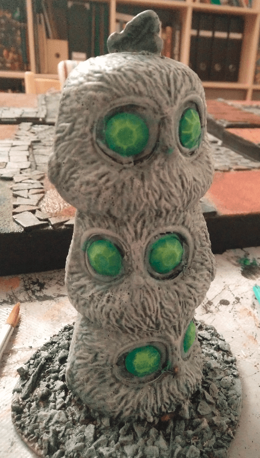
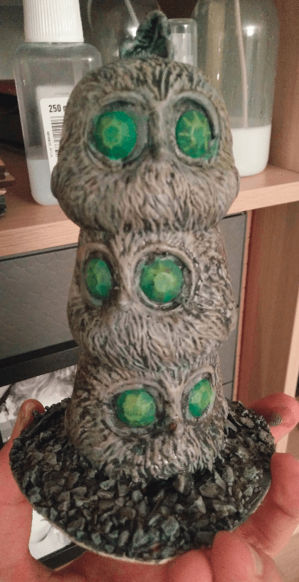

*You walk into the jungle and come face to face with this horrible statue. Three bird heads stacked on top of each other, their eyes emerald green. What do you do?*

This all started with this weird Angry Bird / MacDonalds toy.

I glued it on a piece of plastic to secure it in place, and glued some cheap plastic jewels in place of its eyes.

Then, I let the magic of the drybrush turn this into a statue.

I painted the eyes emerald green and added a drybrush of a yellowish green on top.

A dark brown wash on top.

And heavy flocking to give it an air of forgotten statue covered in moss.

That was a very quick build, and to be honest I didn't expect it to look so great. The original toy is pretty goofy to begin with, but the addition of the emerald eyes on top of the cartoonish birds gives it an aura of weirdness.