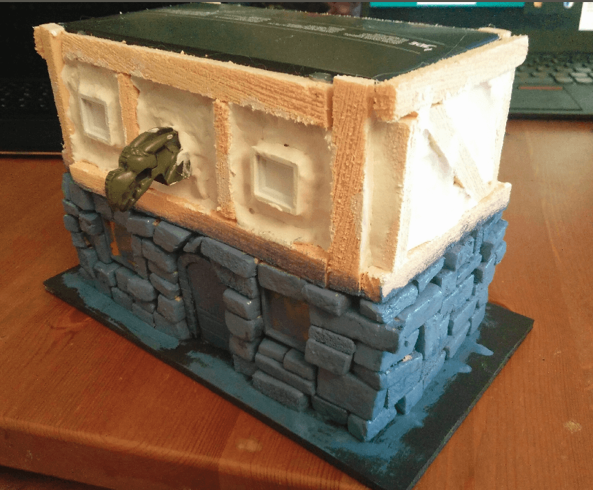
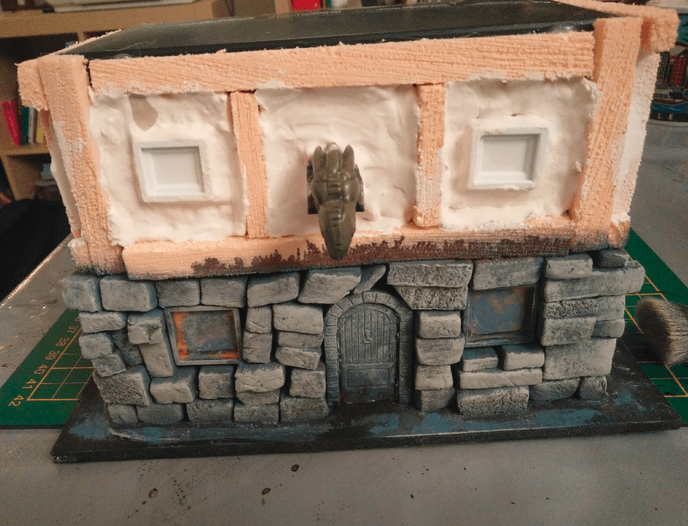

This is my first house build, from a coffee capsule box.

## Structure

Having a nespresso machine at home, I end up with a lot of those coffee capsule boxes. Being in a crafting frenzy, I'm also always on the lookout for common household items that I could turn into terrain. Seeing the perfectly rectangular shape of those boxes, I tried to transform one into a half-timber house.

I started by gluing it to a piece of foamcore, and added a door (taken from the Zombicide board game) to give me an idea of the scale I was aiming for.

I cut strips of foam, and added wood texture by scrapping them with one of those brushes with metal bristles. 

One or two passes of this on each strip gives a perfect illusion. 

I then glued them to make it more or less look like a timber house.

And the back.

I then started to add some windows. I took those plastic things I got from old board games (scrabbles and such) I had for a few euros a bag in a garage sale.

I glued them on the house where I wanted to have the windows. This would make adding the bricks and texture around them much easier that trying to fit a window afterward.

I added bricks on the ground floor. I used my mix of black paint and mod podge as glue. I dipped each brick in it on one side, then added the brick to the wall, with the glue-covered side facing the wall. This was a bit fiddly and took some time to dry.

But, as expected, I was able to cleanly add bricks around the windows.

To give more style to the facade, I decided to add some kind of statue there. Architecturally, it doesn't make much sense as it will be some stone protruding from a half-timber house.

Here it is, after applying the plaster (filling paste).

View from the other side. I used my fingers to apply most of it, then a wet brush to fill the corners. That's also when I realized a flaw in my hasty timber construction around the house angles. Let's say it's some fantasy interpretation, because otherwise the way this house is built doesn't make sense.

## Painting

Once dry the filling paste sagged and crackled a little. I also painted the bottom stone with what I thought was a very dark blue, but it turned out to be lighter than expected and didn't look like stone at all.

I applied a very dark brown was on the stone to try to fix the blue effect.

With a grey drybrush on top, it looks acceptable. You can see spot some traces of blue here and there, but the overall effect is saved.

Now painting the top floor. Brown on the wood, tan on the filling.

Same behind. Also painted some stones in various shades for variety.

Brown wash on the filling on the first floor. I expected it to go in the recesses and give some depth to it, but I let it to dry with the house sitting up, so all the wash pooled at the bottom. I should have left the house to dry horizontally, with the side I washed facing up. But hey, I didn't.

I drybrushed the top floor with the tan color I used for the first coat, and it saved the effect.

The drybrush also made the sloppy wood paintjob and filling more apparent, though.

## Windows

For the windows, I used this gardening mesh thing.

Cut them into the dimensions of my windows.

And glued them in the windows. I used some golden paper (packaging from a cake I bought) as the background, to make it look like there is light inside.

I started adding wooden frame with matches around the windows, but soon realized it was quicker to made them from textured foam. I cut fine strips of foam, and applied wooden texture with my metal brush. Once painted this actually look more like wood than actual wooden matches.

The frame on the front are a big large, though.

Painting the frames with a lighter brown color. I wanted to differentiate them from the timbers.

## Roof

Now, let's work on the roof. Cardboard folded in half, and foamcore triangle support.

I cut lots of cardboard shingles. Actually much more than what is in the picture.

Glued them on the roof, again using my black paint + mod podge mix as glue. This had the added advantage of also covering the initial cardboard with black, covering in darkness any spot left between shingles.

I added more timber on the ends, using pins to keep them in place.

For the windows, I used some cheese packaging.

Once cut, they have the perfect shape.

Once again, trash recycling to the rescue.

This is what the roof looks like with the windows added. Glueing those shingles around the round windows was tedious.

I then started painting. Initial black coat of mod podge and black paint. My mod podge was quite old and some parts of the glue had started to solidifying, which turn out to be for the best as it gave the mix a grime texture that works well on those shingles.

I applied three drybrushes: deep red, red and orange.

## Final shot

And the final shot, with flocking added. I kinda like the protruding window effect, but I don't think the mesh works well on those windows. I will have to revisit that in a later build.

I learned quite a bit in this build:

- Don't paint stone in dark blue
- Filling paste cracks and sags a lot
- Timber corners should be made with one large piece, not two smalls
- Roof should be larger than the house

