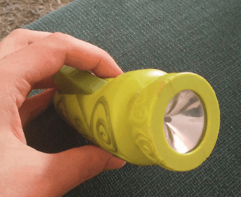

## 

This is, I think, a HappyMeal toy. If you press the button it generates some light (as well as an horrible noise). I immediately saw how I could turn that into an elven monument.

First thing to do is opening it to remove the mechanism.

It left a large hole the side that we'll fix later, but at least it starts to resemble a menhir.

I filled the hole with a plastic bit, then glued some plastic crystals on top. 

Modelling paste on top to give it this old, rugged stone look. I don't think I should have put paste on the crystal though, maybe just at the base for a smoother transition. Well, I'll now for next time.

I smoothed the surface using sanding paper so it removes all the little hooks creates by the modeling paste.

I primed it black and took a crappy picture of it.

Ah, now with the drybrush it starts to look good.

Even better with a second, lighter, coat.

I started painting the gems in green. My plan was to make them look like emerald. I wanted to try to paint some gem effect, simulating light reflecting on it. I'm no expert painter so I was aiming for something basic, but that would allow me to hone my technique.

I painted the bottom two third of each gem with a slightly brighter green.

I also painted the sculpts in two shades of green.

I then painted the lower third of each gem with an even brighter green. At that point I realized I had my effect reversed. I should have had the brighter parts of the gem on the top, where the light would hit them, not at the bottom. Nevertheless, I continued the effect, curious to see what it would look like.