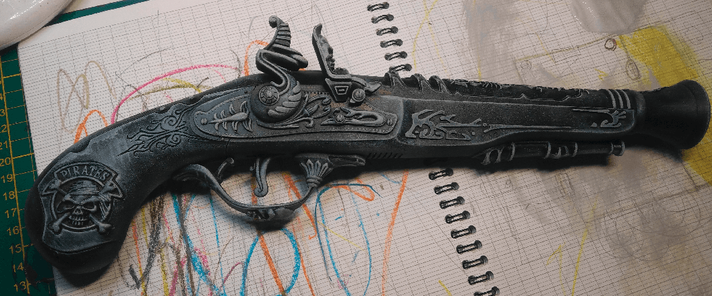
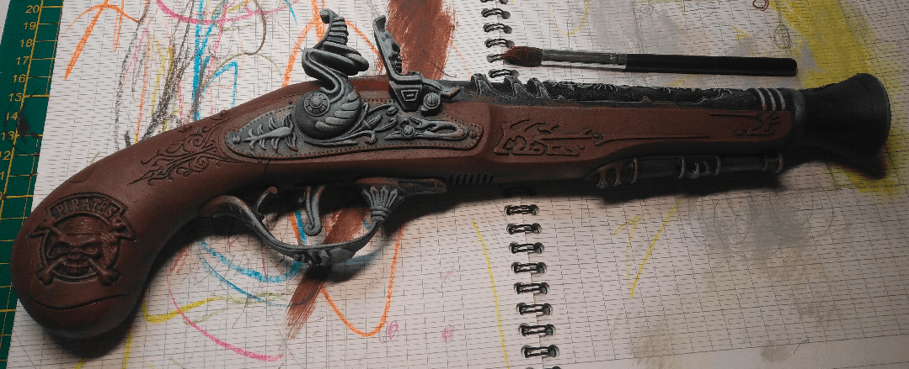
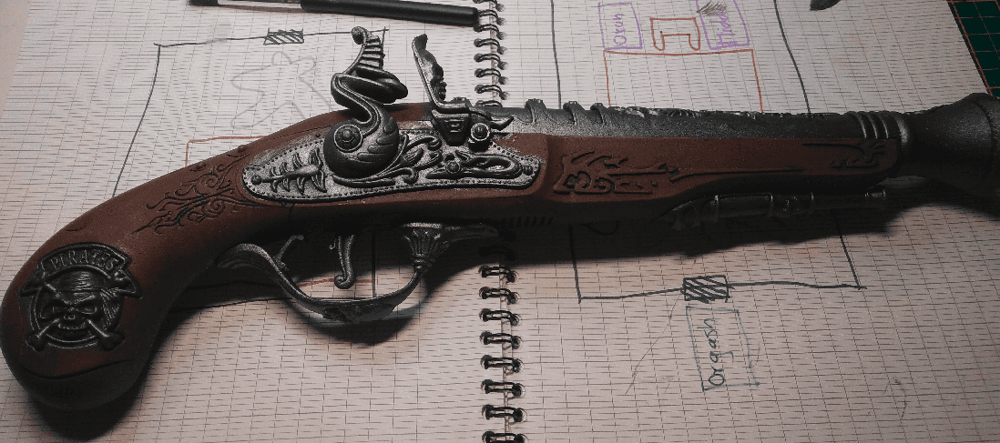
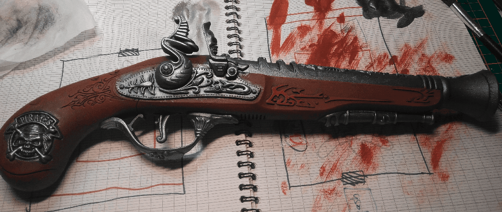
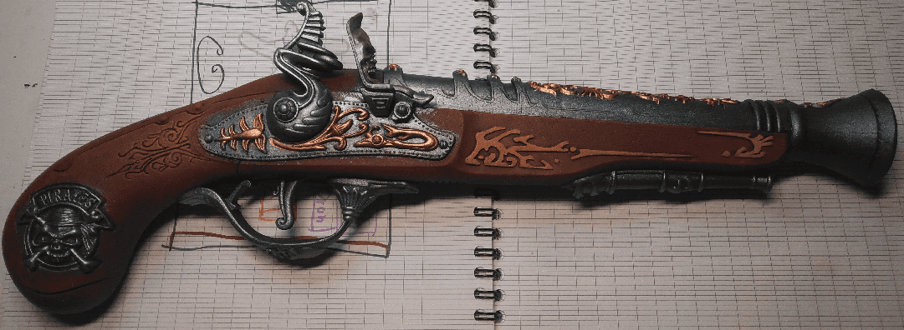

With no real plan in mind for how I would use it, I decided to try to repaint a plastic toy to see if I could make it look much better.

I think I forgot to take a picture of the gun before I started... well, too bad. Once again, it was found for 1€ in a second hand shop.

I started with a black primer and a white dry-brush. I did the dry brush to better see the various edges of the weapon, but also hoping it would improve the latter highlights.

Brown dry brush. I did it with a small brush so I would not put too much brown on the metal parts.

Now metal drybrush on the metal parts. I used a similar brush, but a different one. When I drybrush, I usually use several brushes as I can never manage to get rid of all the paint from one color before using another. And if I use water to get rid of it it's even better because then my dry brush is not dry at all and it creates lots of smudges marks everywhere.

I did a second brown drybrush, slightly lighter on the raised areas and the engraved parts.

Then painted the details with some gold on the metal and chestnut on the wood.