---

title: Toy Terrain Galore
tags: terrain, wip
date: 2020-07-18
---

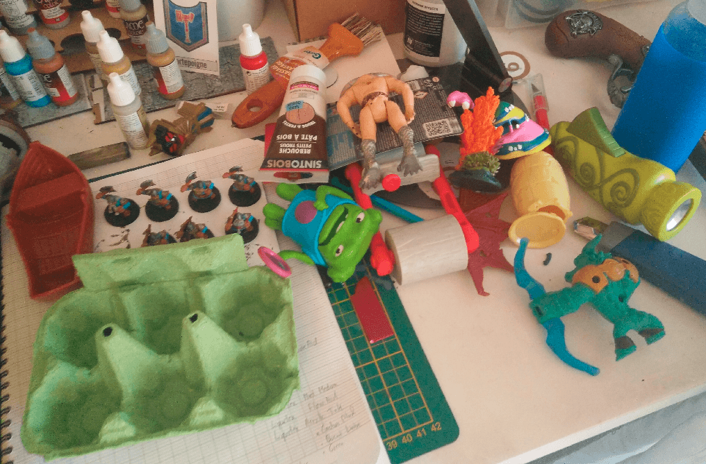

This is the state of my workshop after buying stuff and having a few ideas. I started working on all the projects at once, mostly because I wanted to see what could work and what didn't.

## The Torchlamp Menhir

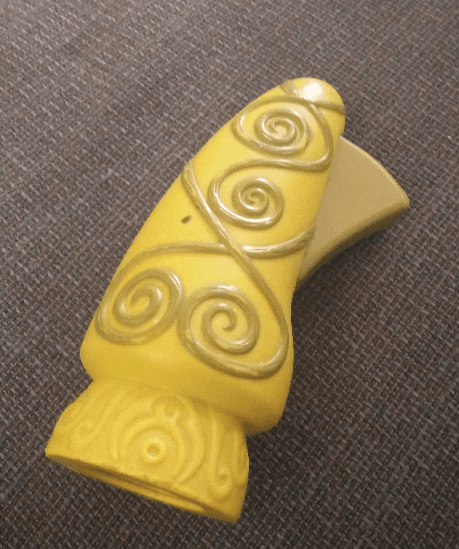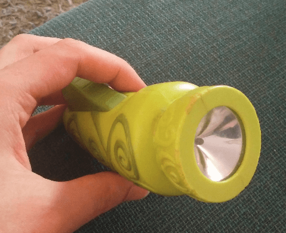

This is, I think, a HappyMeal toy. If you press the button it generates some light (as well as an horrible noise). I immediately saw how I could turn that into an elven monument.

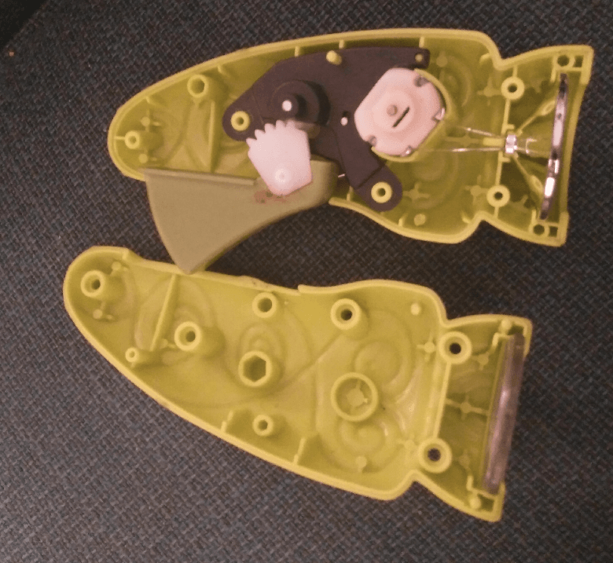

First thing to do is opening it to remove the mechanism.

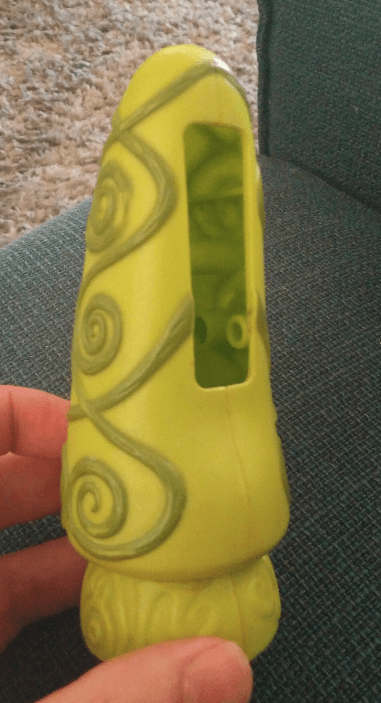

It left a large hole the side that we'll fix later, but at least it starts to resemble a menhir.

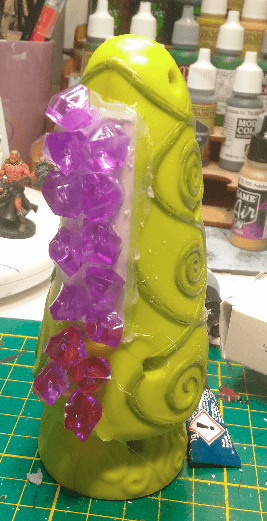

I filled the hole with a plastic bit, then glued some plastic crystals on top. 

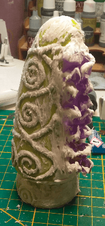

Modelling paste on top to give it this old, rugged stone look. I don't think I should have put paste on the crystal though, maybe just at the base for a smoother transition. Well, I'll now for next time.

I smoothed the surface using sanding paper so it removes all the little hooks creates by the modeling paste.

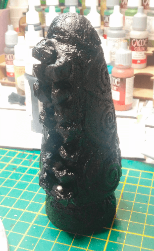

I primed it black and took a crappy picture of it.

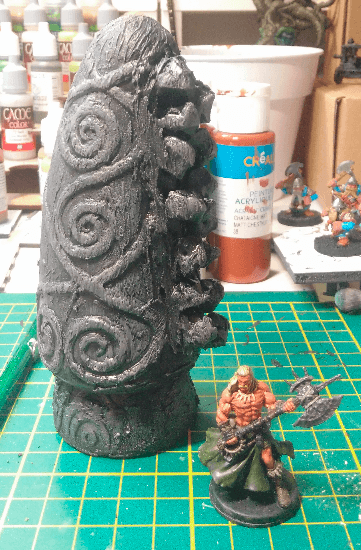

Ah, now with the drybrush it starts to look good.

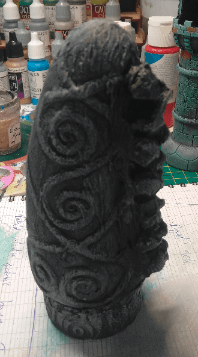

Even better with a second, lighter, coat.

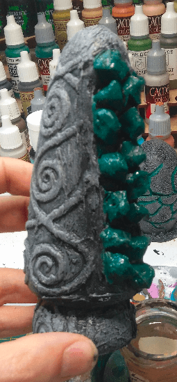

I started painting the gems in green. My plan was to make them look like emerald. I wanted to try to paint some gem effect, simulating light reflecting on it. I'm no expert painter so I was aiming for something basic, but that would allow me to hone my technique.

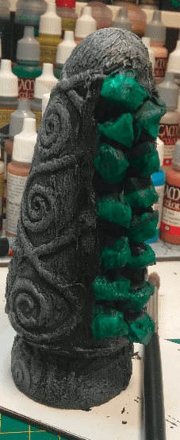

I painted the bottom two third of each gem with a slightly brighter green.

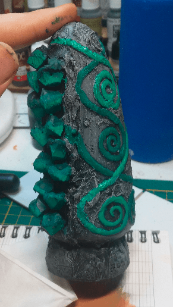

I also painted the sculpts in two shades of green.

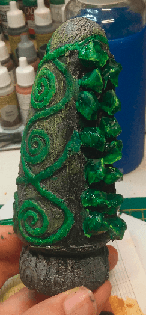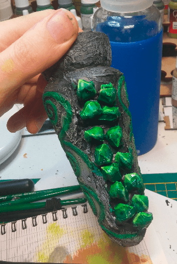

I then painted the lower third of each gem with an even brighter green. At that point I realized I had my effect reversed. I should have had the brighter parts of the gem on the top, where the light would hit them, not at the bottom. Nevertheless, I continued the effect, curious to see what it would look like.

## Quicksand monster

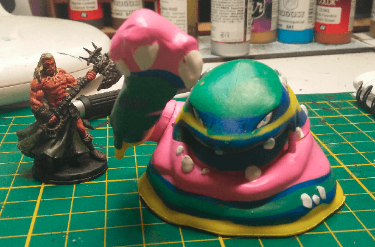

When I found the miniature I knew I would turn it into a kind of Ooze. I find it pretty hard to find cheap Ooze miniatures.

I didn't really know which kind of Ooze I would make, but then I  realized Ochre Jellies are large Ooze, so that would fit and I was set on this idea.

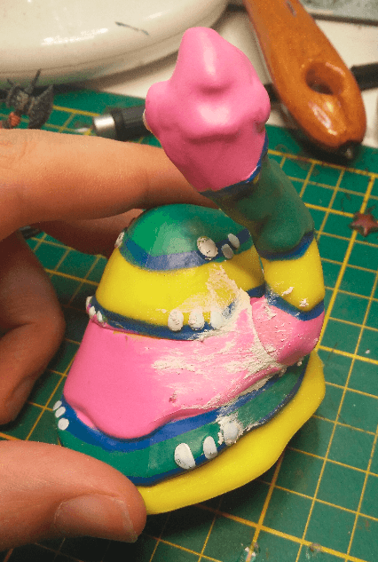

I glued the hand in place and tried to fill the gap with modeling paste. This is the only paste I have, but it is very good for that. I will need to learn how to use milliput/greenstuff.

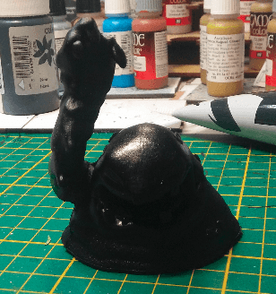

No more of this weird colorscheme it had before.

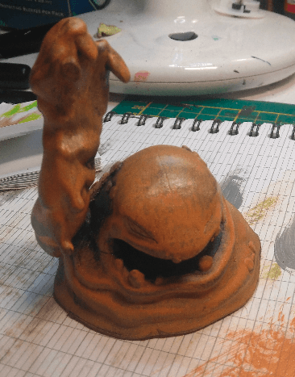

Heavy drybrush with some Caramel craft paint. It starts to look like an animated quicksand creature.

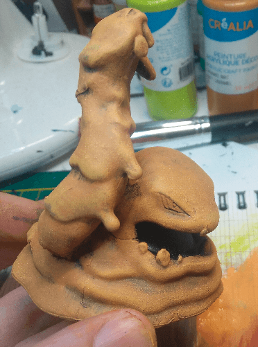

After more and more layers of drybrush, I'm starting to get this sandy effect.

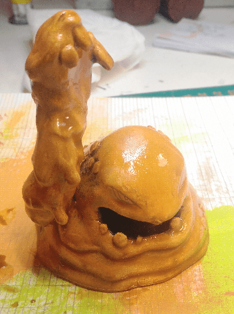

Adding a wash to increase the contrast of the recesses.

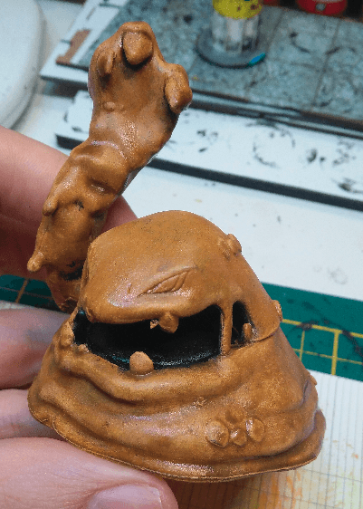

And once the wash dried.

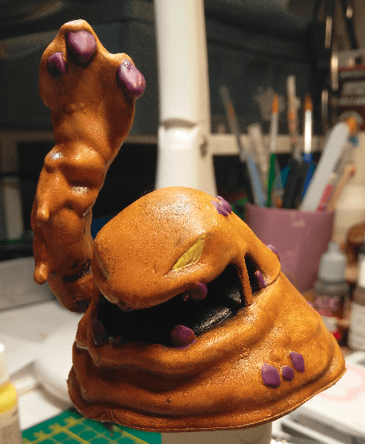

I decided to stray away from my initial attempt at making an Ochre Jelly and went for a custom quicksand monster instead. I painted the rocks in a purple tint, to make it look like it's a stone-related creature.

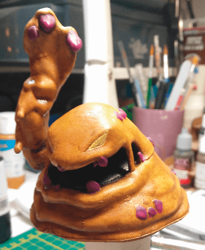

I painted the bottom half of all gem in a lighter purple.

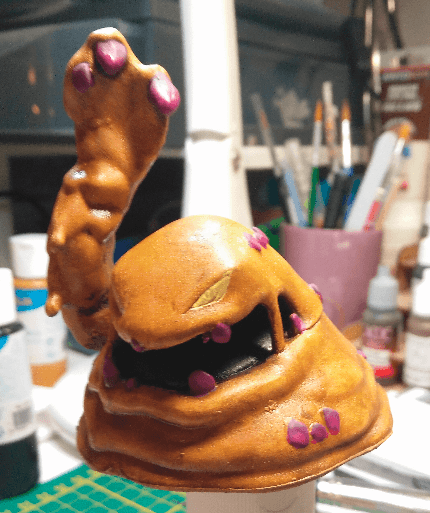

It's hard to see, but I added some even lighter purple on top of the gem.

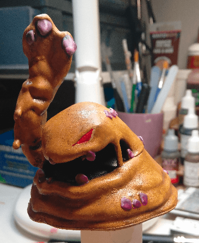

The previous effect didn't work as I expected, so I started highlighting the edges with a white-purplish color.

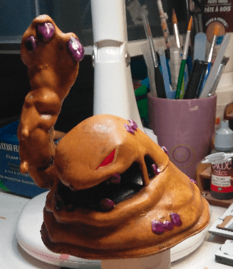

I then applied a purple wash on the gems to try to blend the previous attempts together. As you might guess, I had no clear idea of what I was doing. I didn't check any "how to paint crystals" tutorial online and just went on experimenting.

## Wyrdstone Egg

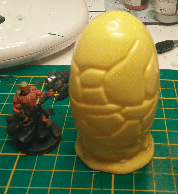

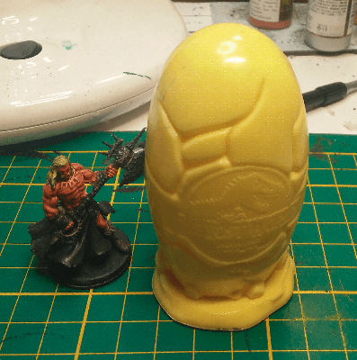

This is a Jurassic Park promotional egg, I guess it's from MacDonalds as well. I wanted to paint it as some crackling egg releasing some kind of foul energy. I had never painted anything like this before, so I thought that having such a large miniature to try would be perfect.

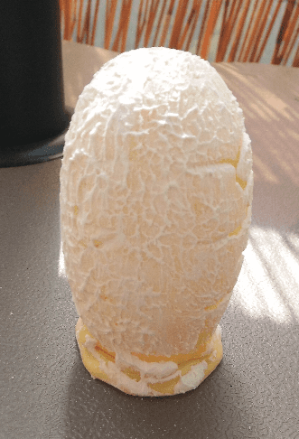

Applied a fair layer of modeling paste and sanded it to give it a smoother texture.

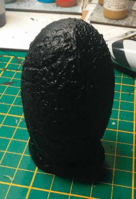

Priming it black.

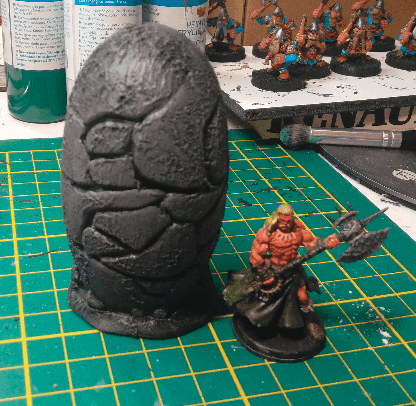

My plan was to make this a stone egg, with some weird green light coming out of it. Now that I think of it, I don't know why it should be made of stone. I must confess I didn't really think this part through. It would have been more logical if it was colored more like a bird egg, or a weird color.

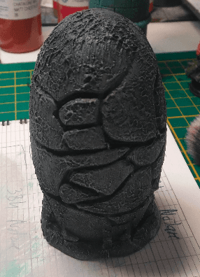

Second coat for more depth.

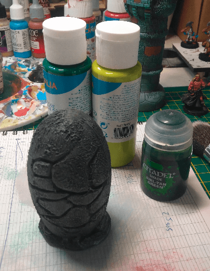

Now my plan is to paint the cracks as green light. I had never done this before but here is what I'll try to do. First paint the cracks with a deep green, then drybrush around the edges with a light green, repaint the center of the cracks with the same green, and unify this with a wash at the end.

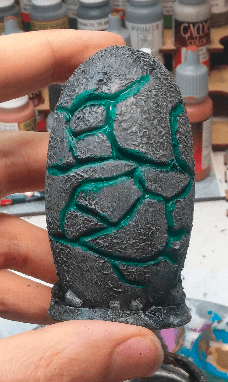

First pass of green in the cracks.

Drybrush of light green around all the cracks.

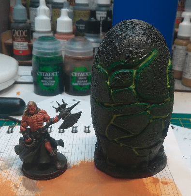

Lightgreen inside the cracks

## Coaster Dungeon Tiles

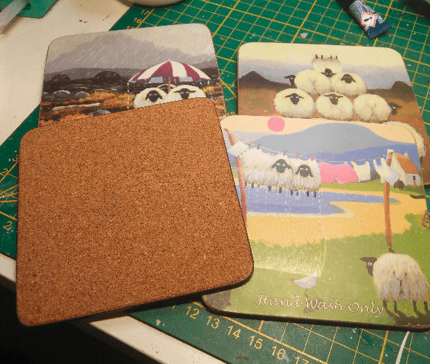

This are the 4 coasters for 50cts I bought. Full of witty jokes on the front and cork on the back.

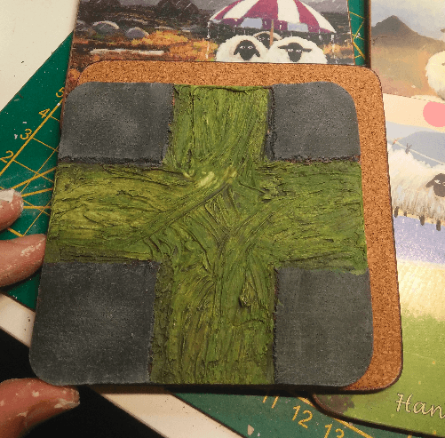

I already had some Sewer tiles I made in the past from cork coasters, but they were unfortunately not the same scale. So instead of making more sewer tiles I decided to simply make regular tiles.

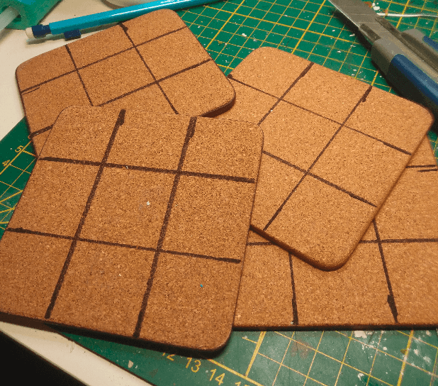

I divided them 3x3 3.5cm squares. I could have made them 4x4 2.5cm squares but I like my minis to have some breathing room. 2.5cm is the very minimum, and because I will be chopping some cork off to delimit the squares, it would have ended up too small.

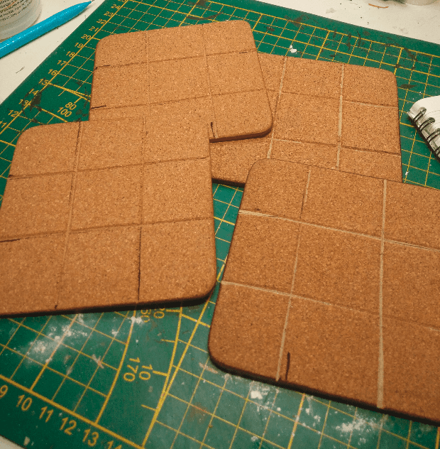

Cutting the fork along the lines.

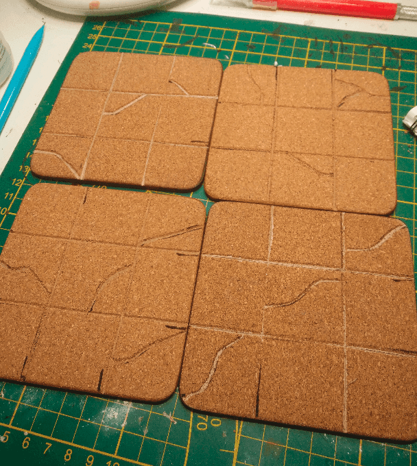

Adding some irregularities to the patterns.

Priming them black. The good thing about cork (as opposed to foam) is that you can prime it without the spray melting it.

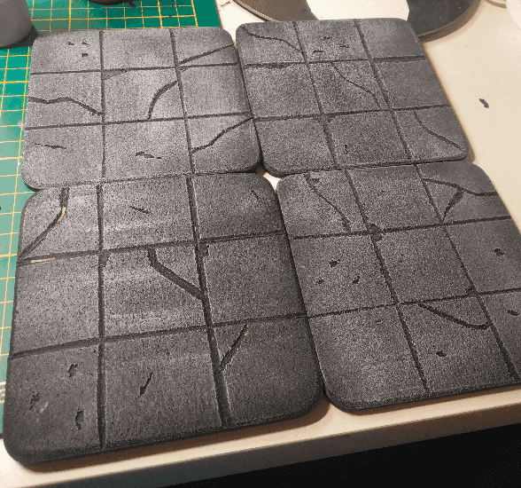

A little drybrush and they look much better already.

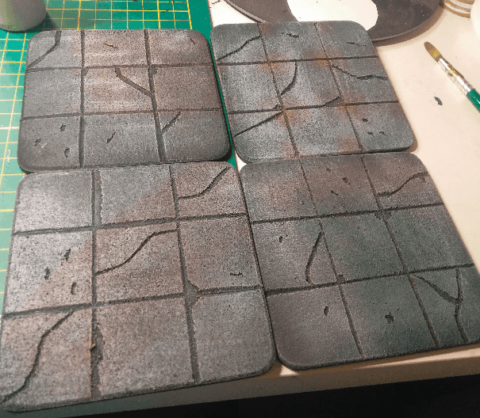

A second one with some brown and green. I tried to do some irregular patterns. The last thing I tried is on the top right, brushing on the corners, I find it gives a nice finish, I should do more of that.

## Plastic Boats

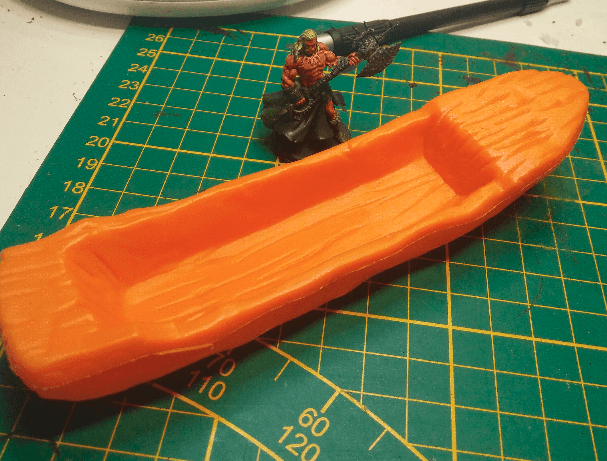

A simple boat carved out of a trunk.

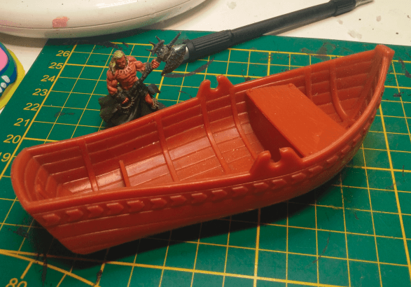

And another slightly more sophisticated.

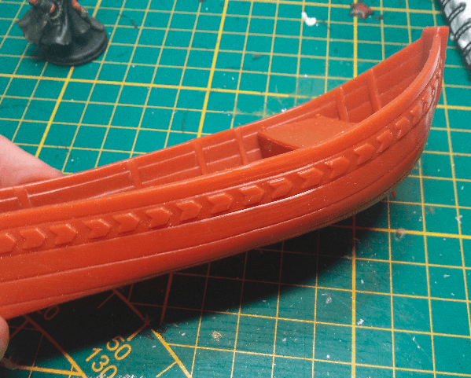

I really didn't have much in way of preparation, just cutting the small plastic parts used for the oars and that's it.

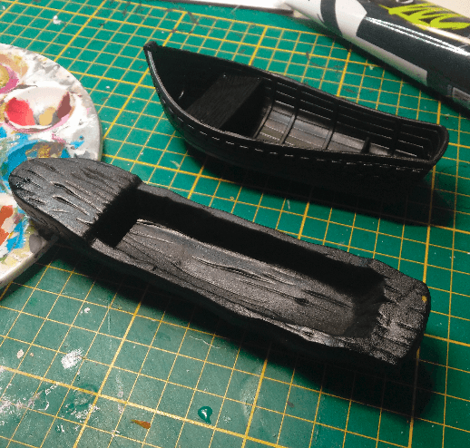

Priming them black as well.

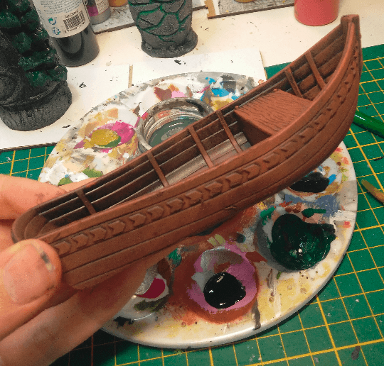

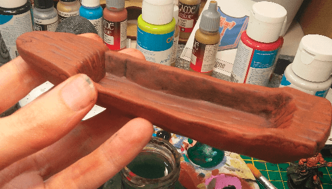

Quick drybrush of brown and they already look like I could use them!

## The Green Tower

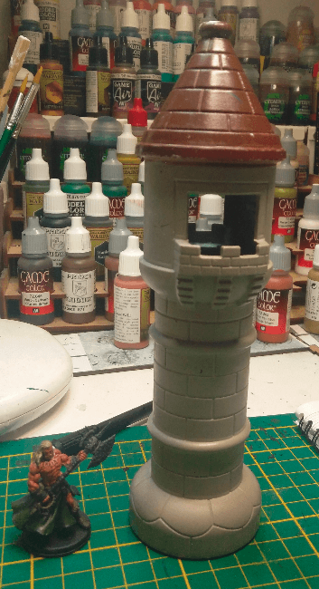

At first I thought I could add a small light at the bottom of the tower so it would light the upstair window. Turns out my lights were not powerful enough, so I reverted to making it a regular tower instead.

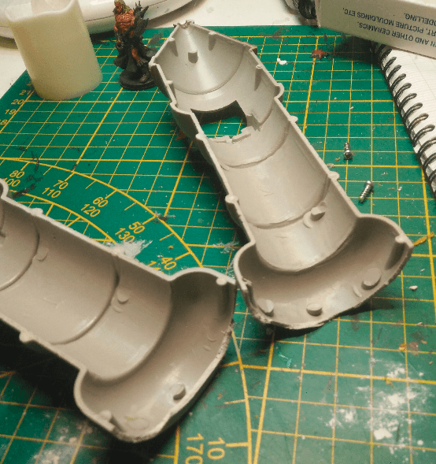

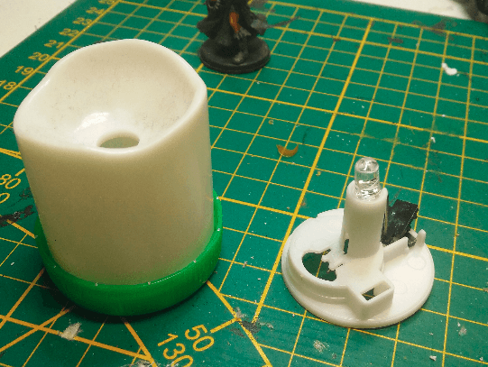

But now I had a top of a small light lying around. I put it in a bottle cap and thought maybe I could make it look like a broken pillar? I'll explain what I do with it in the next section.

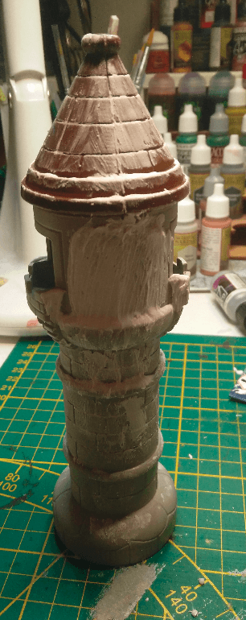

I did the same on the tower. Maybe too much actually, I wasn't really sure of what I was doing there to be honest.

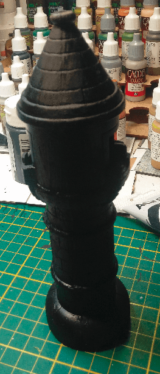

Now that it's primed, I should be able to add more details with a dry brush and better see how it goes.

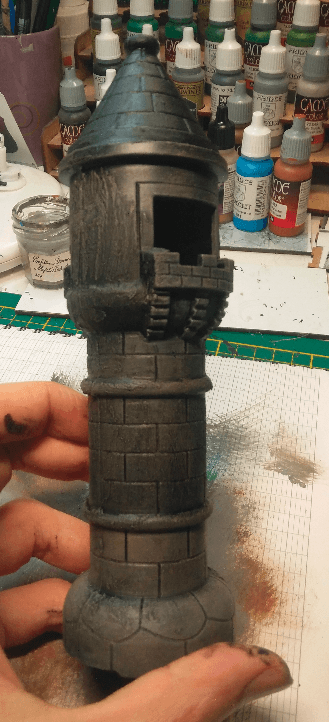

Ok, so the drybrush did bring some details. My brush wasn't totally clean from a previous drybrush so I had a few parts of brown as well. It's ok, it made it look a bit older.

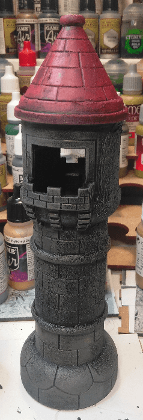

I painted the roof red, giving it an old Warhammer look.

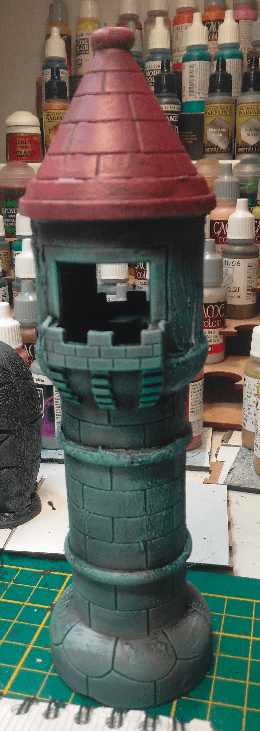

But then something unexpected happened. I started drybrushing some more light grey on it, but I didn't clean my brush correctly once again, and this time it added a green glow on it. At first I wanted to stop and clean the brush and then I got curious: what would happen if I paint it green? So I kept going. I expected that the green would be toned down with the wash I'll be adding later, so we'll see how it will turn out.

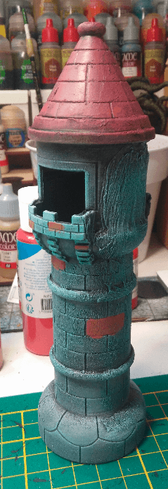

I painted a few bricks in another color for more variety. I think I should paint a few in a darker brown or gray as well. Maybe not too much as there isn't that many bricks in this tower I don't want it to look like it has too many colors.

## The broken pillar

So here is the broken pillar from the remnants of my attempt at lightning the tower.

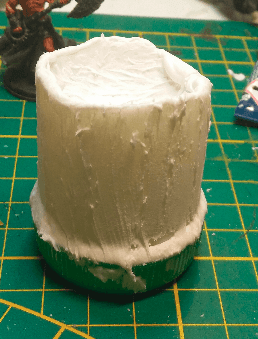

I applied a fair dose of modeling paste on it. This stuff is not good for filling small gap, but perfect to add some texture to any regular plain surface.

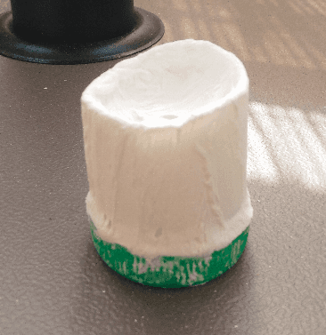

And sanded it.

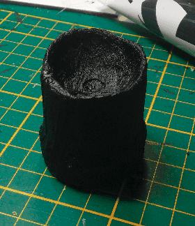

And primed black.

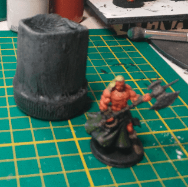

This looked a bit better. I can't decide if it really looks like a broken pillar or a bit of plastic on top of a bottle top.

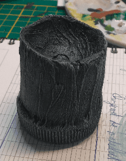

The second dry brush gave a bit more depth. I think it looks mildly more interesting. At this point I'm starting to consider this more like a training ground than an actual piece I'll love to have on the table.

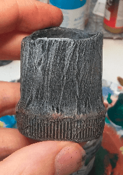

Added some grime at the bottom, to separate the base from the pillar.

## The Underground Plant

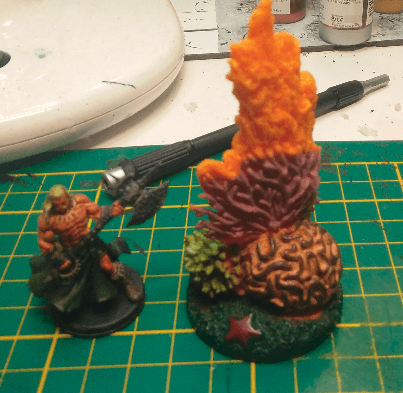

This is an aquarium decoration made of some kind of plastic. I wasn't really sure what I would turn it into when I bought it, but I figured I would find out as I was painting it.

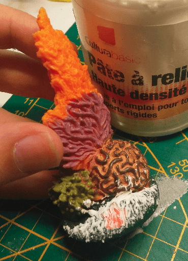

The only modification I did was removing the starfish and adding some modeling paste before priming.

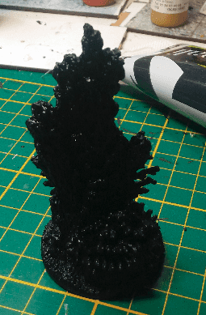

Ready to be painted.

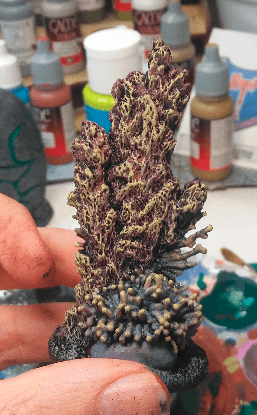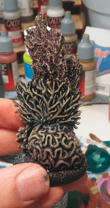

I wasn't really inspired for the color scheme here. I took some random colors and painted the various parts with them, then I drybrushed some yellow on top of it to homogenize the plant. In retrospect I should have used brighter colors because in its current state, it's hard to tell the various parts. 

## Wood Logs

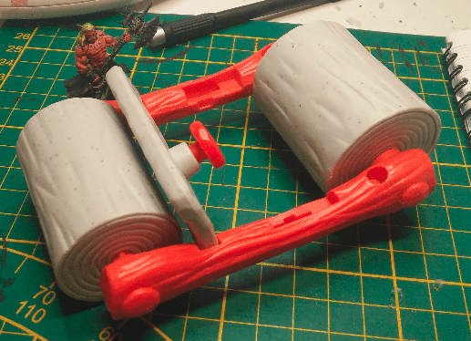

This seems to be a Flintsone vehicule. In the cartoon the "wheels" are supposed to be made of rock but here the texture made it look like some kind of wood, so I thought I could transform that into logs.

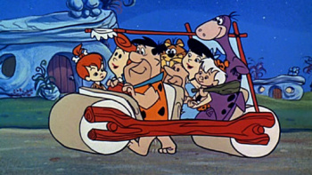

So I dismantled the car and kept the "logs". The other bits went into my bits box, maybe for future use.

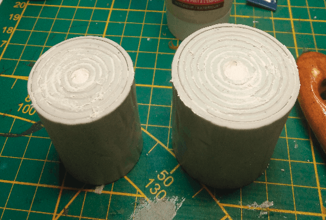

Put some paste in the holes.

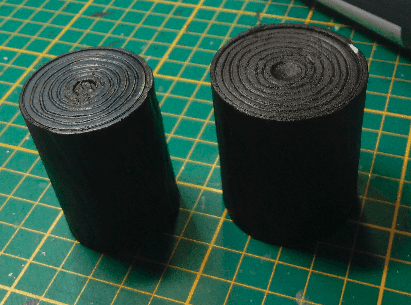

Priming them black. Now I can see that the circle don't really look like wood logs. They don't really look like stone either to be honest.

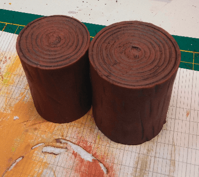

Painting them with a rough drybrush work.

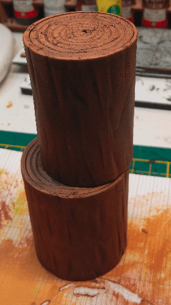

Adding some more colors.

## Everything else that didn't work

### The Ugly Monster

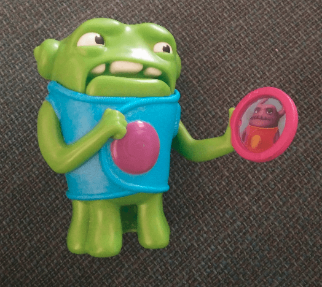

I thought I could remove its head to use as a base for sculpting an old face in my Vulli Tree project.

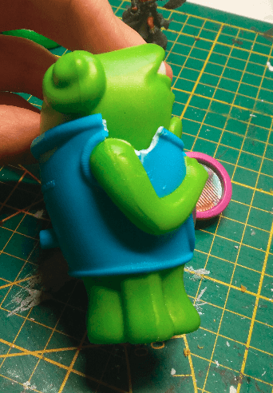

Turns out that, in addition to some screws, it is heavily glued and I don't have the tools to open it more.

### The Even Uglier Demon

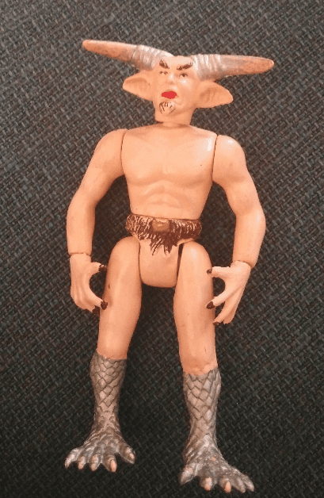

Same. Thought I could use the head. Turns out it's not the right scale. And the whole thing is pretty ugly and weird. I wouldn't even want my daughter to have it as a toy.

### The orphan wing

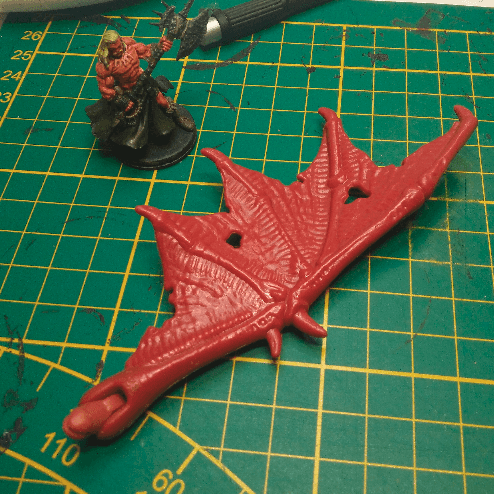

I had this wing as well. No idea what I could do with it, so going to the bitz box for now.

### The Egg Pillars

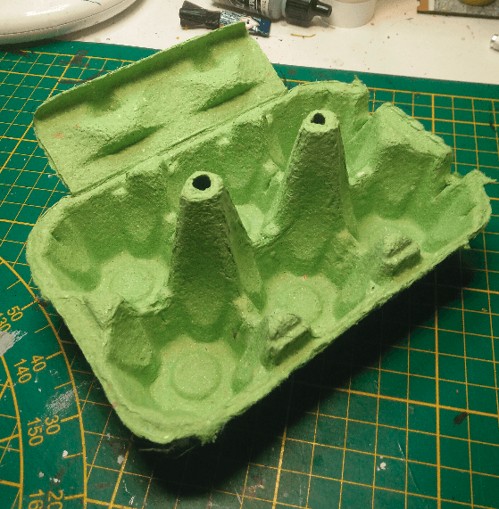

I thought I could create some pillars out of the central parts of an egg box. This didn't turn out so great and was actually pretty painful and uninteresting to build. Especially considering that pillars might be the terrain stuff I have the most of already.

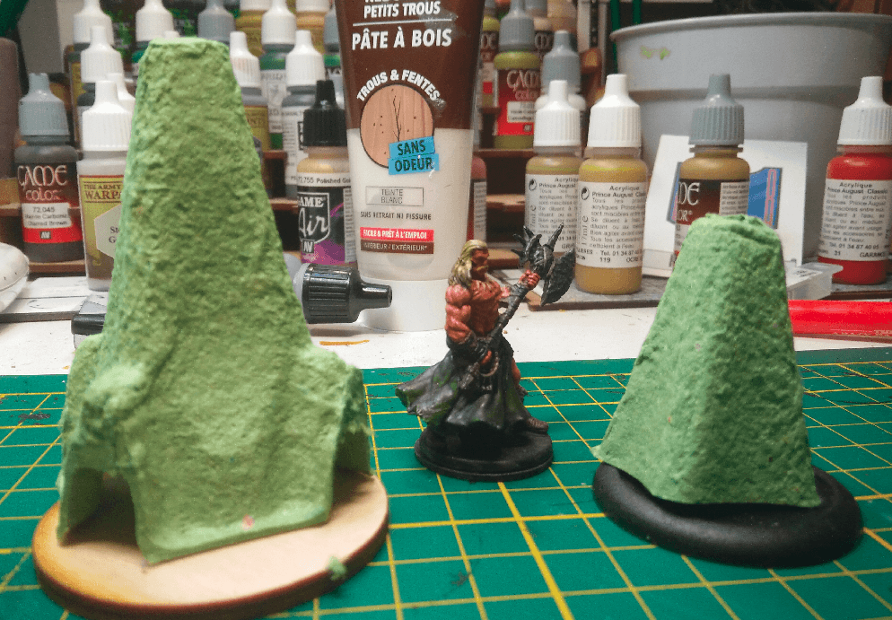

I tried two different sizes, not really sure about how they would turn out in the end.

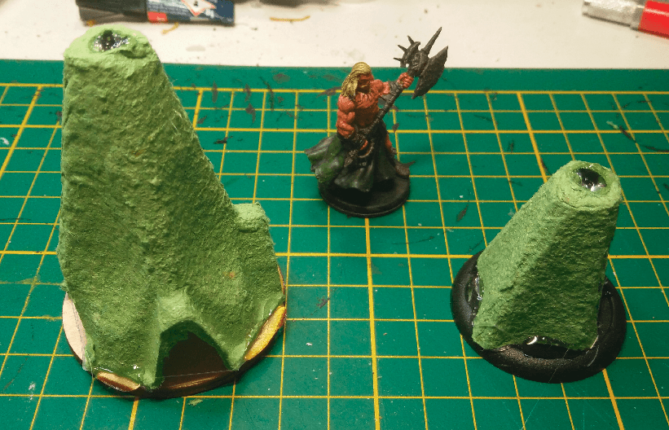

I glued them to their bases and tried to fill the top hole with glue.

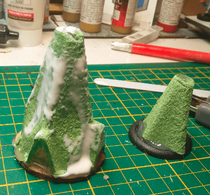

I also thought I could try the "Modpodge" I bought some time ago but never used. I still haven't figured out how I'm supposed to use it. It looks like some very liquid PVA glue, so I applied some on the pillar, but I thought using PVA glue would have been easier.

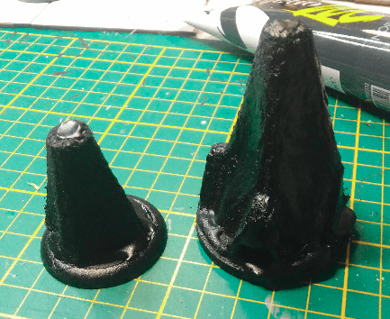

Still not sure where I'm going with that. Usually when I prime something black I better see how it will look. For those pillars I'm still not sure.

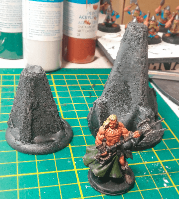

Meh. Still not convinced about those weird stuff. Maybe it would work better as concrete elements in a moder world, but for a fantasy setting I don't think it fits very well.

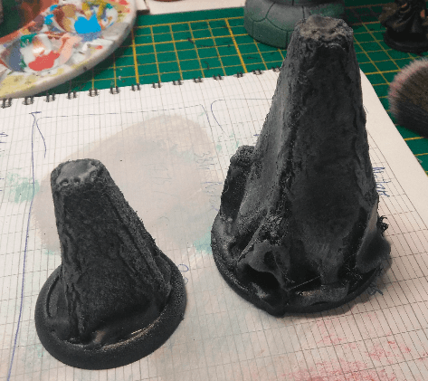

Even the second coat does not improve their look.