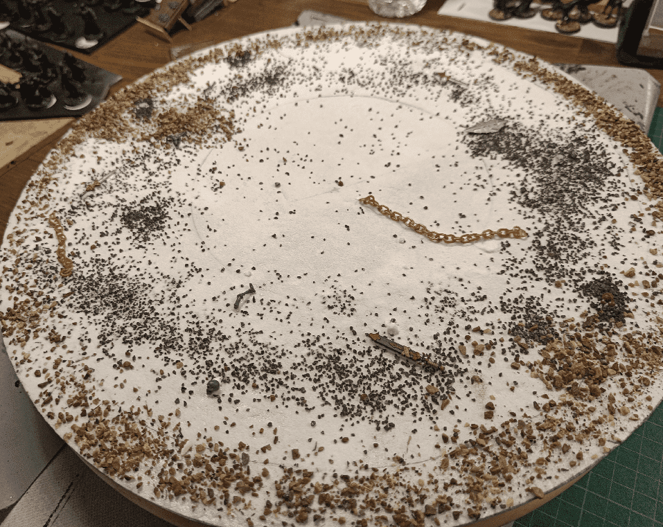

I built a Swamp/Sewer UDT tile. 

UDT stands for Ultimate Dungeon Terrain and has been popularized by this [Dungeon Craft YouTube video](https://www.youtube.com/watch?v=dQqhTiE7i84). The goal is to abstract combat and exploration by getting rid of the grid and focusing on a circle area that represents the current scene. The area can be further split into three concentric rings representing melee, range and "too far".

I like using this in games, mostly for the ease of focus on the current scene. You set your UDT at the center of the table and it does represent the scene. You add some scenery and it makes it easier for people to know where they are, and remember the place. 

Add a few walls and doors and you can simulate a dungeon room. Players open one of those doors? You change the wall arrangement and now they are in this new room.

I loved the idea so much I wanted to craft a few different UDT to represent various common areas characters might encounter. I already had a basic "cavern" one, so this time I went with a more murky one that could represent either a swamp or some sewers.

It all started with a circle of fine foam. I used my Ikea Lazy Susan as a guide for this. As the UDT will sit on it, I wanted it to have the exact same size.

I then textured it with the usual rocks/aluminium foil. In hindsight, I'm not even sure that step is requires as I'll be adding a lot of dirt and rocks later on.

I roughly traced the three concentric circles. My initial idea was to have a way (either through texture or paint) to see the three zones, but still make it look like a swamp, without artificial lines drawn on it.

In the end, I didn't managed that effect really well. The final result only has two zones: the deep center, and the shallow outline.

I covered everything with glue, and sprinkled various rocks and dirt on it. I tried to put the larger rocks on the outside, and almost no stones on the inside. Once again, I don't think this shows much in the final result.

I added some bits (chains, skeleton parts, weapons) here and there to give it some depth (both literally and figuratively). I find that those little touches (forgotten bottles, lit candles, footsteps, etc) makes our brain develop stories around them and make the terrain piece more real.

I let the glue to dry for one night, then I added a second layer of highly diluted glue all over it to really seal in all the rocks.

Once dry, after one more night, I basecoated it with the traditional black and modpodge mix. Those three layers of glue should put all the rocks well in place for the next steps.

I did a first coat of green paint.

Then, once dry, I dappled a sponge into various browns and greens and dabbed it on the surface, avoiding the central pit. The goal was to make it look like the center is deeper than the rest, and also muddle the colors so it doesn't seem like one uniform flat surface.)

I then painted the individual bits (bone, chains, weapons) and drybrushed with a tan color all around it.

I then applied a serie of brown and green washes on it. I actually prepared something like 6 different shades, dabbed a big brush in the first shade, applied it on the piece in a rough circle, then dabbed in the next shade, made another circle next to the first, and continued, cycling through all shades. I tried to blend the circle together when they met, and it helped accentuate the weird coloring (not to mention that it's a very soothing thing to do).

Once dried I added some masking tape all around it, in preparation of the resin pour. I pressed the tape real hard, to make sure no resin would leak.

This is the first cup of resin I made. I added a few drops of green ink into it. I had no idea if the quantity was right.

This was clearly not enough resin, it covered only about half. So I quickly made another batch before the first one could cure too much.

I managed to mix the second one before the first one could start to cure, and by leaning the UDT in all directions, I finally managed to cover 100% of it.

I finally made a last third pour, this time with brown ink mixed into and only poured it in the center and let it slide wherever it wanted. Because the first pours didn't cure yet, it blended a bit with them, but as most of the ink was concentrated in the center, it accentuated the depth effect a little bit more.

And after one night it was cured (and no leaks \o/) and I could remove the masking tape.

And here is the final piece!

The surface wasn't varnished and I quickly realized that it was taking fingerprints and tiny notches pretty quickly so I varnished it for protection. The only varnish I had was matte, so it dulled the reflectivness a bit, which I actually enjoy better (no picture of that, sorry).

Overall, if I had to do it again, I might not have spent as much time on texturing the foam because most of it is hidden. I might have either gone full speed on not bothering with the three concentric rings and just made it look like a murky swamp, or have created a more frontal and explicit separation between the circles.

There isn't much I would change though, for my second resin pour ever, I'm very happy with the results.