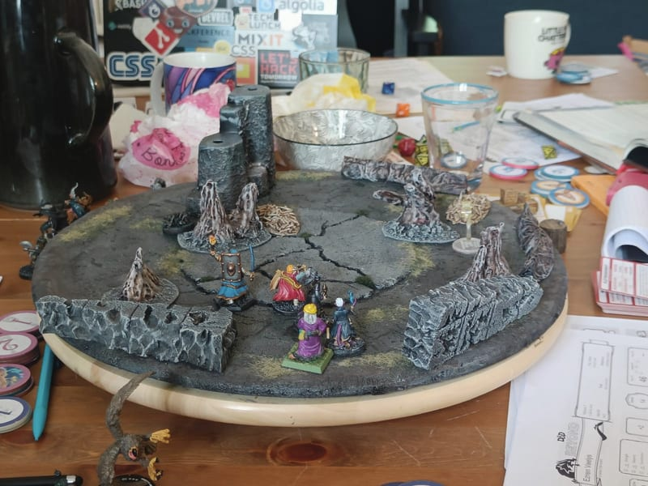

The four encounters above took place on the same board; I only had to change various walls and dressing to make them very different places. This all thanks to the underlying UDT, or Ultimate Dungeon Terrain as it is know.

The idea if to have a circular piece of terrain as a board, divided in three concentric circle. Each circle represents an abstract zone, used for abstracting distances. The center is the "here", anyone here is in melee range of each other, and they are all within earshot as well. The second ring is for "there", anyone here can attack the central circle using range weapons. The outer rim of the board symbolize "somewhere else", miniatures here are not even in combat, they might have fled, or will arrive later.

In some encounters we didn't even used those abstract zones, we just used the board as terrain. Because it's sitting on top of a lazy suzan, it can rotate so all players can enjoy the view.

Overall, we all found it very practical, but we didn't really used the abstract zones, and many of us prefer the ease of using squares for movement, rather than abstract zones. So I think I'll craft more of them, but add a grid on it.

Anyway, to build it at the exact dimensions, I actually used my lazy suzan as a pattern and cut the circle around it.

I beveled the edges and used this board as a pattern to cut on a textured wallpaper I had.

I then roughly marked the three zones. I used a paper plate I had laying around to draw a perfect circle in the center. And also if I ever need to craft a new one, I'll be able to reproduce the exact same dimensions.

I glued the wallpaper everywhere except on the outer rim.

I added broken cork at the center, to symbolize broken stones. In retrospect, adding this kind of elevation wasn't a good idea, as it prevents putting some terrain elements flat.

Painting black, using modpodge to solidify it.

I tried to use different colors for each part, but it was too subtle and didn't look very good.

The wash didn't help either. Some people pointed out that it looked like a moldy chocolate cake, and I can't blame them.

I finally added some flocking. 

Overall it turned out to be a trusty piece of terrain and I will be most certainly be crafting more, for other types of environments.