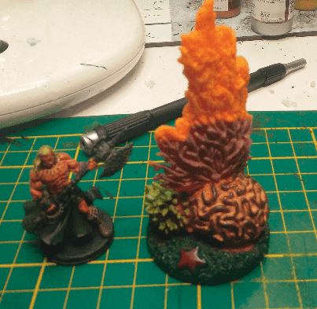
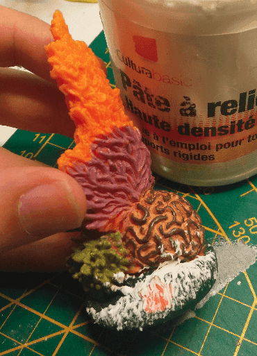
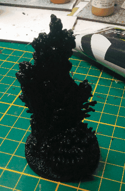
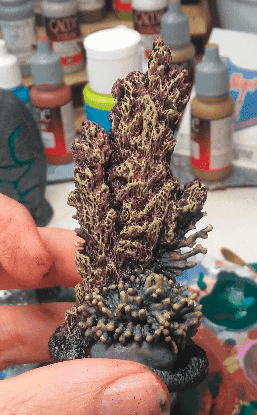
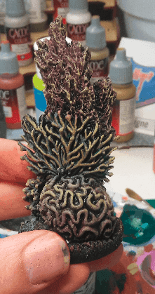

## The Underground Plant

This is an aquarium decoration made of some kind of plastic. I wasn't really sure what I would turn it into when I bought it, but I figured I would find out as I was painting it.

The only modification I did was removing the starfish and adding some modeling paste before priming.

Ready to be painted.

I wasn't really inspired for the color scheme here. I took some random colors and painted the various parts with them, then I drybrushed some yellow on top of it to homogenize the plant. In retrospect I should have used brighter colors because in its current state, it's hard to tell the various parts.