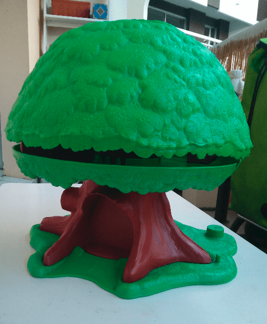
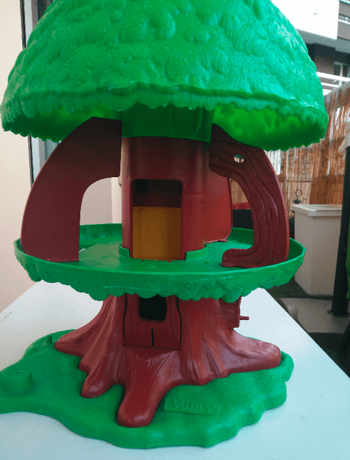
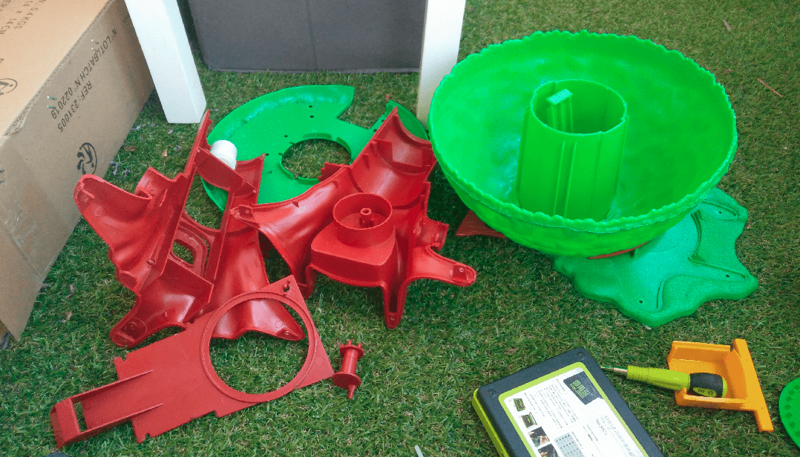
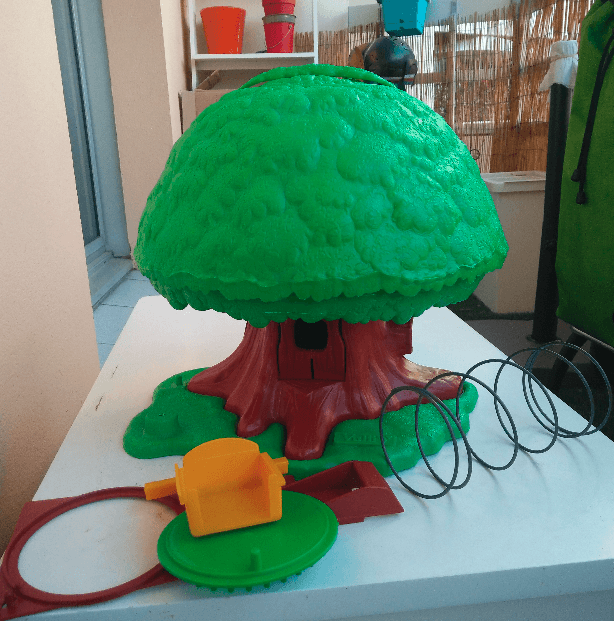
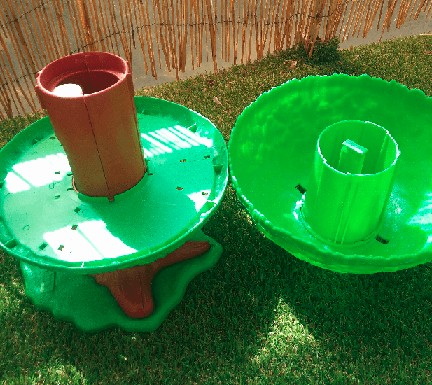
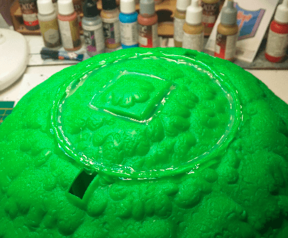
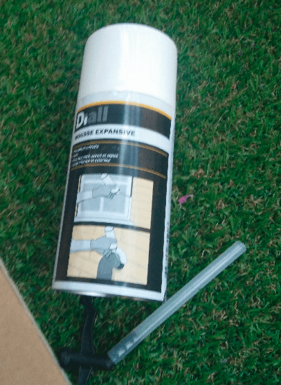
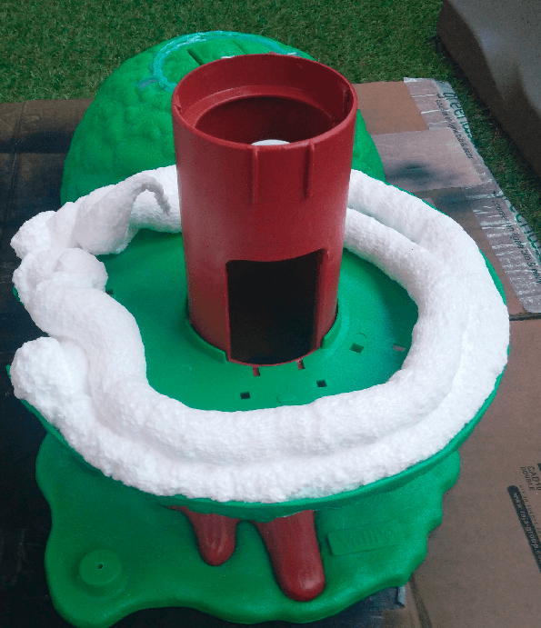

I don't know if you're familiar with this toy. It's a Vulli Tree, and has been pretty popular with kids in France for at least three generations.

I never had one myself, but I recently found two of them in a second hand shop for 2€ each. I bought one for my daughter and took one for me.

Being second hand they were missing some stickers and plastic parts. But by buying two I was able to make an almost-complete one for my daughter and keep the bare one for me.

This is how it looks once opened. As a terrain piece, I didn't want it to open at all. I had in mind an old wise tree like you can see in GoT, so I had a plan to paint it white with autumnal leaved.

I had never done this kind of thing before (painting trees, especially not white-barked and in autumnal leaves so I kinda expected it to not look as great as I envisioned but.. as I always say when DMing: "there's only one way to find out").

First step was opening it and removing all the pieces from the inner mechanism. It would make the whole structure lighter and less noisy.

Here it is, with all the "useless" parts removed.

As you can see, the upper part is pretty empty. My plan was to fix the top part with some glue, but also fill in the gap between the canopy and the first floor with some expansive moss (not sure of the exact term).

I filled the top ridges with glue from my glue gun. Gluing the central square was actually an error, as I would need it to be mobile for the next step.

This is the expansive moss I was talking about.

I put some on the rim of the first floor and then attached the canopy on top. I should have tester the product on some cardboard first because it didn't expand as I expected.