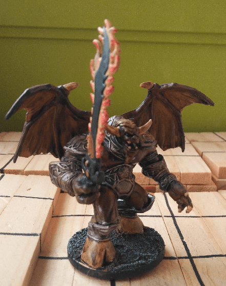

In my current game, my players woke up an ancient Bat Demon during one of their exploration. I didn't anticipated that, so didn't had the right mini for it. I painted that shortly after the session, being the closest thing to a Bat Demon I could find.

In retrospect I'm happy with the fire effect. It's not fantastic, but it works. As for the rest of the colors, I think there is not enough contrast here. I should have put a lighter wash on the flesh of the wings, and/or used a more golden metal for the armor parts.
