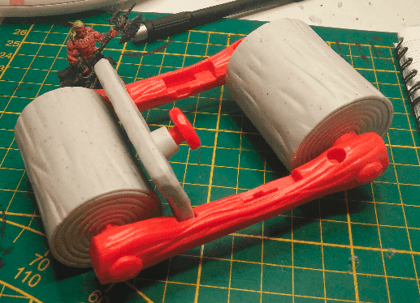
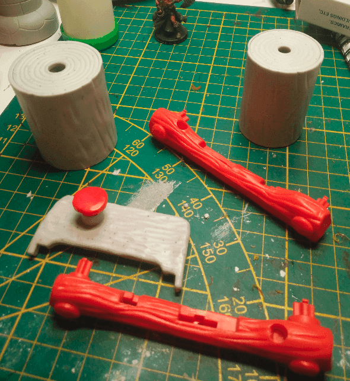
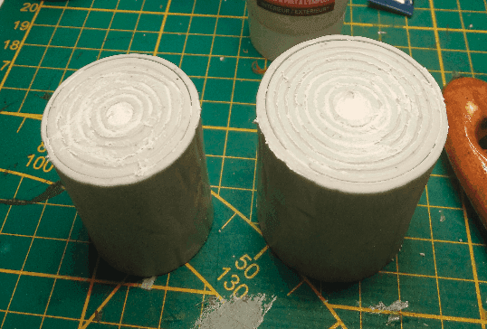
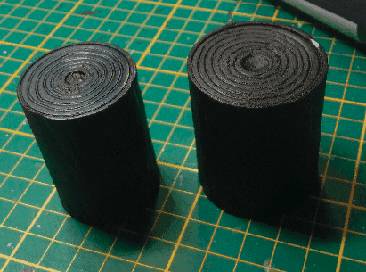
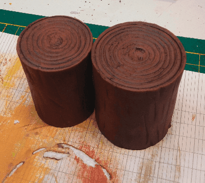
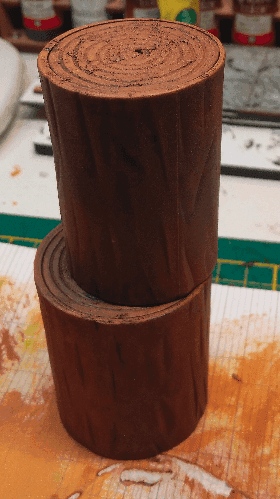

This seems to be a Flintsone vehicule. In the cartoon the "wheels" are supposed to be made of rock but here the texture made it look like some kind of wood, so I thought I could transform that into logs.

So I dismantled the car and kept the "logs". The other bits went into my bits box, maybe for future use.

Put some paste in the holes.

Priming them black. Now I can see that the circle don't really look like wood logs. They don't really look like stone either to be honest.

Painting them with a rough drybrush work.

Adding some more colors.