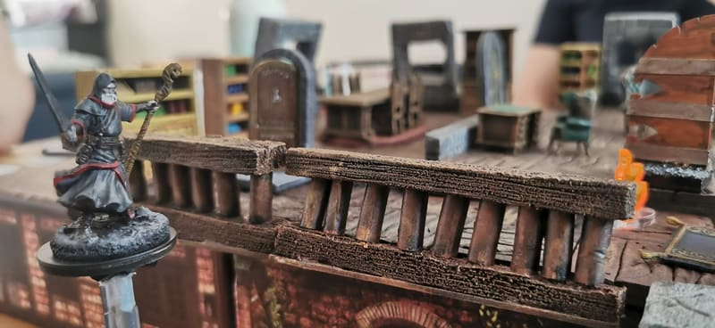
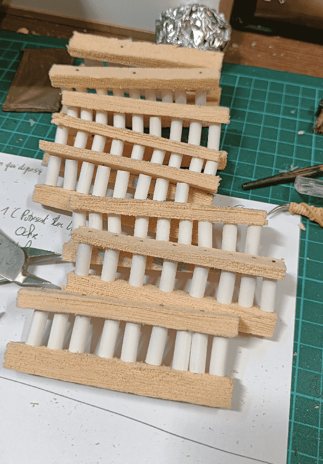
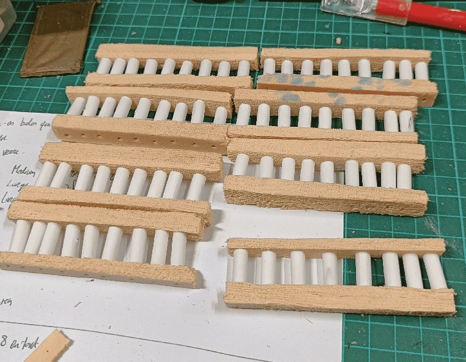
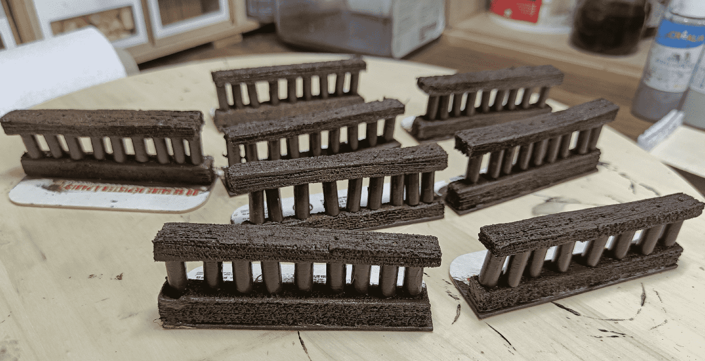
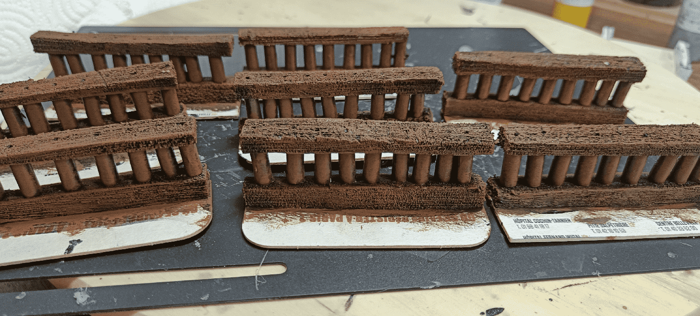
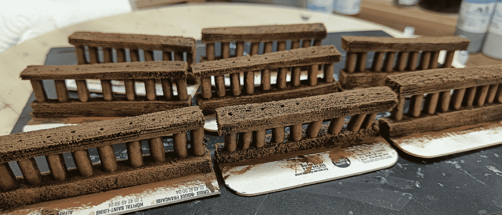

The fight in the Kaijitsu Mansion took place on the first floor, and there was a balcony allowing for some vertical combat with people on the ground floor (actually, only a flying mage). I wanted a way to represent the ledge, so I built some wooden railings.

The crux of it are two foam beams (textured to look like wood) and some cigarette filters for the vertical parts. The filters are put in place with small pins on the top and bottom.

I tried gluing the things in place, but it was too instable. In the end, using the pins was the most sturdy solution I could find.

I glued them on some cardstock. I kept a large part on the side, both to ensure they would stay flat on the table, and also to be able to tuck them under existing boards.

The mandatory second brown drybrush.

The result before the final painting of the bases black.

