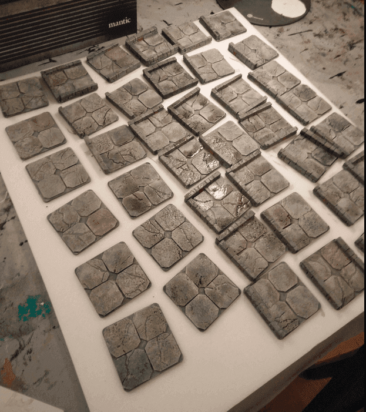

I made some dungeon tiles, inspired by Wyloch. I used completely different materials though, but kept the same overall idea.

First, I'm really bad at cutting stuff in a straight line. Wyloch seems to be able to cut cardboard with very high precision and have all his tiles of the exact same dimensions. I can't do that.

I also don't own a proxxon like Black Magic Craft, so I can't cut foam either.

That's why I ordered a bunch of cheap square wooden tiles online. That way I'm sure they all have the exact same dimensions, and I don't need to bother cutting them at the right size.

I draw on the sides with a black sharpie where the walls would go.

I then cut individual squares in a sheet of textured wallpaper. This one I found in a second hand shop, and it has a nice stone texture.

 I cut this into lots of squares.

I then cut the corners of each square, to better visually mark them, and create a mess on my table.

I then glue them to the base tiles. I had to cut some squares so they don't overlap with where the wall will go, but because it's wallpaper, it's pretty easy to cut.

I also started working on the walls. As previously mentioned, I'm really bad at cutting at exact dimensions, so I'm using my foam board thickness as my wall thickness, making sure I have a consistent thickness for all my tiles.

I then texture them to look like stone. The foam I use seem to have a different texture on its top/bottom than on its side, resulting on the final wall texture not looking uniform.

Honestly, for a bunch of dungeon tiles as I'm making, it's good enough.

Some examples of the various tiles configurations.

And here we go, making more and more.

Then, covering them with black mod podge (here you can see corner pieces I made also). The wallpaper actually absorbs paint much more than I anticipated , so I had to do several layers.

I also need to paint the floor and walls in two passes, otherwise I couldn't actually hold the pieces in my hand.

Initial gray overbrush.

First light grey drybrush.

I set another even lighter grey drybrush on the square sides. 

Coloring some squares and wall bricks in red.

And applying a black wash on all of them, to enhance the stone effect.

And that's it; a way to generate lots of various dungeons.