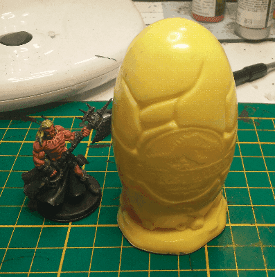
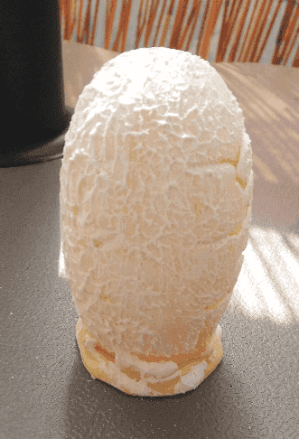
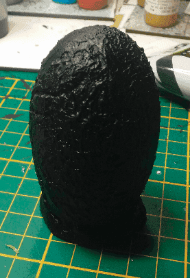
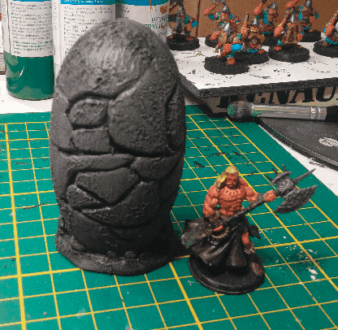
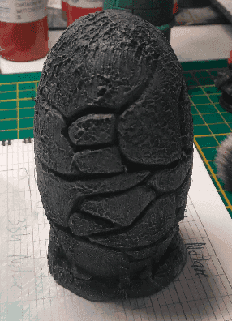
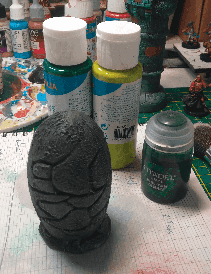
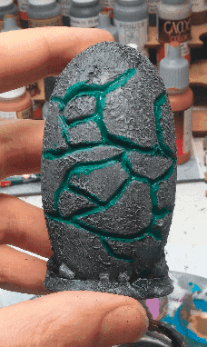
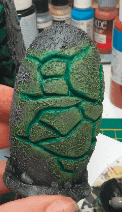
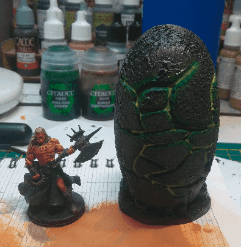

This is a Jurassic Park promotional egg, I guess it's from MacDonalds as well. I wanted to paint it as some crackling egg releasing some kind of foul energy. I had never painted anything like this before, so I thought that having such a large miniature to try would be perfect.

Applied a fair layer of modeling paste and sanded it to give it a smoother texture.

Priming it black.

My plan was to make this a stone egg, with some weird green light coming out of it. Now that I think of it, I don't know why it should be made of stone. I must confess I didn't really think this part through. It would have been more logical if it was colored more like a bird egg, or a weird color.

Second coat for more depth.

Now my plan is to paint the cracks as green light. I had never done this before but here is what I'll try to do. First paint the cracks with a deep green, then drybrush around the edges with a light green, repaint the center of the cracks with the same green, and unify this with a wash at the end.

First pass of green in the cracks.

Drybrush of light green around all the cracks.

Lightgreen inside the cracks