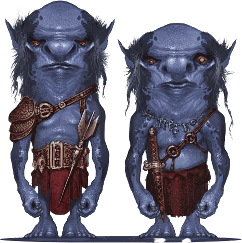
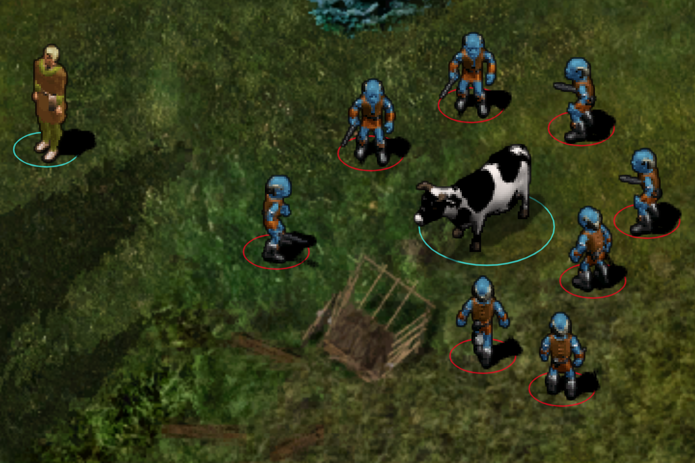
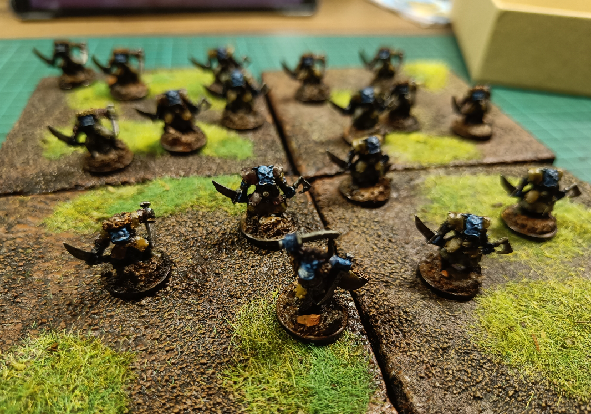
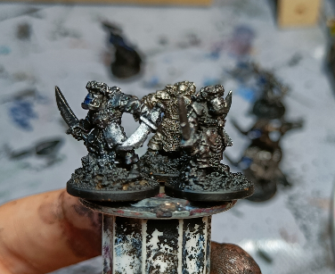
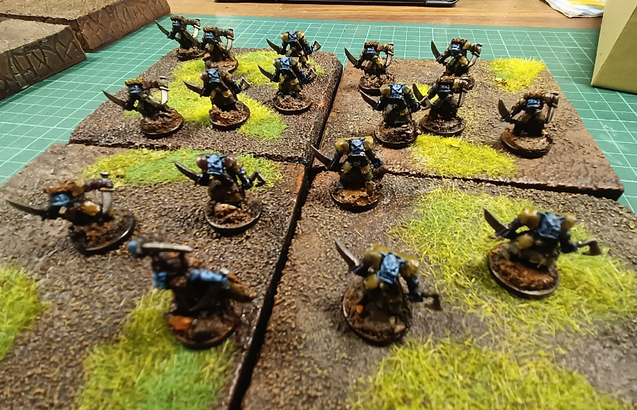
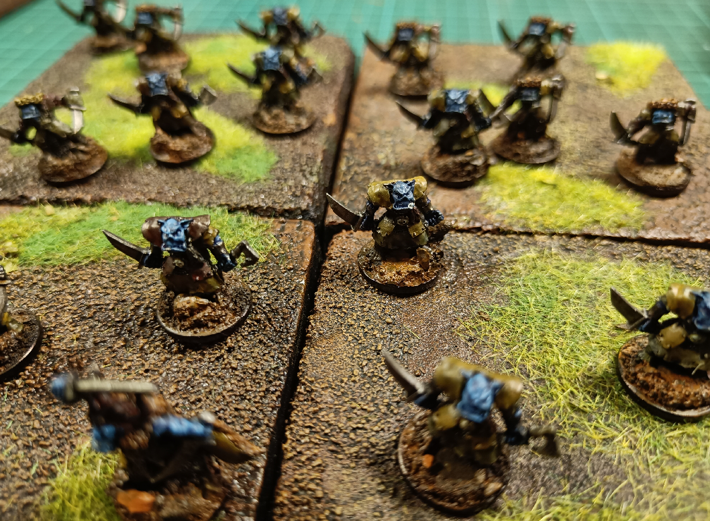

Xvarts are horrible little creatures in D&D. First time I encountered them was in Baldur's Gate. They are nice monsters for a level 1 group and bring some change from the usual kobold / giant rat trope.

I wanted to have some myself, so I set out on finding the right miniatures for that. Official Xvart miniatures are way to expensive.

I picked those old orcs I had lying in a drawer. They are very tiny scale, as you can see, I fitted them on one cent coins.

I painted them blue, and added some very light drybrush on their skin, but painted their clothes in brown shades with a dark wash. The contrast made them distinctive enough for my purpose.

I expect them to be living in sewers below a small scale city.