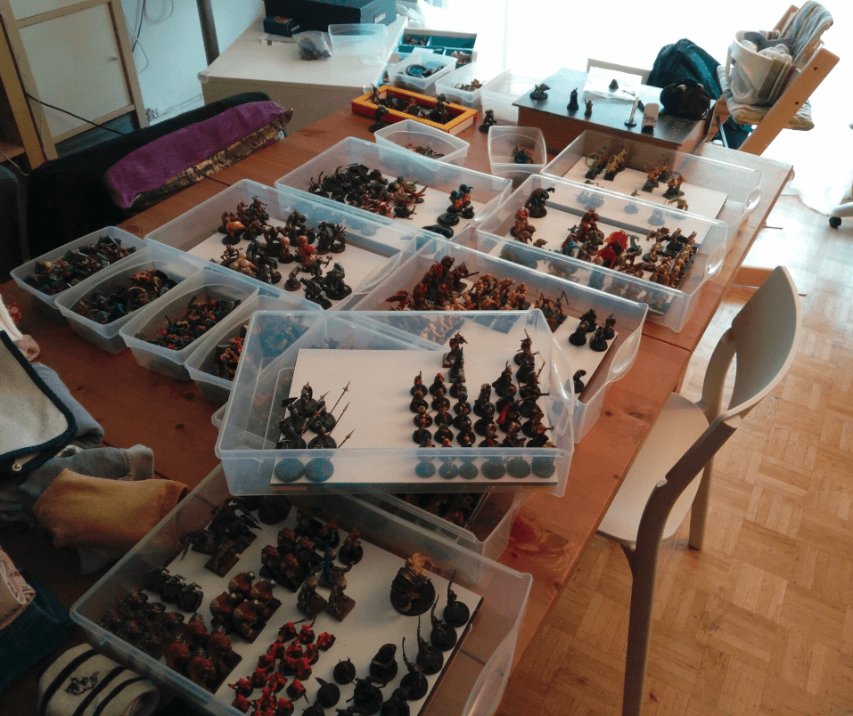

I realized I start to have too many miniatures. As I've been painting regularly for the past year, I can see the progress I made from earlier.

Many of them were very quick attempts at building a large collection quickly using barely two colors and a dip in wood varnish. When I compare those minis to what I do today, the difference is huge. And I don't want to put badly painted minis on the board when I have better looking ones, so I started to put the very bad ones into boxes and store them.