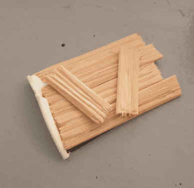

This is a hut, made from a yoghurt. So, a yoghut.

I started with an empty yoghurt glued to a plastic lid. I traced a rough circular shape with a sharpie around it, and cut it with scissors. This was meant to give it some stability on the table.

I then took a bunch of wood sticks (the one you find in ice creams) and craved grooves in them with a utility knife. This was very long to do, and since then I found a much faster way using a screwdriver.

I cut them in different sizes so it won't seem too uniform.

I glued a some together to form a boarded up door.

And glued all that on the initial yoghurt. The door was glued in the inside of the yoghurt while the other boards were glued on the outside.

I trimmed the top of the planks so they would all have the same height. 

After that I wasn't really sure how to finish the roof. At first I wanted to create something mossy, with tree branches and leaves everywhere, like a hag hut, but had no idea how to do that. 

This project stayed in that state on my shelf for several months because I had no idea how to finish it. And one night, I decided to give it a try and see how it would turn out.

So I started with gluing a rough foam part on the top, to give it more volume.

Then I soaked a few paper tissue in a mix of water and wood glue and applied that on the top. I let it dry overnight.

I painted it with a old pink/beige color that would serve as a basis for a future wash.

I then applied wood varnish directly on the piece, wood and roof. To be honest, I still don't know myself what the roof is supposed to be made of. I ended up adding flocking, the magic ingredient that make any craft piece 20% better.
