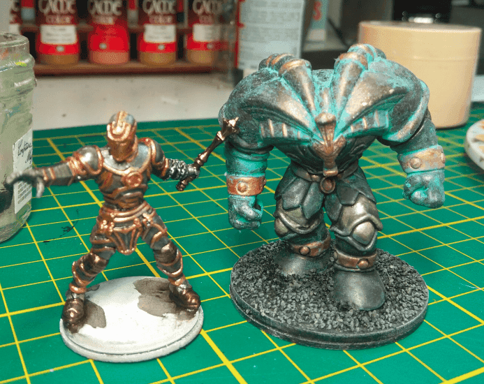
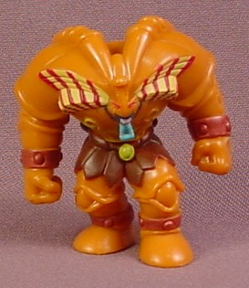

I transformed a Yu-Gi-Oh toy into an iron golem

The mini on the left is from Zombicide Green Horde, and I was painting it at the same time, but the star of this post is the big hulking figure on the right.

I found it in a garage sale, and had no idea what it was, but I thought it could be good practice for testing out my new metallic paints.

Turns out to be a character from Yu-Gi-Oh, named Exodia. I have 

no idea what their backstory is, though.

I painstakingly painted it all around with the metallic paints, trying to use various metals for various parts, but it turned out to be pretty boring looking in the end.

So I decided to apply a fair dose of Nihilak Oxyde on it to make it look like it was very old. The result is mildly convincing.

On one hand, it does give it a special look, like it was sitting at the bottom of the sea for a long time and finally got out. On the other hand it does look like paint and not real oxydation. I still haven't mastered how to use this special paint.

But the main lesson I learned here is that I don't need to apply metallic paint everywhere. I drybrush is more effective and much faster.

