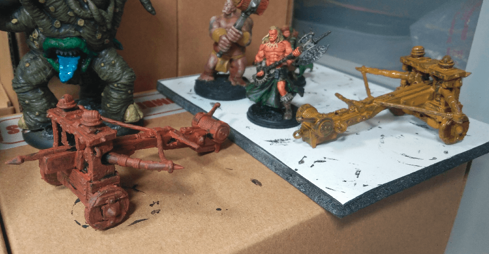

The nice thing about having two of those is that I can try two different painting techniques and compare.

The one on the left was dry brushed, while the one the right was painted. When I was dry brushing the first one I thought it was very tedious, so I went on to painting the second one, hoping it would be easier. It turned out that it was even worse. This first basecoat was pretty boring to do.