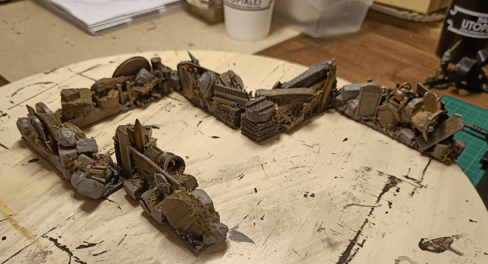
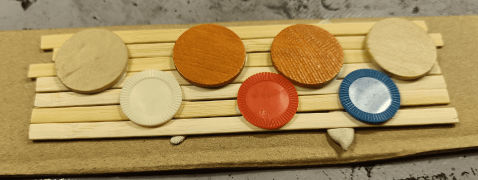
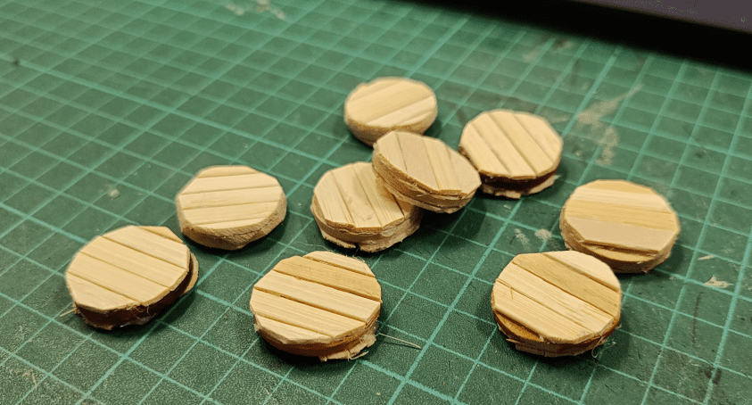
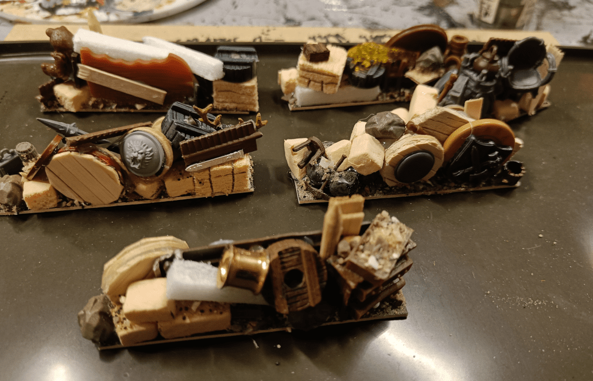
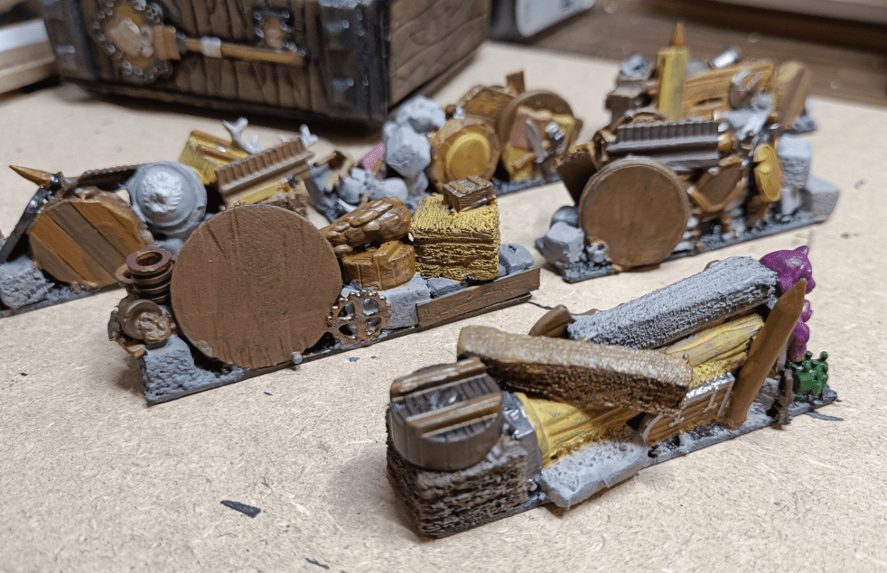
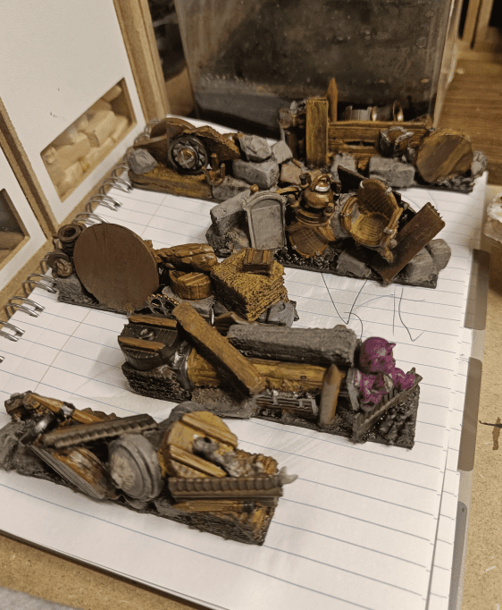
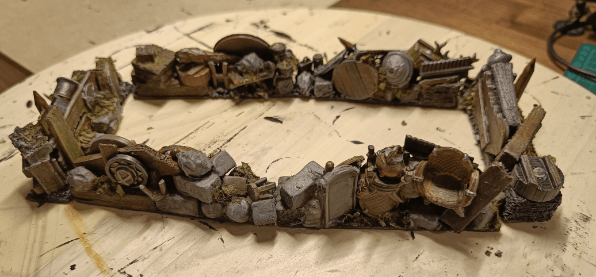

Zombicide: Green Horde also features another type of obstacle, that is the exact opposite of Hedges. Barricades prevent movement, but not line of sight.

It's less common in Zombicide scenarios, but I still wanted something to represent them, so I dug into my bits box and came up with those.

I first created some... shields? wheels? I don't know, some medieval-looking wooden round thing; let your imagination fill the blanks. It's just fine wood glued on both sides of buttons and circular token, then cut to shape.

I then glued all those things together, with old bits of miniatures, and toys, and foam, and lego parts, to make it look like townsfolk picked up anything they had to raise those barricades.

Blocking some first colors.

Adding a wash.

And some final drybrushes and flocking to tie it off together.

